# Creación del entorno en AWS ZTH-Node-Cloud

## Índice
- [Añadimos reglas al Security Group](#añadimos-reglas-al-security-group)
- [Creación de la instancia](#creación-de-la-instancia)
- [Acceso al nodo de AWS mediante la terminal](#acceso-al-nodo-de-aws-mediante-la-terminal)
- [Configuración para dejar accesible para el nodo local](#configuración-para-dejar-accesible-para-el-nodo-local)

Creamos un Security Group inicial para crear la instancia:

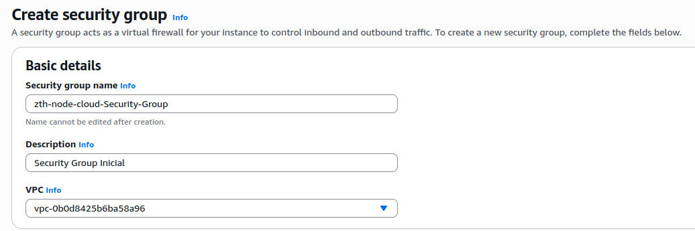

## Añadimos reglas al Security Group

Añadimos una regla de entrada para acceder vía SSH desde solo la IP pública del instituto, además añadimos la máscara /32 ya que esta solo permite una sola IP:

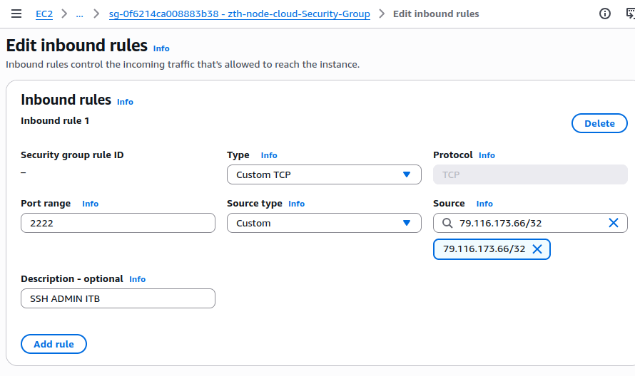

Añadimos la regla de HTTPS para la web y que solo se pueda acceder desde la IP pública del ITB:

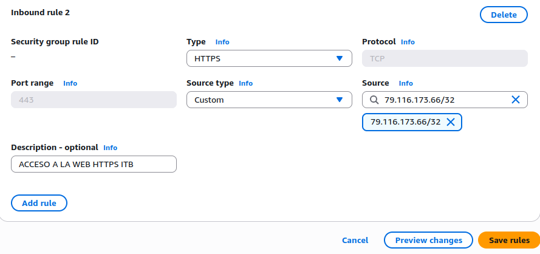

Por último creamos la regla para Wireguard VPN, mediante el puerto 51820 y la IP pública del nodo local (Nuvolet):

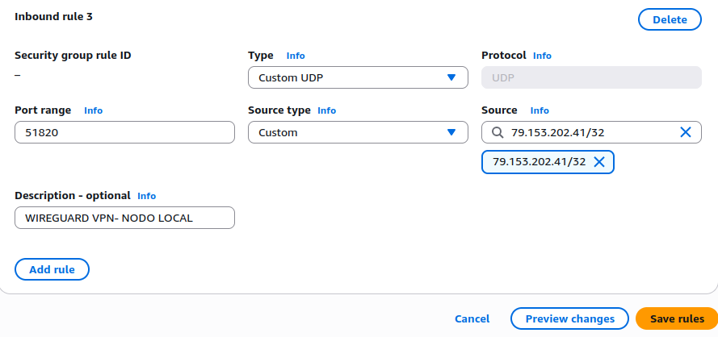

Creamos una regla para poder acceder al Keycloak:

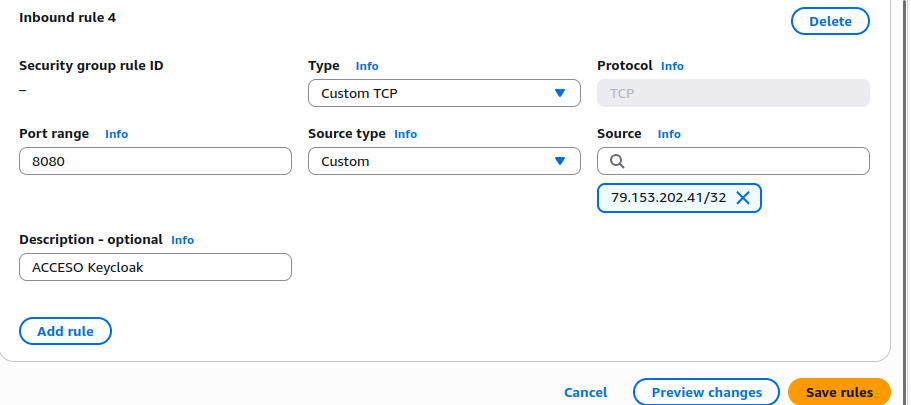

## Creación de la instancia

Asignamos el nombre a la instancia de AWS:

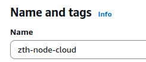

Asignamos una imagen Ubuntu Server 24.04 LTS (o 24.01 según el doc), con el tipo de instancia "t2.medium" con 2 vCPU y 4 GiB Memory:

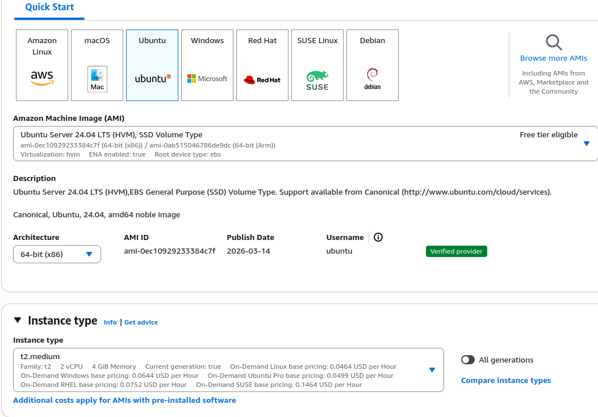

En la configuración de red añadimos el Security Group que creamos al inicio:

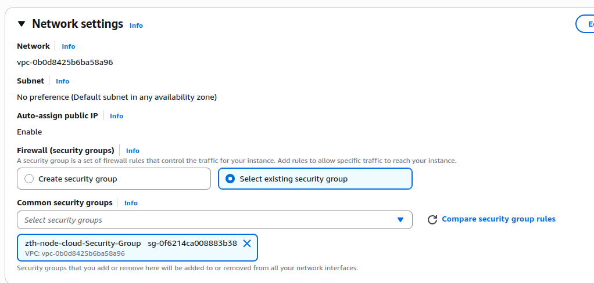

Configuramos el almacenamiento de la instancia:

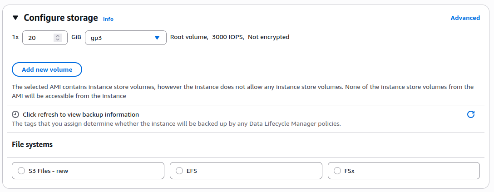

Creamos una key para poder acceder a la instancia:

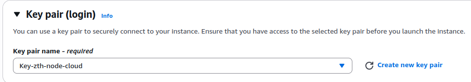

Creamos una IP estática para que la IP pública del nodo en AWS no cambie al reiniciar la máquina y la asociamos a la instancia que hemos creado:

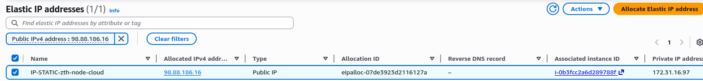

## Acceso al nodo de AWS mediante la terminal

Primero cambiamos los permisos de la key a los permisos adecuados con el comando:

```bash
chmod 400 Key-zth-node-cloud.pem
```

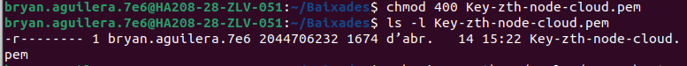

Accedemos mediante SSH con el comando:

```bash
ssh -i Key-zth-node-cloud.pem ubuntu@ec2-98-88-186-16.compute-1.amazonaws.com
```

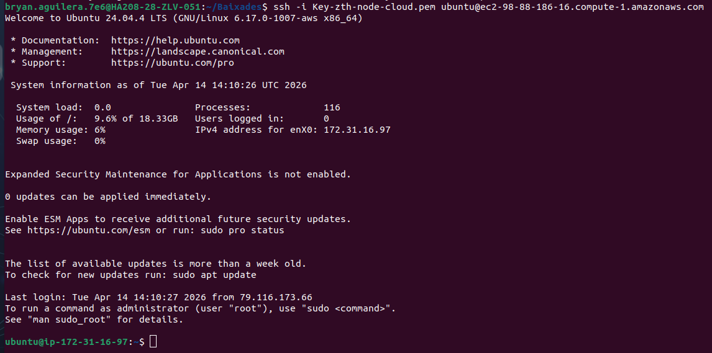

## Configuración para dejar accesible para el nodo local

Configuramos el acceso de SSH al puerto 2222 ya que el puerto por defecto es muy inseguro, además añadimos el sin login por contraseña, sin root login y activamos el acceso con clave:

```bash
sudo nano /etc/ssh/sshd_config
```

Dentro del archivo, modificamos o añadimos:

```text
Port 2222
PermitRootLogin no
PasswordAuthentication no
PubkeyAuthentication yes
```

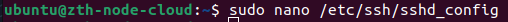
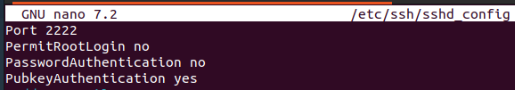

Reiniciamos el servicio, miramos por donde se está escuchando el SSH y accedemos desde la terminal:

```bash
sudo systemctl stop ssh.socket
sudo systemctl disable ssh.socket
sudo systemctl mask ssh.socket
sudo systemctl daemon-reload
sudo systemctl restart ssh
sudo ss -tulpn | grep ssh
```

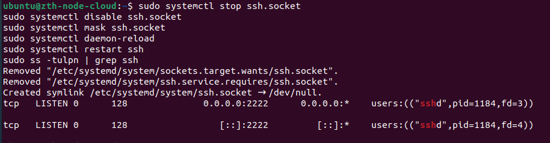

Probamos acceder con el comando:

```bash
ssh -i Key-zth-node-cloud.pem -p 2222 ubuntu@34.231.236.201
```

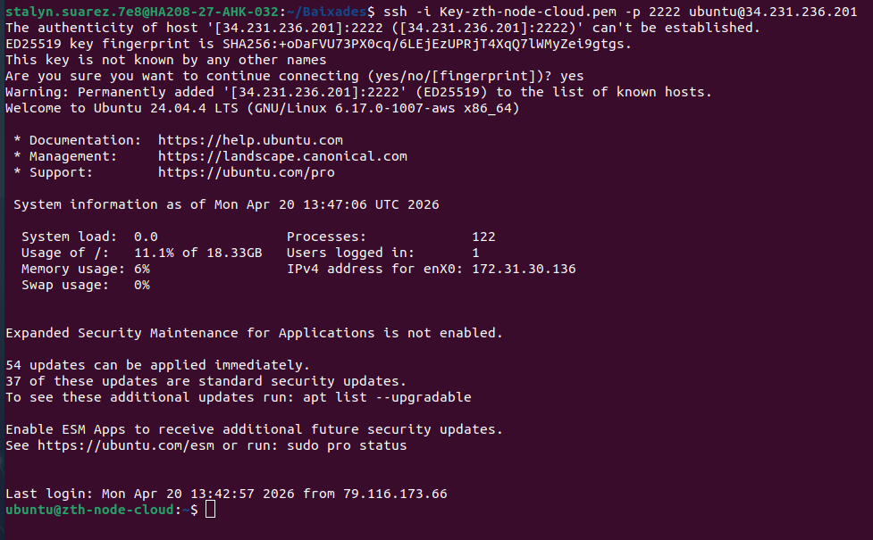
