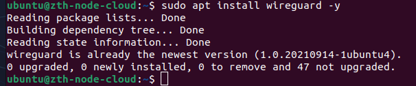
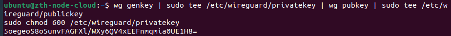
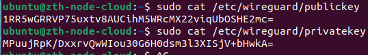
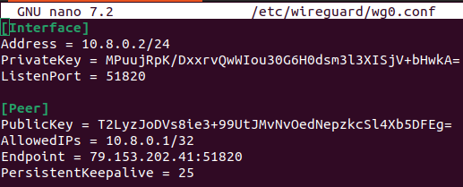
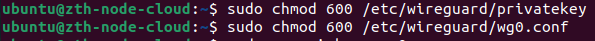
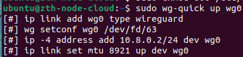
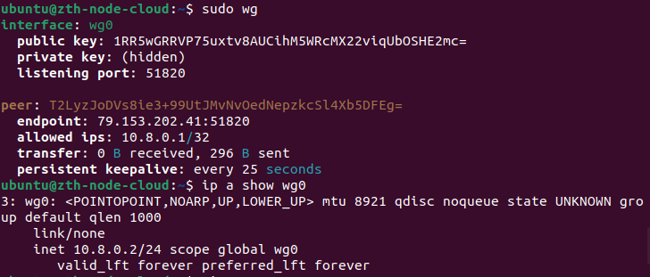
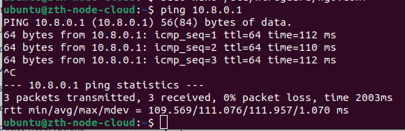
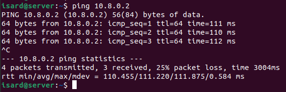
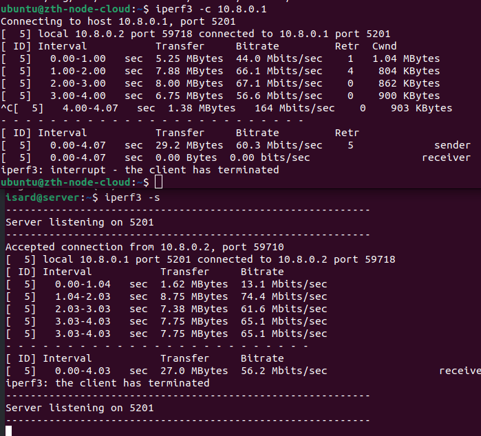

# Creación y Configuración de WireGuard en AWS zth-node-cloud

## Índice
- [Instalación de WireGuard](#instalación-de-wireguard)
- [Configuración de WireGuard](#configuración-de-wireguard)
- [Creación y Configuración del Túnel](#creación-y-configuración-del-túnel)
- [Puesta en marcha y Verificación](#puesta-en-marcha-y-verificación)
- [Pruebas de Rendimiento (iperf3)](#pruebas-de-rendimiento-iperf3)

## Instalación de WireGuard

Instalamos el paquete de WireGuard:

```bash
sudo apt install wireguard -y
```



## Configuración de WireGuard

### Creamos claves:

```bash
wg genkey | sudo tee /etc/wireguard/privatekey | wg pubkey | sudo tee /etc/wireguard/publickey
sudo chmod 600 /etc/wireguard/privatekey
```



Ahora miramos la clave pública y privada con un cat:

```bash
sudo cat /etc/wireguard/publickey
sudo cat /etc/wireguard/privatekey
```



## Creación y Configuración del Túnel

Creamos el archivo de configuración de WireGuard:

```bash
sudo nano /etc/wireguard/wg0.conf
```

Y añadimos lo siguiente dentro del archivo de configuración:

```text
[Interface]
Address = 10.8.0.2/24
PrivateKey = MPuujRpK/DxxrvQwWIou30G6H0dsm3l3XISjV+bHwkA=
ListenPort = 51820

[Peer]
PublicKey = T2LyzJoDVs8ie3+99UtJMvNvOedNepzkcSl4Xb5DFEg=
AllowedIPs = 10.8.0.1/32
Endpoint = 79.153.202.41:51820
PersistentKeepalive = 25
```



Primero añadimos los permisos correctos a los archivos para proteger los archivos sensibles de WireGuard:

```bash
sudo chmod 600 /etc/wireguard/privatekey && sudo chmod 600 /etc/wireguard/wg0.conf
```



## Puesta en marcha y Verificación

Levantamos la interfaz VPN:

```bash
sudo wg-quick up wg0
```



Comprobamos que la interfaz está levantada y la IP asignada:

```bash
sudo wg && ip a show wg0
```



Por último hacemos un ping al nodo local:

```bash
ping 10.8.0.1
```



Y desde el nodo local hacemos un ping al nodo en cloud:



## Pruebas de Rendimiento (iperf3)

Los resultados de iperf3 confirman que el túnel no solo está levantado, sino que tiene un rendimiento sólido de unos 60 Mbps.

**En AWS (Cliente):**
```bash
iperf3 -c 10.8.0.1
```

**En Local (Servidor):**
```bash
iperf3 -s
```


