# Hardening Inicial y Despliegue de

## Indice

- [Hardening Inicial y Despliegue de](#hardening-inicial-y-despliegue-de)

- [Infraestructura Segura](#infraestructura-segura)

- [N°: GRUPO 8](#n-grupo-8)

- [Integrantes: Javier Vericat - Bryan Aguilera - Giuseppe Suarez](#integrantes-javier-vericat-bryan-aguilera-giuseppe-suarez)

- [Profesores: Sergi - David Sicart](#profesores-sergi-david-sicart)

- [S1-01 - Acceso SSH Seguro (Hardening Inicial) - Isard](#s1-01-acceso-ssh-seguro-hardening-inicial-isard)

- [1. ​ Gestion de claves](#1-gestion-de-claves)

- [a. ​ Generar claves](#a-generar-claves)

- [b. ​ Pasar claves](#b-pasar-claves)

- [c. ​ Comprobación](#c-comprobación)

- [2. ​ Handering de SSH](#2-handering-de-ssh)

- [a. ​ Cambiar puerto y archivo de configuración](#a-cambiar-puerto-y-archivo-de-configuración)

- [b. ​ Comprobacion](#b-comprobacion)

- [3. ​ Firewall](#3-firewall)

- [a. ​ Crear reglas](#a-crear-reglas)

- [4. ​ Regla AWS](#4-regla-aws)

- [S1-02 - Docker + Keycloak - Isard](#s1-02-docker-keycloak-isard)

- [1. ​ Instalación de Docker](#1-instalación-de-docker)

- [a. ​ Instalar paquetes](#a-instalar-paquetes)

- [b. ​ Permisos](#b-permisos)

- [2. ​ Despliegue de KeyCloak](#2-despliegue-de-keycloak)

- [a. ​ Creación de directorios](#a-creación-de-directorios)

- [b. ​ Crear y configurar archivo .yml](#b-crear-y-configurar-archivo-yml)

- [c. ​ Firewall Regla](#c-firewall-regla)

- [d. ​ Comprobación](#d-comprobación)

- [S1-03 - Configuración de Seguridad IAM - Isard](#s1-03-configuración-de-seguridad-iam-isard)

- [1. ​ Crear Realm](#1-crear-realm)

- [a. ​ Configurar Realm](#a-configurar-realm)

- [2.​ Autenticación multifactor](#2-autenticación-multifactor)

- [a. ​ Configuración de Autenticación](#a-configuración-de-autenticación)

- [b. ​ Políticas de ataques](#b-políticas-de-ataques)

- [d. ​ Políticas de Contraseñas](#d-políticas-de-contraseñas)

- [e. ​ Roles y Grupos](#e-roles-y-grupos)

- [f. ​ Usuario](#f-usuario)

- [g. ​ Comprobacion](#g-comprobacion)

- [S1-04: Hardening Avanzado del Sistema - Isard](#s1-04-hardening-avanzado-del-sistema-isard)

- [1. ​ Fail2Ban](#1-fail2ban)

- [a. ​ Instalación del Fail2Ban](#a-instalación-del-fail2ban)

- [b. ​ Crear configuración inicial](#b-crear-configuración-inicial)

- [c. ​ Reiniciamos y comprobamos ​](#c-reiniciamos-y-comprobamos)

- [d. ​ COMPROBACION](#d-comprobacion)

- [2. ​ Actualizaciones Automáticas de Seguridad](#2-actualizaciones-automáticas-de-seguridad)

- [a. ​ Configurar actualizaciones automáticas](#a-configurar-actualizaciones-automáticas)

- [Ejecutamos el siguiente comando](#ejecutamos-el-siguiente-comando)

- [c. ​ Configuración de política restrictiva](#c-configuración-de-política-restrictiva)

- [S1-05: Hardening en el Nodo AWS](#s1-05-hardening-en-el-nodo-aws)

- [1. ​ Firewall - AWS](#1-firewall-aws)

- [a. ​ Reglas](#a-reglas)

- [Ahora indicamos el puerto de HTTPS para la web](#ahora-indicamos-el-puerto-de-https-para-la-web)

- [Todo lo que no se encuentra aqui sera denegado con DROP](#todo-lo-que-no-se-encuentra-aqui-sera-denegado-con-drop)

- [b. ​ Dentro de la Instancia](#b-dentro-de-la-instancia)

- [2. ​ Fail2Ban](#2-fail2ban)

- [b. ​ Configuración](#b-configuración)

- [d.​COmprobacion](#dcomprobacion)

- [3. ​ Actualizaciones Automáticas de Seguridad en AWS](#3-actualizaciones-automáticas-de-seguridad-en-aws)

## Infraestructura Segura

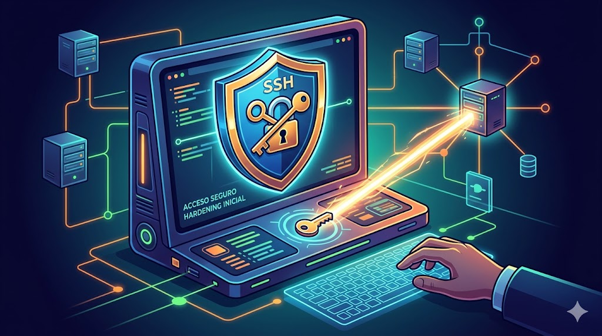

#### N°: GRUPO 8

#### Integrantes: Javier Vericat - Bryan Aguilera - Giuseppe Suarez

#### Profesores: Sergi - David Sicart

S1-01 - Acceso SSH Seguro (Hardening Inicial) - Isard............................................................4

1. Gestion de claves.................................................................................................................4

a. Generar claves...............................................................................................................4

b. Pasar claves...................................................................................................................5

c. Comprobación................................................................................................................ 5

2. Handering de SSH............................................................................................................... 6

a. Cambiar puerto y archivo de configuración....................................................................6

b. Comprobacion................................................................................................................7

3. Firewall.................................................................................................................................8

a. Crear reglas....................................................................................................................8

4. Regla AWS...........................................................................................................................9

S1-02 - Docker + Keycloak - Isard............................................................................................ 10

1. Instalación de Docker.........................................................................................................10

a. Instalar paquetes..........................................................................................................10

b. Permisos...................................................................................................................... 10

2. Despliegue de KeyCloak.................................................................................................... 11

a. Creación de directorios.................................................................................................11

b. Crear y configurar archivo .yml.................................................................................... 12

c. Firewall Regla...............................................................................................................14

d. Comprobación..............................................................................................................14

S1-03 - Configuración de Seguridad IAM - Isard.....................................................................16

1. Crear Realm.......................................................................................................................16

a. Configurar Realm......................................................................................................... 16

2. Autenticación multifactor....................................................................................................18

a. Configuración de Autenticación................................................................................... 18

b. Políticas de ataques.....................................................................................................19

c. Comprobación.............................................................................................................. 21

d. Políticas de Contraseñas............................................................................................. 22

e. Roles y Grupos.............................................................................................................24

f. Usuario..........................................................................................................................28

g. Comprobacion..............................................................................................................34

giuseppe-admin​

​

Iniciaremos sesión con el usuario de administrador.................................................. 34

operador-bryan​

​

Ahora iniciaremos sesión con permisos de trabajador...............................................38

Auditor-Javi................................................................................................................ 42

S1-04: Hardening Avanzado del Sistema - Isard.....................................................................48

1. Fail2Ban.............................................................................................................................48

a. Instalación del Fail2Ban............................................................................................... 48

b. Crear configuración inicial............................................................................................48

c. Reiniciamos y comprobamos....................................................................................... 50

d. COMPROBACION....................................................................................................... 51

2. Actualizaciones Automáticas de Seguridad.......................................................................53

a. Configurar actualizaciones automáticas...................................................................... 53

Ejecutamos el siguiente comando....................................................................................54

b. Comprobacion..............................................................................................................54

c. Configuración de política restrictiva..............................................................................54

S1-05: Hardening en el Nodo AWS...........................................................................................56

1. Firewall - AWS....................................................................................................................56

a. Reglas.......................................................................................................................... 56

b. Dentro de la Instancia.................................................................................................. 57

2. Fail2Ban.............................................................................................................................59

b. Configuración............................................................................................................... 59

d. COmprobacion............................................................................................................. 60

3. Actualizaciones Automáticas de Seguridad en AWS.........................................................62

a. Configurar actualizaciones automáticas...................................................................... 62

b. Comprobacion..............................................................................................................63

## S1-01 - Acceso SSH Seguro (Hardening Inicial) - Isard

### 1. ​ Gestion de claves

#### a. ​ Generar claves

Crearemos las claves con este comando

ssh-keygen -t ed25519 -C "giuseppe-access"

El algoritmo ed25519 es más seguro y más rápido que el predeterminado como es el RSA

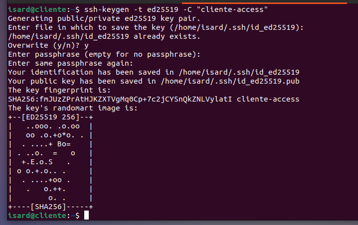

#### b. ​ Pasar claves

Ahora pasaremos las claves con el servidor que en este caso es del compañero

ssh-copy-id -i ~/.ssh/id_ed25519.pub isard@192.168.18.10

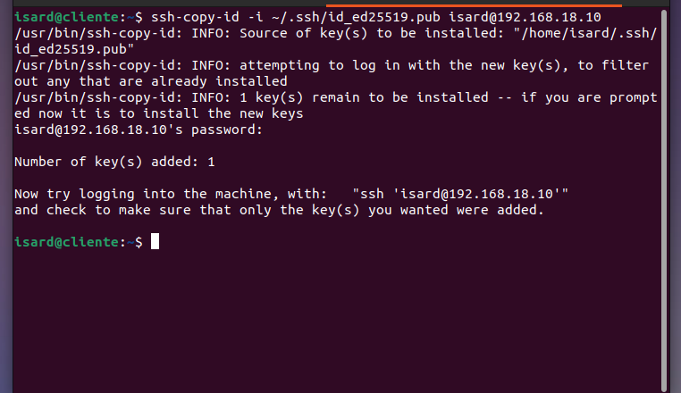

#### c. ​ Comprobación

Podemos hacer ssh y no nos pide la contraseña

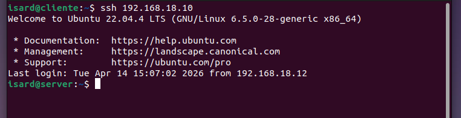

### 2. ​ Handering de SSH

#### a. ​ Cambiar puerto y archivo de configuración

Accedemos al archivo de configuración

sudo nano /etc/ssh/sshd_config

Ahora hemos modificado lo siguiente

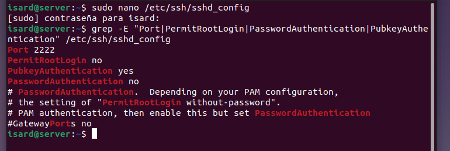

Puerto →  Modificamos el puerto que viene por defecto para evitar ataques de botnets

PermitRootLogin  → Prohibimos que un usuario con root o superusuario pueda acceder

directamente

PubkeyAuthentication  → Indicamos al servidor que puedas procesar y aceptar claves

como la configurada

PasswordAuthentication  → Obligamos a que el servidor solo acepte claves, y no

contraseñas, lo cual lo hace que no se pueda intentar ataques de fuerza bruta

#### b. ​ Comprobacion

Validamos si la configuración se ha realizado correctamente o hay algo en el archivo

incorrecto

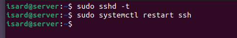

Y seguidamente hicimos un reinicio del servicio

Para finalizar miramos el servicio

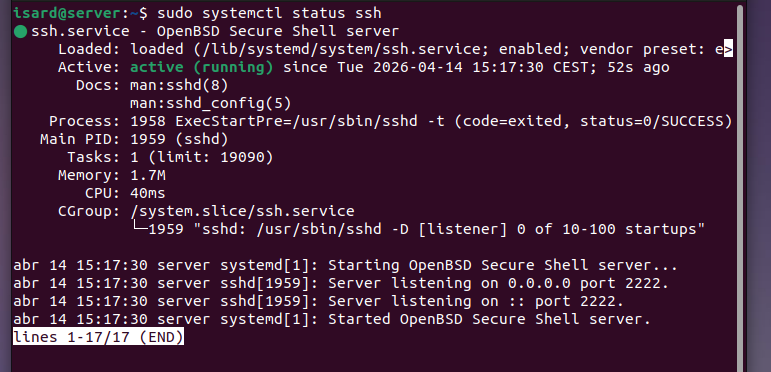

### 3. ​ Firewall

#### a. ​ Crear reglas

Bloqueamos todo y solo dejaremos lo que necesitaremos

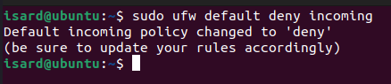

Ahora lo que haremos es habilitar solo lo necesario

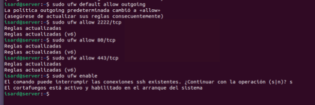

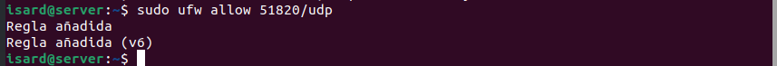

sudo ufw default allow outgoing  →  Indicamos que los paquetes desde el servidor hacia

fuera sean habilitados

sudo ufw allow 2222/tcp como el puerto 22  →  Son para el SSH, primero el ssh es puerto

22 pero luego lo cambiamos a puerto 2222 para seguridad

sudo ufw allow 80/tcp y 8443/tcp  →  Son para el servicio de Nginx tanto el http como

https

sudo ufw enable  →  Hacemos que ahora quede configurado siempre que se inicie el

servidor con esta configuración

### 4. ​ Regla AWS

a. ​ Security Group

Ahora desde AWS, deberemos de crear una regla de entrada indicando el protocolo TCP

y que sea por el puerto 2222 ​

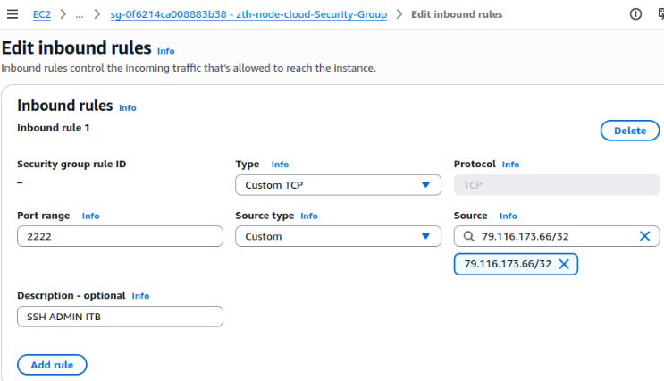

## S1-02 - Docker + Keycloak - Isard

### 1. ​ Instalación de Docker

#### a. ​ Instalar paquetes

Ejecutamos lo siguiente para instalar los paquetes

sudo apt install docker.io docker-compose -y

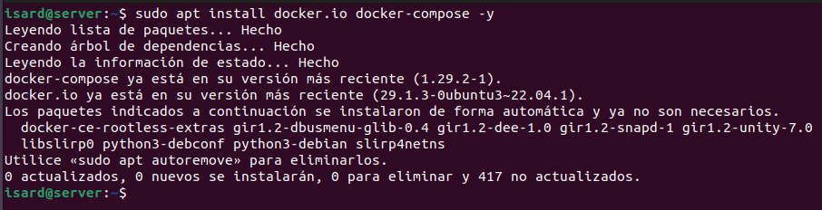

#### b. ​ Permisos

Para evitar usar sudo, lo que haremos es lo siguiente

sudo usermod -aG docker $USER

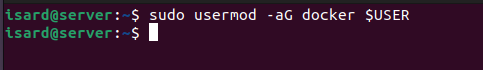

### 2. ​ Despliegue de KeyCloak

#### a. ​ Creación de directorios

Crearemos las carpetas

mkdir -p ~/zth-node-cloud/keycloak

cd ~/zth-node-cloud/keycloak

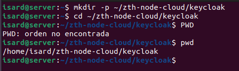

#### b. ​ Crear y configurar archivo .yml

Creamos el archivo con el comando

sudo nano docker-compose.yml

Y el contenido de este es el siguiente

version: '3.8'

services:

zth-postgres:

image: postgres:16

container_name: zth-keycloak-db

restart: always  # <-- Esto hace que el contenedor se reinicie solo si el server falla

volumes:

- zth_db_data:/var/lib/postgresql/data  # <-- PERSISTENCIA AQUÍ

environment:

POSTGRES_DB: keycloak

POSTGRES_USER: keycloak

POSTGRES_PASSWORD: K3yl0ack_ZTH-db

networks:

- zth-network

zth-keycloak:

image: quay.io/keycloak/keycloak:24.0

container_name: zth-keycloak-server

command: start-dev

restart: always  # <-- Persistencia de disponibilidad

environment:

KC_DB: postgres

KC_DB_URL: jdbc:postgresql://zth-postgres:5432/keycloak

KC_DB_USERNAME: keycloak

KC_DB_PASSWORD: K3yl0ack_ZTH-db

KEYCLOAK_ADMIN: admin

KEYCLOAK_ADMIN_PASSWORD: K3yl0ack-ZTH_

KC_HTTP_ENABLED: "true"

KC_PROXY: edge

ports:

- "8080:8080"

depends_on:

- zth-postgres

networks:

- zth-network

networks:

zth-network:

driver: bridge

# Definición de los volúmenes persistentes

volumes:

zth_db_data:  # Docker gestionará este espacio en /var/lib/docker/volumes/

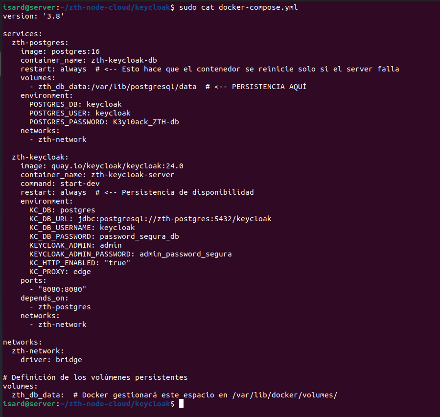

#### c. ​ Firewall Regla

Ahora deberemos de crear una nueva regla para poder acceder al Keycloak

sudo ufw allow 8080/tcp

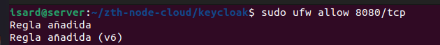

#### d. ​ Comprobación

Ahora accederemos mediante la IP del servidor :8080 y nos pide las credenciales

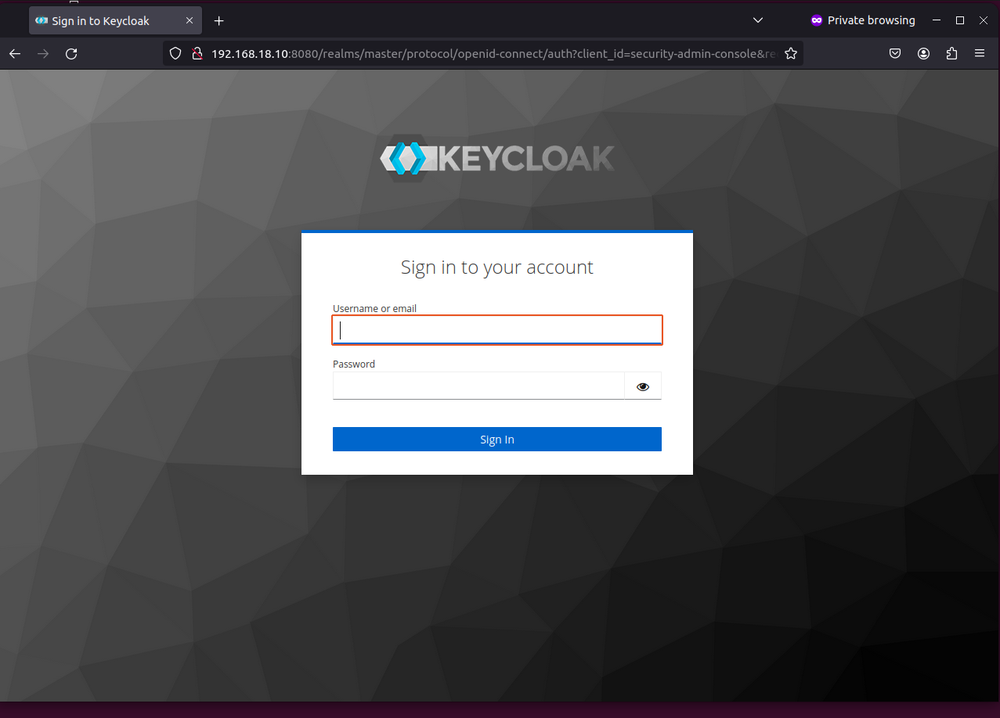

Después de poner las credenciales, accedemos correctamente

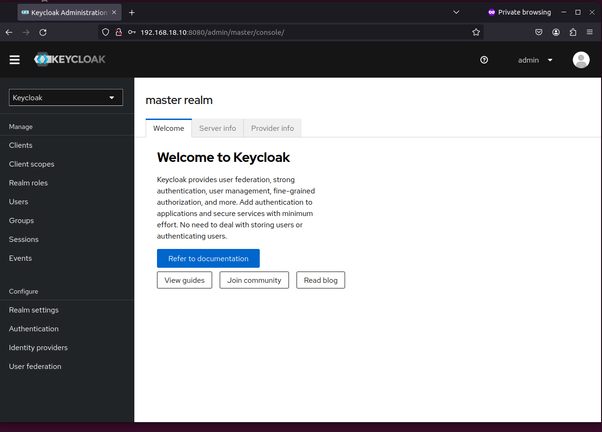

## S1-03 - Configuración de Seguridad IAM - Isard

### 1. ​ Crear Realm

#### a. ​ Configurar Realm

Ejecutamos lo siguiente para instalar los paquetes

Ahora le damos clic en Create Realm

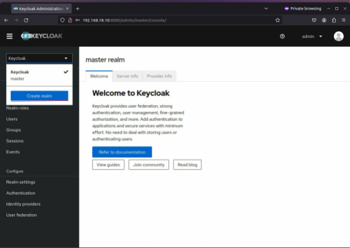

Ahora crearemos el Realm

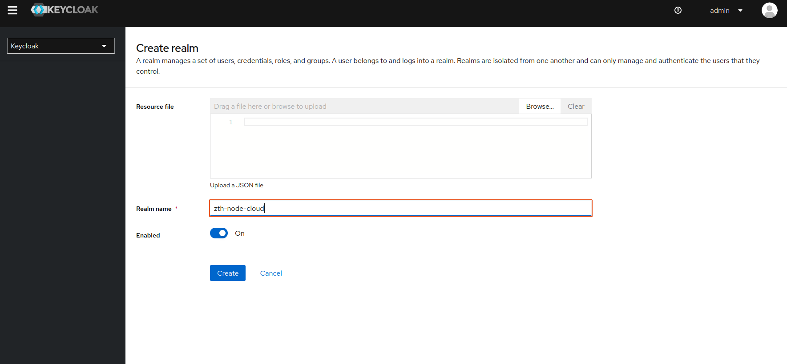

Ya hemos creado el Realm Correctamente

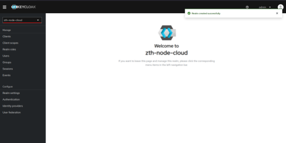

### 2.​ Autenticación multifactor

#### a. ​ Configuración de Autenticación

Desde nuestro Realm, nos vamos al apartado de configure y nos dirigimos donde nos

dice Authentication

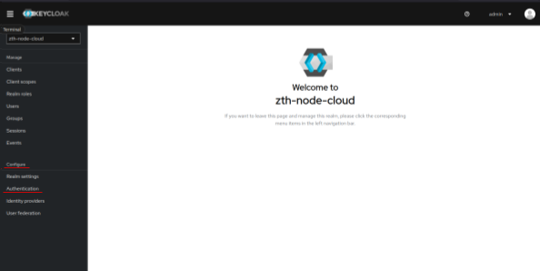

Ahora nos dirigimos donde nos indican Requiere Actions

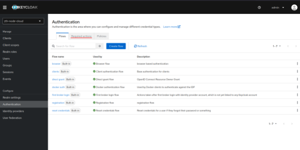

Ahora marcamos la opción de Set as Default Action

Esto lo que hará es que todo usuario nuevo deberá de tener una app para autenticarse

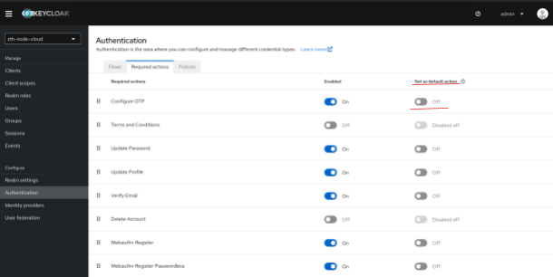

#### b. ​ Políticas de ataques

Ahora deberemos de dirigirnos a donde dice Realm Settings y después a Security

Defense

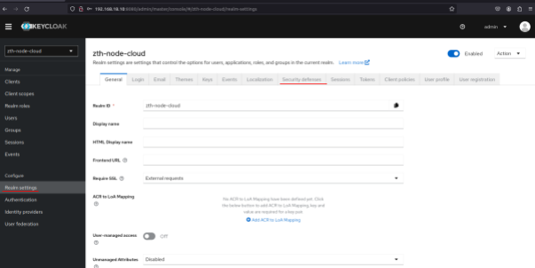

En este caso en el apartado de Brute Force

Elegimos esta última opción porque es la más segura de todas, es la que tiene tolerancia

cero

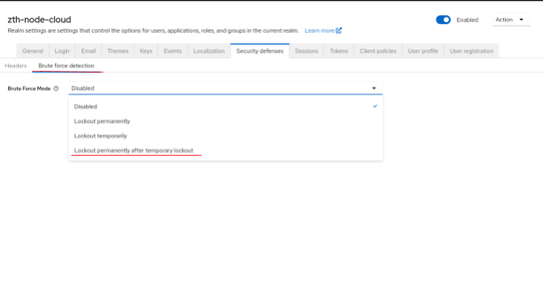

Lo configuraremos de la siguiente manera

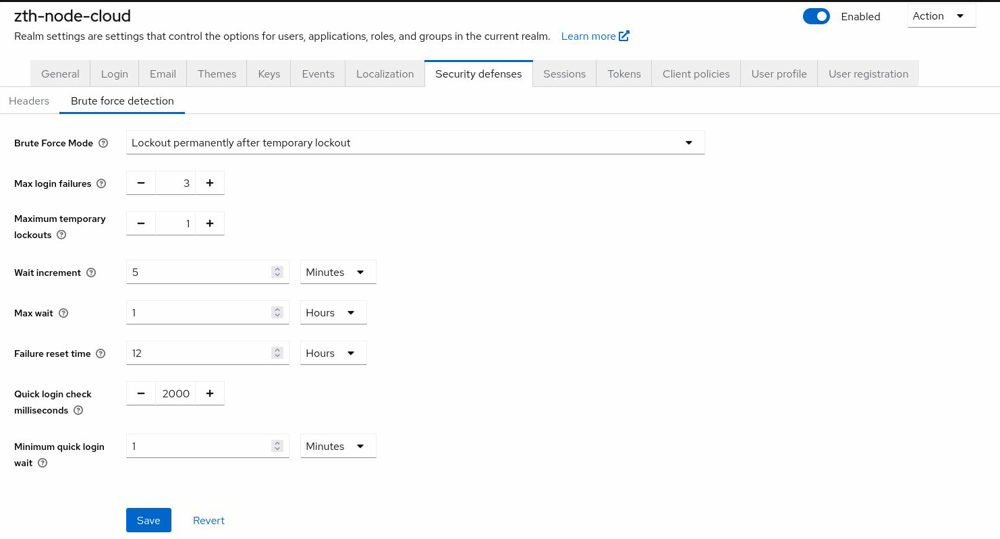

Max login failures  →  Indicamos que si el “usuario” ha fallado 3 veces, el sistema ejecuta

las acciones que hemos configurado a continuación

Maximum temporary lockouts  →  Aquí le decimos que si el “usuario” ya ha fallado 1 vez

y en este segundo intento vuelve a fallar, la cuenta queda bloqueada para siempre y el

unico metodo de desbloqueo es que el administrador, lo haga manualmente

Wait increment  →  Después de haber fallado la 1a vez, no pueden intentarlo al

momento, deberán de esperar unos 5 minutos para volver a intentar

Quick login check  →  Bloqueamos ataque de fuerza bruta o de diccionario, aquí le

indicamos que si han intentado iniciar sesion en menos de 2 segundos son bots o

ataques

Failure reset time  →  Es el tiempo en que quedan registrados los intentos, se quedan

guardados en memoria durante X tiempo, si por ejemplo fallan 1 vez por la mañana y 2

por la tarde se bloquea la cuenta

#### c. ​ Comprobación

SI intentamos acceder y fallamos 3 veces la contraseña

En el panel de administración, vemos que se ha bloqueado temporalmente

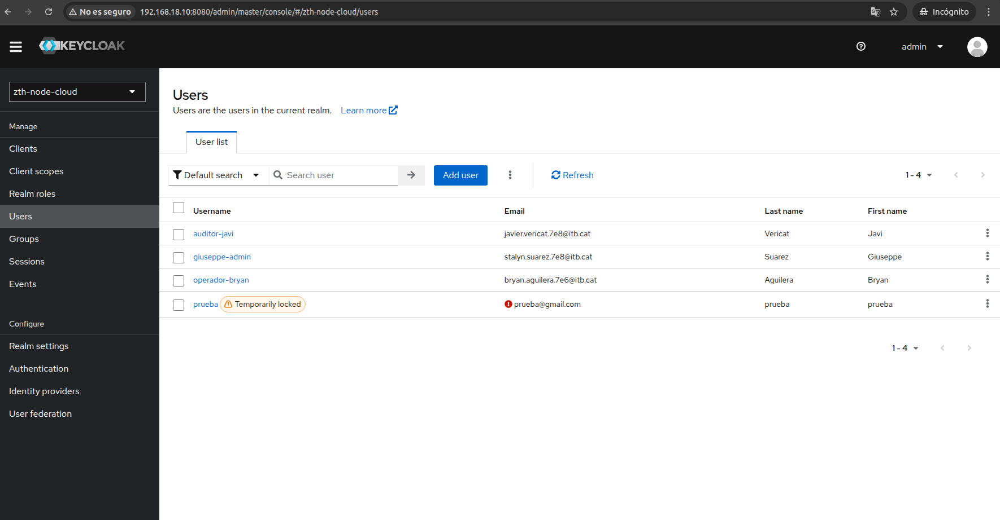

#### d. ​ Políticas de Contraseñas

Nos vamos al apartado de Authentication y nos vamos al apartado de Polices

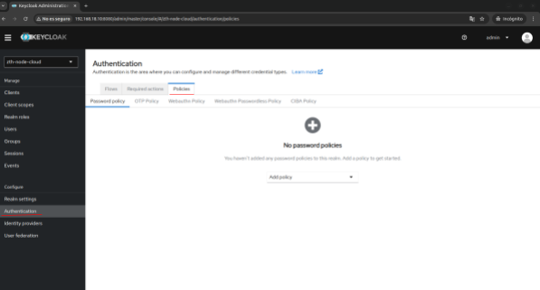

Ahora en el apartado de Add Policy y marcamos las siguientes opciones

1.​ Digit → Obligamos a poner dígito como mínimo

2.​ Not Username →  Evitamos que la contraseña pongan el nombre del usuario

3.​ Lowercase Characters →  Obligatorio poner mayúscula como mínimo

4.​ Uppercase Characters  →  Obligatorio poner mayúscula como mínimo

5.​ Special Characters  → Obligatorio poner un carácter especial

6.​ Minimum Length  → Un mínimo de longitud obligatoria

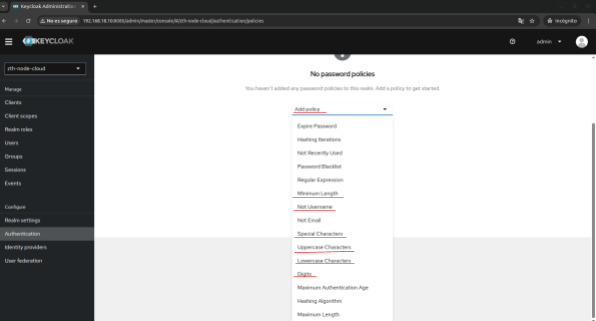

Ahora lo configuramos de la siguiente manera

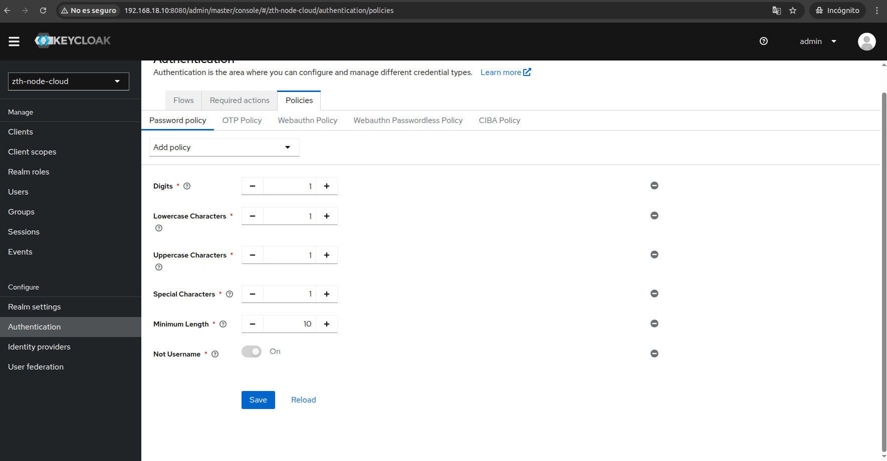

Obligamos a que las contraseñas tengan como mínimo 10 caracteres

#### e. ​ Roles y Grupos

Ahora crearemos los roles estos se hacen desde Realm Roles

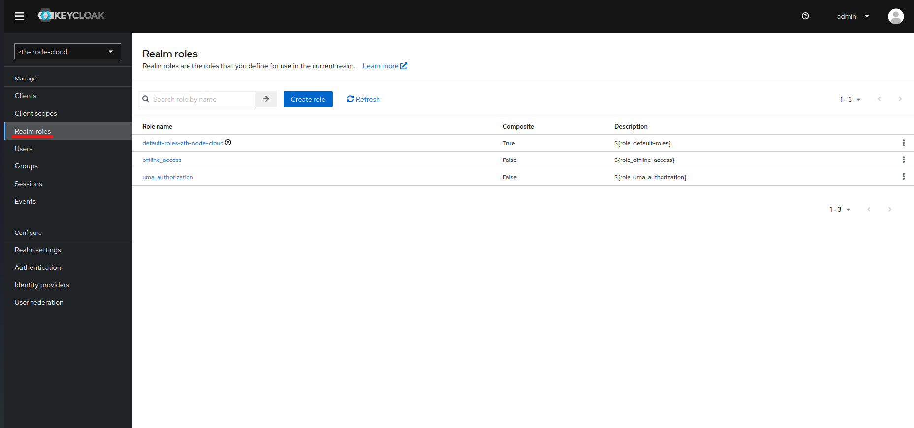

El primer role que crearemos será el de Administrador

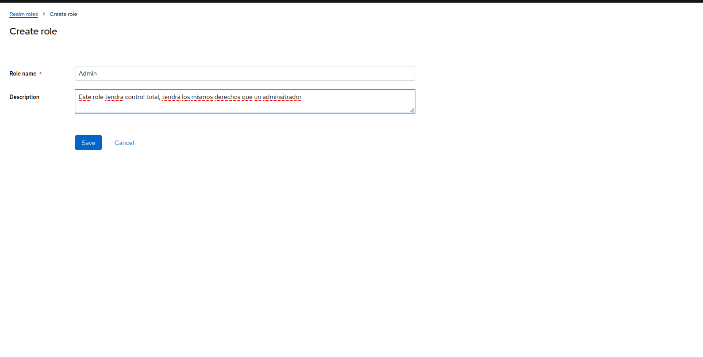

Ahora el otro Role seria de Trabajadores

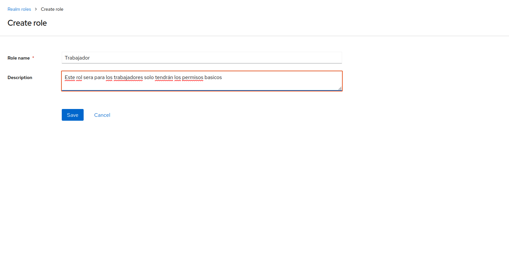

Ahora el otro Role seria de Auditoría

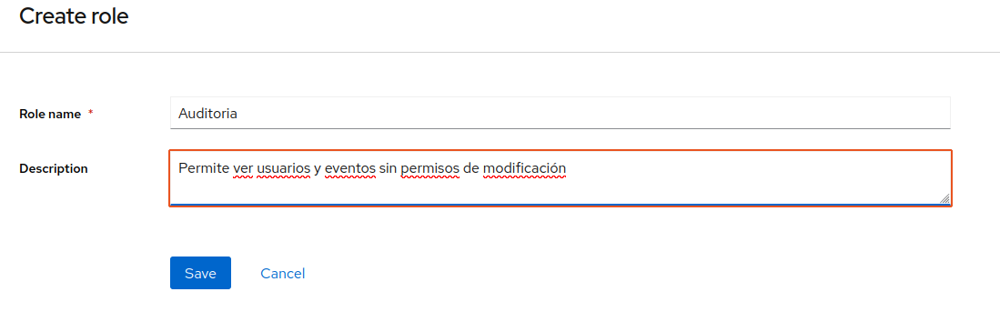

Ahora crearemos también un grupo que sea Administradores

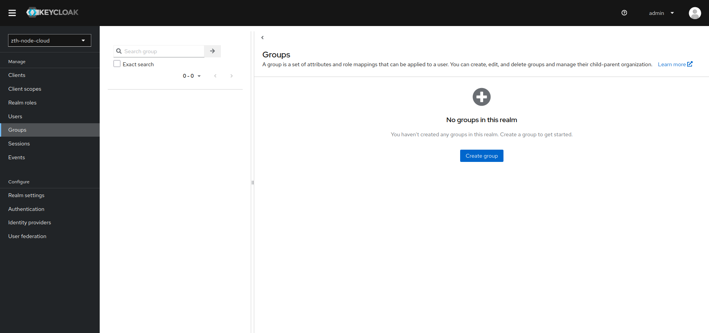

Le asignamos un nombre ​

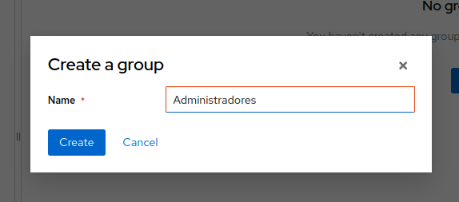

Ahora crearemos el otro grupo como es el de los Trabajadores

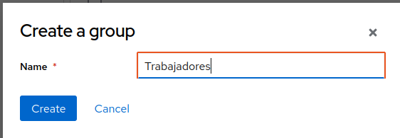

Ahora crearemos el Grupo de Auditoría

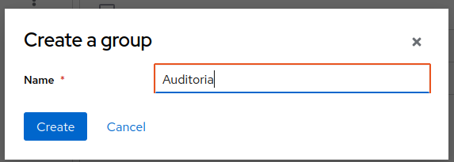

#### f. ​ Usuario

Antes de realizar la comprobación. deberemos de crear un usuario ​

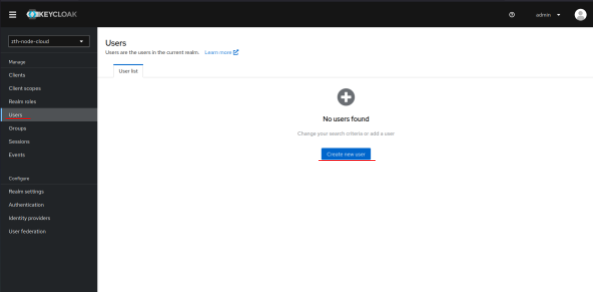

Aquí seleccionamos la opción de Configurar OTP

Esto lo que hará es decir al KeyCloak que este usuario la próxima vez que inicie sesión

deberá de usar una aplicación de OTP para poder iniciar sesión

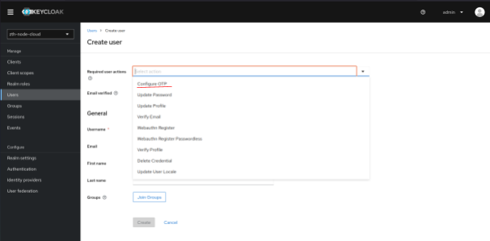

Completamos el formulario

Indicamos que el mail deberá de ser verificado

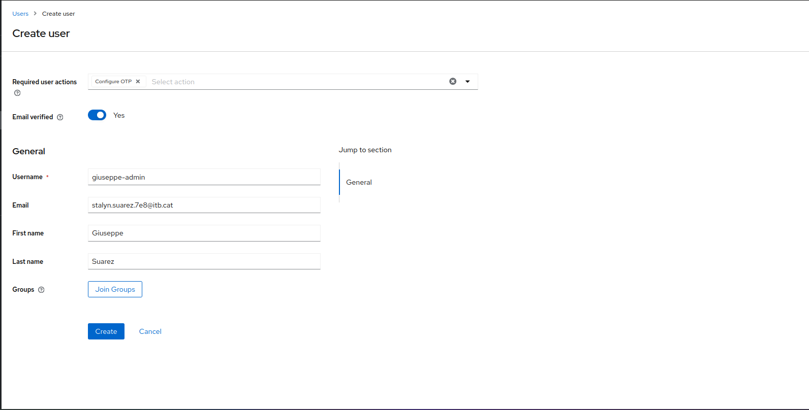

Ahora le asignamos al grupo de Administradores

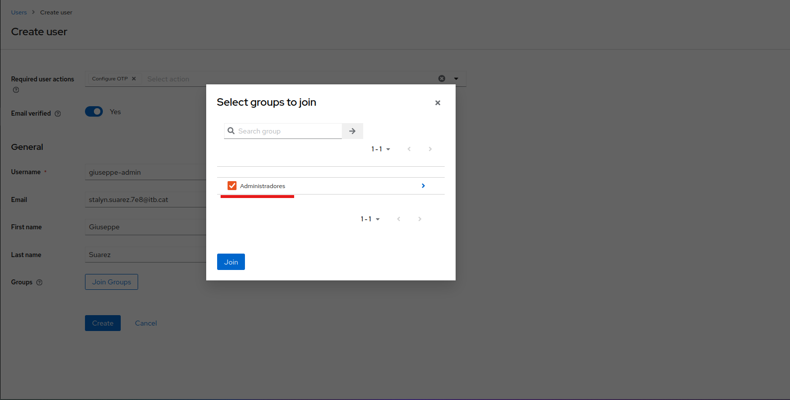

Le asignaremos una contraseña

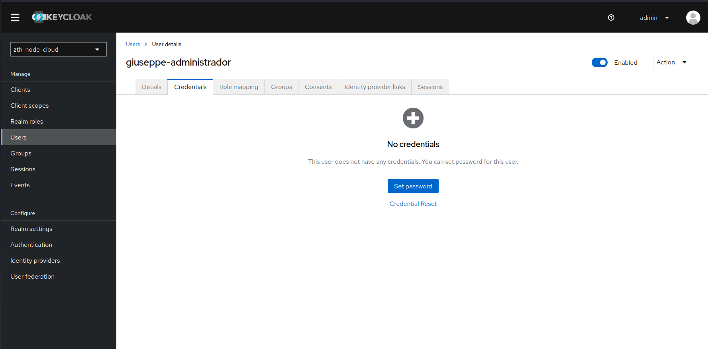

Aquí desactivamos la contraseña temporal para que no la pida cambiar y para que salga

el código QR para de MFA

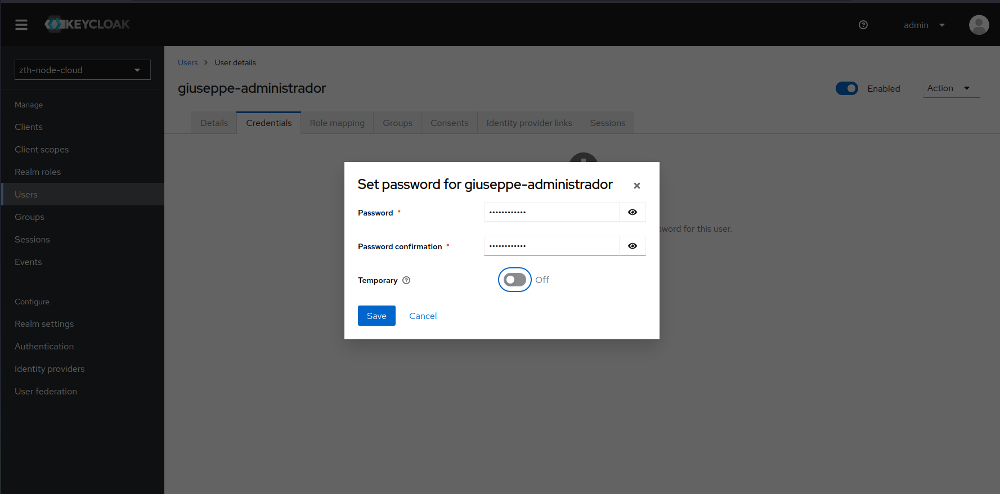

Ahora asignaremos este usuario creado al Rol de Administrador

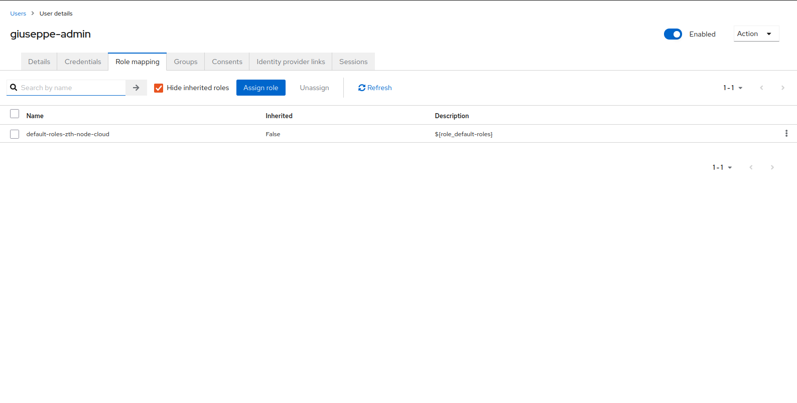

Indicamos que es del rol Administrador y listo ya lo tendríamos

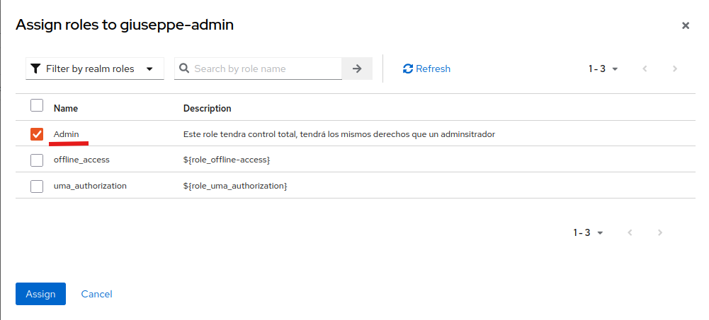

Ahora creamos el usuario Operador, lo asignamos al grupo de Trabajadores

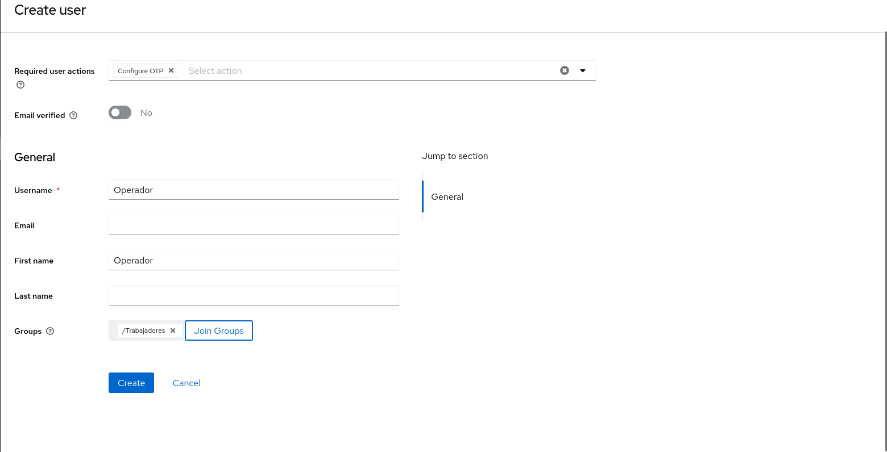

Ahora asignamos una contraseña

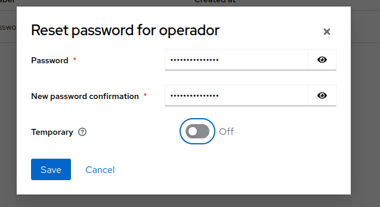

Ahora indicamos el rol que en este caso es Trabajador

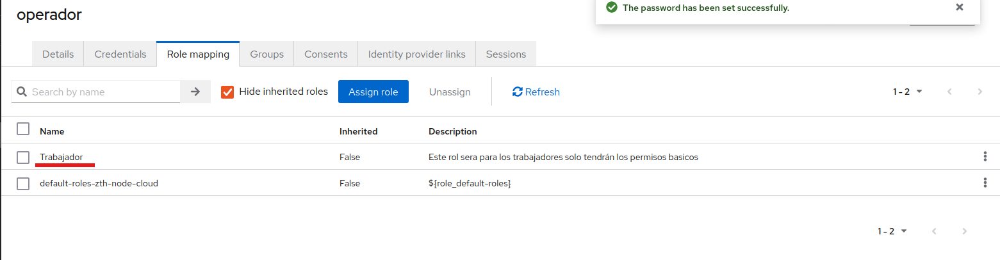

Ahora creamos el usuario de Auditor


Como hemos realizado antes, asignamos una contraseña


Una vez creado, le indicamos el rol que es en este caso de Auditoría


#### g. ​ Comprobacion

giuseppe-admin ​

​

Iniciaremos sesión con el usuario de administrador


Ahora nos aparecerá lo siguiente


Vemos que nos pide instalar una aplicación de autenticación como puede ser Microsoft

Authenticator

Google Authenticator

FreeOT

En nuestro caso lo haríamos con Google Authenticator


Al escanearlo, nos aparecerá que se añadió un nuevo código y que de nombre tiene

zth-node-cloud. Después de poner el código puse desde el dispositivo el cual se hizo en

este caso fue con el S24 Ultra de Giuseppe

Cuando el demos a Submit nos aparecerá lo siguiente


En este apartado podemos ver que tenemos el inicio de sesión, tanto la contraseña y si

queremos cambiarla como MFA que en este caso es desde el dispositivo que hemos

indicado, podemos ver cuando fue y a que hora


operador-bryan ​

​

Ahora iniciaremos sesión con permisos de trabajador


Nos pedirá como antes usar una aplicación de la ya mencionadas


Iniciamos ​


Este usuario al ser solo Trabajador tiene sólo acceso básico


Como puede ser usuarios y eventos

Puede ver los otros usuarios


Y como es un Operador LVL 1 puede añadir usuarios, puede resetear contraseñas o

borrar, siempre y cuando tengan menos privilegios que el


Auditor-Javi

Ahora iniciamos sesión con los permisos de auditor


Nos pedirá el MFA ​


Configuramos


Una vez iniciado sesión ​

Con este usuario podemos ver los roles, pero no crear ni hacer otra operación


Por otro lado también podemos ver los Usuarios


Aunque ponga add user este usuario solo puede ver los campos que existen, porque si

intenta crear aparecerá el siguiente mensaje


Podemos ver grupos y sus miembros


Como auditor, debe de ver los eventos


También los eventos de administradores


## S1-04: Hardening Avanzado del Sistema - Isard

### 1. ​ Fail2Ban

#### a. ​ Instalación del Fail2Ban

Primero de todo realizaremos la instalación

sudo apt install fail2ban -y


#### b. ​ Crear configuración inicial

Creamos un .local para que si hay alguna actualización, que no se nos escriba el archivo

.conf

sudo nano /etc/fail2ban/jail.local

[sshd]

enabled = true

port = 2222

filter = sshd

logpath = /var/log/auth.log

maxretry = 2

findtime = 600

bantime = -1

banaction = ufw

[sshd]  →  Indicamos que esta configuración se aplica al ssh

enabled = true  →  Indicamos que se ejecute

port = 2222  →  Indicamos en qué puerto debe de ejecutarse

filter = sshd  →  Es un filtro para que busque errores como invalid password etc

logpath = /var/log/auth.log  →  Es donde se revisaran los logs

maxretry = 2  →  Número máximo de intentos

findtime = 600  →  Si fallo 2 veces, en menos de 10 min, se ejecuta el baneo

bantime = -1  →  Indicamos que el baneo sea permanente

banaction = ufw  →  Indicamos que lo haga mediante ufw en vez de iptables, cuya ventaja

es que lo bloquea directamente el firewall


#### c. ​ Reiniciamos y comprobamos ​

Ahora vamos a reiniciar el servicio

sudo systemctl restart fail2ban ​


Ahora lo vamos a comprobar

sudo fail2ban-client status sshd


​

#### d. ​ COMPROBACION

Si desde cliente intentó acceder y fallo las contraseñas, nos sale este mensaje


Si accedemos al server y miramos el fail2ban podemos ver que tenemos esta IP

bloqueada


#### ​

Corroboramos que la IP del cliente es la baneada


Para desbanear haremos esto ​


Como podemos ver, tenemos la IP baneada, haremos un unban y la IP que queremos

desbloquear y después de hacer eso, vemos que ya no tenemos la IP baneada

### 2. ​ Actualizaciones Automáticas de Seguridad

#### a. ​ Configurar actualizaciones automáticas

Para minimizar las vulnerabilidades, deberemos de indicar que los “parches” de

seguridad se hagan de manera automática ​

Para ello usaremos el siguiente comando

sudo apt install unattended-upgrades -y sudo dpkg-reconfigure --priority=low

unattended-upgrades

sudo apt install unattended-upgrades -y  →  Es un paquete el cual permite descargar

actualizaciones y aplicarse automáticamente sin necesidad de interacción con el usuario

sudo dpkg-reconfigure  → Aquí le indicamos que queremos reconfigurar el programa X

--priority=low  → Indicamos que nos muestre todas las opciones posibles

unattended-upgrades  → Su función es la de revisar repositorios y si hay un nuevo

“parche” lo descarga y se aplica, busca vulnerabilidades

#### Ejecutamos el siguiente comando

sudo dpkg-reconfigure --priority=low unattended-upgrades

#### b. ​ Comprobacion

Para realizar si se está ejecutando correctamente, ejecutaremos el siguiente comando ​

systemctl status unattended-upgrades


#### c. ​ Configuración de política restrictiva

​

Ahora le indicaremos al firewall que bloquee cualquier paquete siempre y cuando no le

hemos indicado lo contrario

sudo ufw default deny incoming

sudo ufw status verbose


http://192.168.18.10:8080/realms/zth-node-cloud/account

## S1-05: Hardening en el Nodo AWS

### 1. ​ Firewall - AWS

#### a. ​ Reglas

En AWS creamos reglas para el ssh por el puerto 2222


#### Ahora indicamos el puerto de HTTPS para la web


#### Todo lo que no se encuentra aqui sera denegado con DROP

#### b. ​ Dentro de la Instancia

Ahora realizaremos la configuración dentro de la instancia, denegamos todo

sudo ufw default deny incoming

sudo ufw default allow outgoing


Creamos las reglas de SSH con puerto 222, tenemos también HTTPS con 443 y tenemos

también el WireGuard

Para finalizar activamos el Firewall

sudo ufw allow 2222/tcp

sudo ufw allow 8080/tcp

sudo ufw allow 443/tcp

sudo ufw allow 51820/udp

sudo ufw enable


Revisión de las reglas

sudo ufw status verbose


### 2. ​ Fail2Ban

a. ​ Instalación del Fail2Ban

Haremos la actualización, y procederemos a la instalación

sudo apt update && sudo apt install fail2ban -y


#### b. ​ Configuración

Ahora el archivo de configuración, tendríamos lo siguiente

sudo nano /etc/fail2ban/jail.local

[sshd]

enabled = true

port = 2222

filter = sshd

logpath = /var/log/auth.log

maxretry = 3

findtime = 600

bantime = -1

banaction = ufw

ubuntu@zth-node-

sudo cat /etc/fail2ban/jail.local


c. ​ Reiniciamos el servicio y miramos el estado

sudo systemctl restart fail2ban

sudo systemctl status fail2ban


#### d.​COmprobacion

Desde la máquina host fallamos 3 veces la contraseña a propósito


Ahora miramos la IP que tenemos PÚBLICA


Ahora desde el servidor de AWS podemos ver el baneo


### 3. ​ Actualizaciones Automáticas de Seguridad en AWS

#### a. ​ Configurar actualizaciones automáticas

Como hemos realizado antes en ISARD, configuraremos para que se hagan las

actualizaciones automáticas

Instalaremos el paquete inicialmente

sudo apt update && sudo apt install unattended-upgrades -y


Ejecutamos el siguiente comando

sudo dpkg-reconfigure --priority=low unattended-upgrades


#### b. ​ Comprobacion

Para realizar si se está ejecutando correctamente, ejecutaremos el siguiente comando ​

systemctl status unattended-upgrades


---

## Recomendaciones Adicionales

Para fortalecer aun mas la infraestructura, se sugieren las siguientes implementaciones:

1. **Auditoria de Logs:** Monitorizar activamente /var/log/fail2ban.log para identificar patrones de ataque recurrentes.
2. **Hardening de Kernel (sysctl):** Configurar /etc/sysctl.conf para deshabilitar IP forwarding (si no es necesario) y proteger contra ataques de ICMP redirects.
3. **Limpieza de Servicios:** Deshabilitar cualquier servicio innecesario que este en escucha (ss -tunlp).
4. **Permisos de Archivos:** Verificar que los archivos sensibles de configuracion (como /etc/ssh/sshd_config) tengan permisos restrictivos (600).

---
**Resultado Final:** La infraestructura cuenta ahora con multiples capas de seguridad, desde el acceso a nivel de red (Firewall) hasta la gestion de identidades (IAM/MFA) y la respuesta automatica ante ataques (Fail2Ban).
