# Hardening Inicial y Despliegue de Infraestructura

Este documento detalla los pasos realizados para el endurecimiento (hardening) inicial y el despliegue de infraestructura utilizando Docker, Keycloak, SSH hardening, IAM y Fail2Ban, tanto en el nodo local (Isard) como en AWS.

## Índice

1. [S1-01: Despliegue de Infraestructura (Docker + Keycloak)](#s1-01-despliegue-de-infraestructura-docker--keycloak)
2. [S1-02: Hardening Inicial (SSH Hardening)](#s1-02-hardening-inicial-ssh-hardening)
3. [S1-03: Configuración de Seguridad IAM - Isard](#s1-03-configuración-de-seguridad-iam---isard)
4. [S1-04: Actualizaciones Automáticas de Seguridad (ISARD)](#s1-04-actualizaciones-automáticas-de-seguridad-isard)
5. [S1-05: Hardening en el Nodo AWS](#s1-05-hardening-en-el-nodo-aws)
6. [S1-06: Actualizaciones Automáticas de Seguridad en AWS](#s1-06-actualizaciones-automáticas-de-seguridad-en-aws)

---

## S1-01: Despliegue de Infraestructura (Docker + Keycloak)

### 1. Instalación de Docker y Docker Compose
Para comenzar, realizamos la instalación de Docker y Docker Compose en nuestro servidor.

```bash
sudo apt update
sudo apt install docker.io docker-compose -y
```

Añadimos nuestro usuario al grupo docker para poder ejecutar comandos sin sudo:
```bash
sudo usermod -aG docker $USER
```

### 2. Configuración de Docker Compose
Creamos un directorio para nuestro despliegue y configuramos el archivo `docker-compose.yml`.

```bash
mkdir -p ~/zth-node-cloud/keycloak
cd ~/zth-node-cloud/keycloak
sudo nano docker-compose.yml
```

**Contenido del `docker-compose.yml`:**
```yaml
version: '3.8'

services:
  zth-postgres:
    image: postgres:16
    container_name: zth-keycloak-db
    restart: always  # <-- Esto hace que el contenedor se reinicie solo si el server falla
    volumes:
      - zth_db_data:/var/lib/postgresql/data  # <-- PERSISTENCIA AQUÍ
    environment:
      POSTGRES_DB: keycloak
      POSTGRES_USER: keycloak
      POSTGRES_PASSWORD: K3yl0ack_ZTH-db
    networks:
      - zth-network

  zth-keycloak:
    image: quay.io/keycloak/keycloak:24.0
    container_name: zth-keycloak-server
    command: start-dev
    restart: always  # <-- Persistencia de disponibilidad
    environment:
      KC_DB: postgres
      KC_DB_URL: jdbc:postgresql://zth-postgres:5432/keycloak
      KC_DB_USERNAME: keycloak
      KC_DB_PASSWORD: K3yl0ack_ZTH-db
      KEYCLOAK_ADMIN: admin
      KEYCLOAK_ADMIN_PASSWORD: K3yl0ack-ZTH_
      KC_HTTP_ENABLED: "true"
      KC_PROXY: edge
    ports:
      - "8080:8080"
    depends_on:
      - zth-postgres
    networks:
      - zth-network

networks:
  zth-network:
    driver: bridge

# Definición de los volúmenes persistentes
volumes:
  zth_db_data:  # Docker gestionará este espacio en /var/lib/docker/volumes/
```

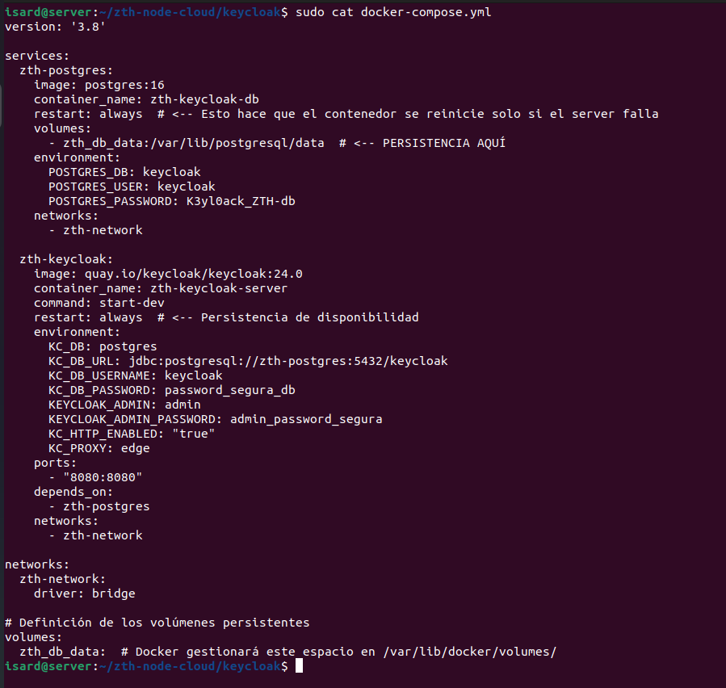

### 3. Reglas de Firewall
Para acceder a Keycloak, abrimos el puerto 8080 en el firewall UFW:

```bash
sudo ufw allow 8080/tcp
```
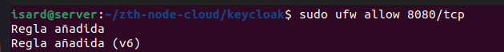

### 4. Comprobación
Accedemos mediante la IP del servidor en el puerto 8080.

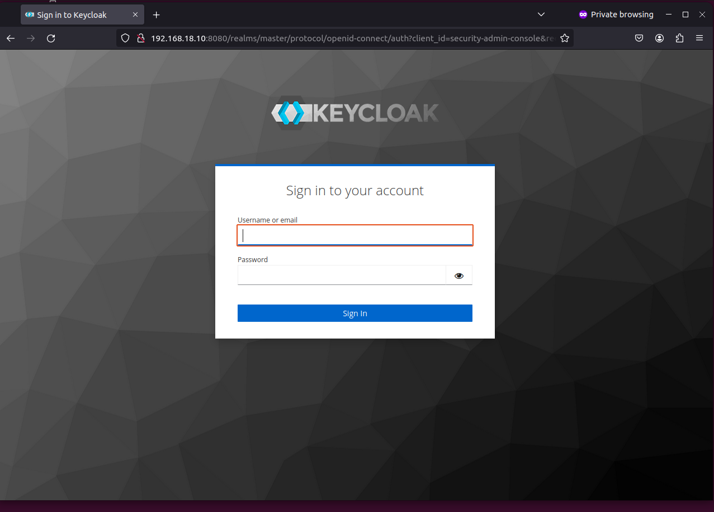
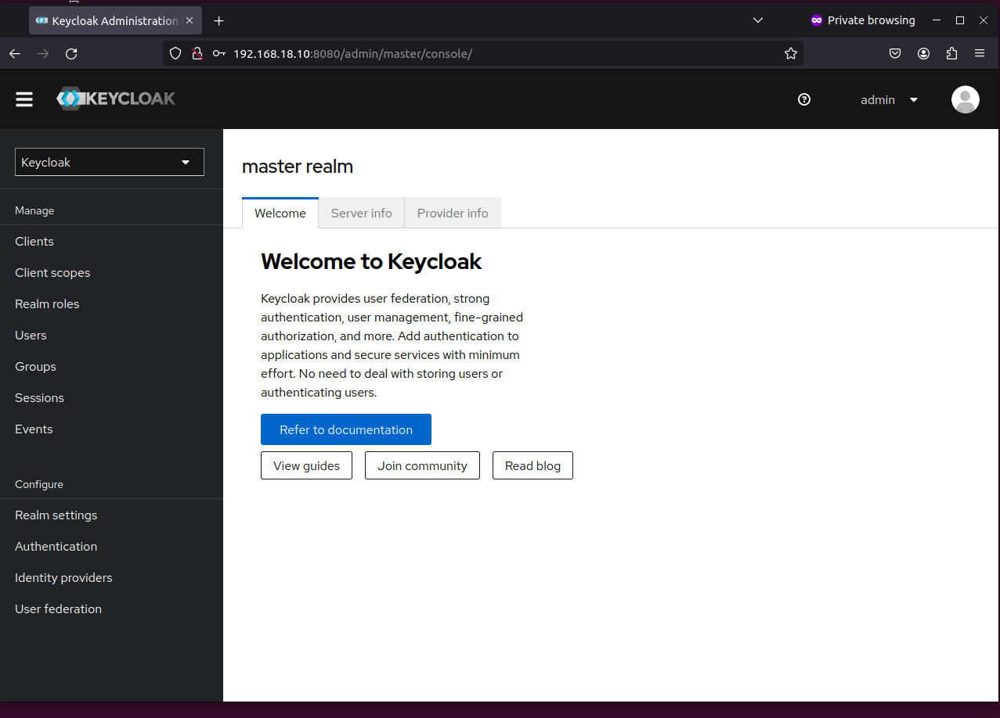

---

## S1-02: Hardening Inicial (SSH Hardening)

### 1. Gestión de Claves
Generamos un par de claves SSH usando el algoritmo ed25519 para mayor seguridad.

```bash
ssh-keygen -t ed25519 -C "giuseppe-access"
```

Copiamos la clave pública al servidor:
```bash
ssh-copy-id -i ~/.ssh/id_ed25519.pub isard@192.168.18.10
```

### 2. Configuración del Servidor SSH
Modificamos el archivo `/etc/ssh/sshd_config` para aumentar la seguridad:

```bash
sudo nano /etc/ssh/sshd_config
```

Cambios realizados:
- Cambiar el puerto por defecto (ej. 2222).
- Deshabilitar el login de root: `PermitRootLogin no`.
- Deshabilitar la autenticación por contraseña: `PasswordAuthentication no`.

### 3. Reglas de Firewall para SSH
Permitimos el nuevo puerto SSH en UFW:

```bash
sudo ufw allow 2222/tcp
```

---

## S1-03: Configuración de Seguridad IAM - Isard

### 1. Crear y Configurar Realm
Creamos un nuevo Realm llamado `zth-node-cloud`.

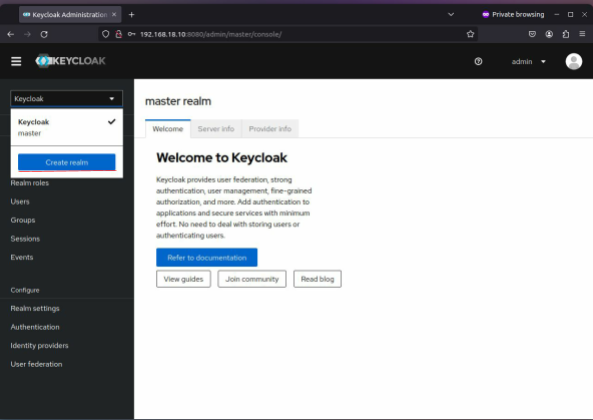
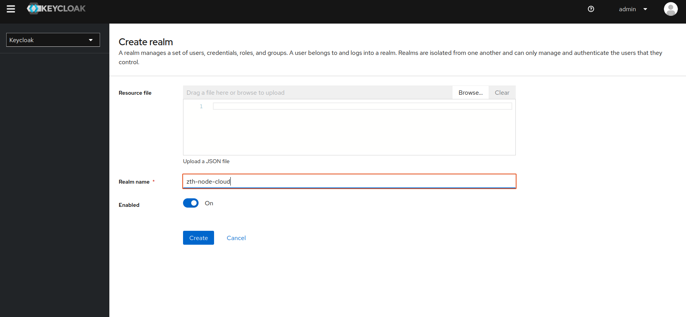
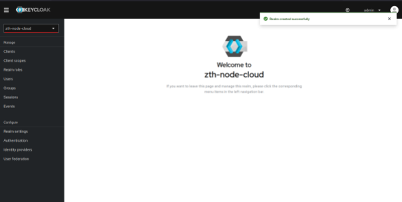

### 2. Autenticación Multifactor (MFA)
Configuramos MFA como obligatorio para todos los usuarios.

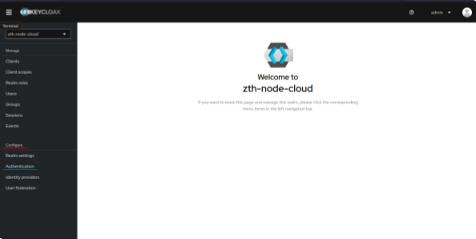
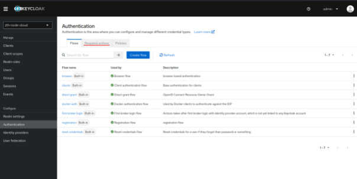
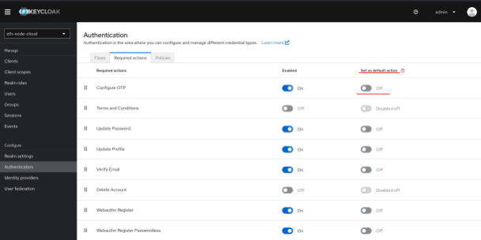

### 3. Políticas contra Ataques de Fuerza Bruta
Configuramos la defensa contra ataques de fuerza bruta en `Realm Settings` -> `Security Defense`.

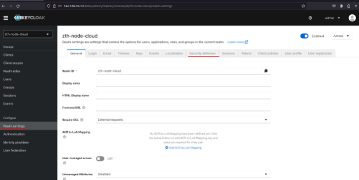
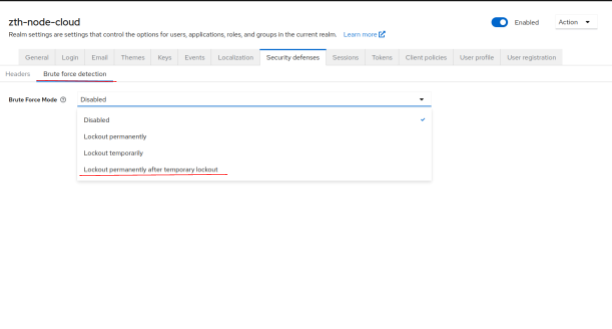
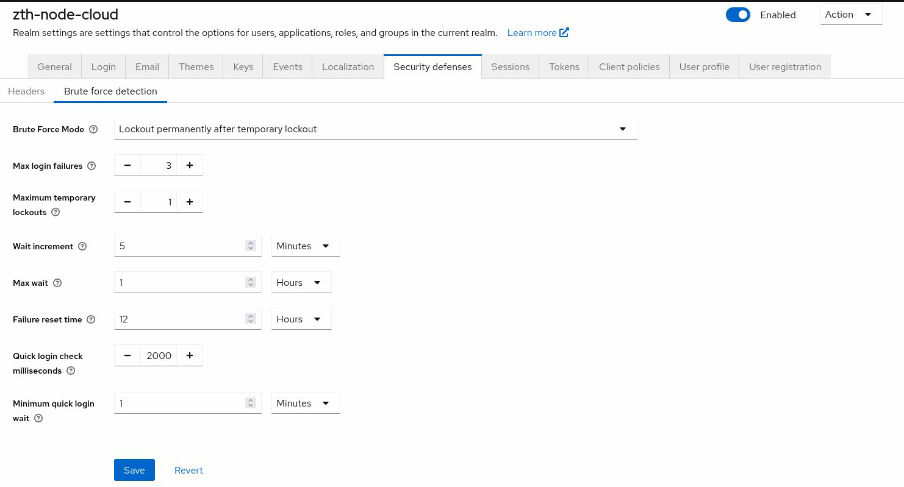

### 4. Políticas de Contraseña
Establecemos requisitos mínimos para las contraseñas.

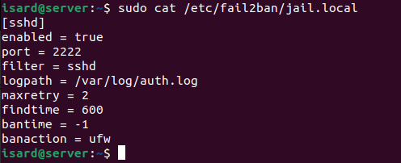

### 5. Gestión de Usuarios y Roles
Creamos roles, grupos y usuarios para el control de acceso.

- **Roles:** `operador-role`, `auditor-role`.
- **Usuarios:** `operador-bryan`, `auditor-Javi`.

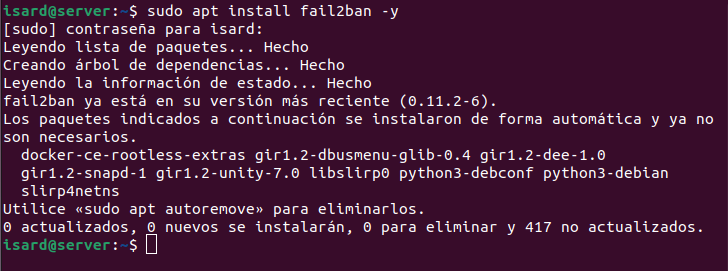
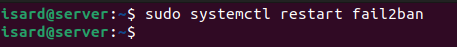
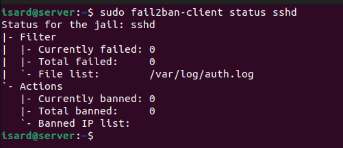

---

## S1-04: Actualizaciones Automáticas de Seguridad (ISARD)

### 1. Configurar Actualizaciones Automáticas
Instalamos y configuramos el paquete `unattended-upgrades`.

```bash
sudo apt install unattended-upgrades -y
sudo dpkg-reconfigure --priority=low unattended-upgrades
```
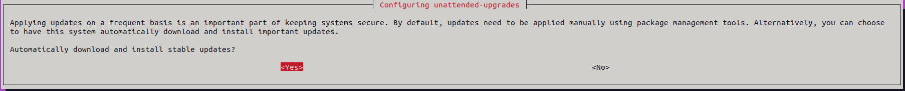

Comprobamos el estado del servicio:
```bash
systemctl status unattended-upgrades
```
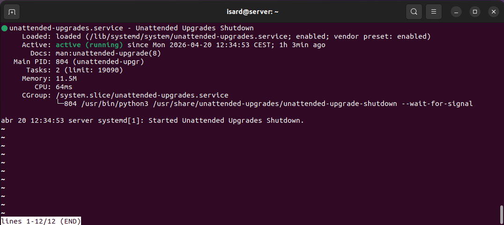

### 2. Configuración de Política Restrictiva
Establecemos una política por defecto de denegar todo el tráfico entrante.

```bash
sudo ufw default deny incoming
sudo ufw status verbose
```
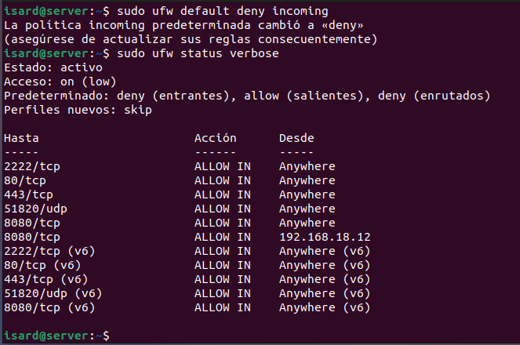

Enlace de acceso a la cuenta de Keycloak: [Account Console](http://192.168.18.10:8080/realms/zth-node-cloud/account)

---

## S1-05: Hardening en el Nodo AWS

### 1. Firewall - AWS (Security Groups)
Configuramos las reglas de entrada en AWS para permitir:
- SSH por el puerto 2222.
- HTTPS por el puerto 443.


Todo lo que no esté permitido explícitamente será denegado (DROP).

### 2. Configuración dentro de la Instancia (UFW)
Denegamos todo el tráfico entrante y permitimos el saliente por defecto.

```bash
sudo ufw default deny incoming
sudo ufw default allow outgoing
```
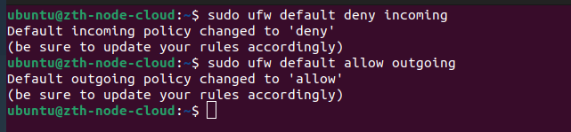

Abrimos los puertos necesarios y activamos el firewall:
```bash
sudo ufw allow 2222/tcp
sudo ufw allow 8080/tcp
sudo ufw allow 443/tcp
sudo ufw allow 51820/udp
sudo ufw enable
```
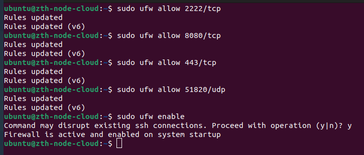

Revisamos las reglas:
```bash
sudo ufw status verbose
```
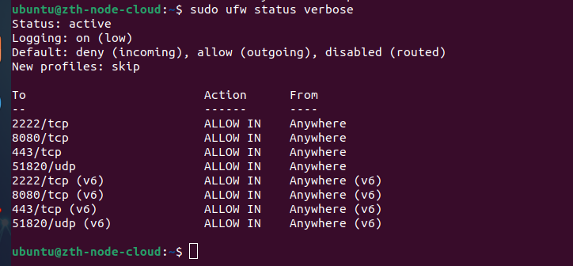

### 3. Fail2Ban en AWS
Instalamos y configuramos Fail2Ban para proteger el acceso SSH.

```bash
sudo apt update && sudo apt install fail2ban -y
```
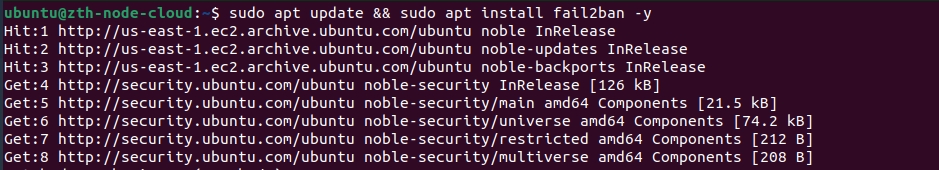

Configuramos el archivo `/etc/fail2ban/jail.local`:
```bash
sudo nano /etc/fail2ban/jail.local
```

**Configuración sugerida:**
```ini
[sshd]
enabled = true
port = 2222
filter = sshd
logpath = /var/log/auth.log
maxretry = 3
findtime = 600
bantime = -1
banaction = ufw
```

Verificamos el archivo:
```bash
sudo cat /etc/fail2ban/jail.local
```
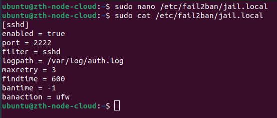

Reiniciamos el servicio y comprobamos el estado:
```bash
sudo systemctl restart fail2ban
sudo systemctl status fail2ban
```
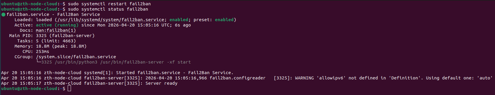

### 4. Comprobación de Fail2Ban
Simulamos ataques fallando la contraseña 3 veces desde una máquina host.

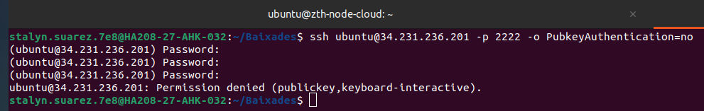
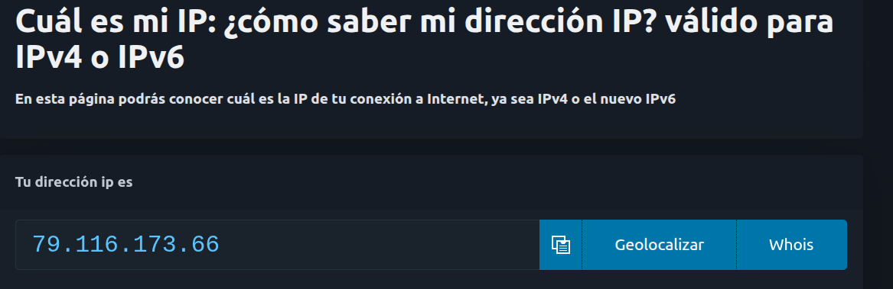

En el servidor de AWS podemos ver el baneo:
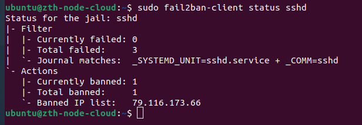

Si intentamos acceder de nuevo, veremos el bloqueo:
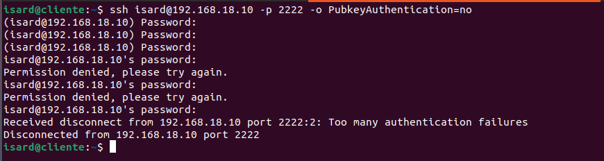
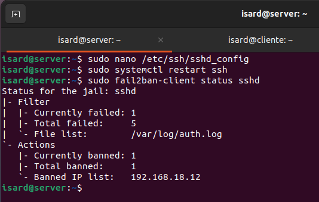
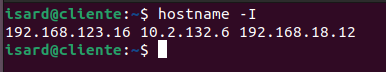

Para desbanear la IP:
```bash
sudo fail2ban-client set sshd unbanip <IP_A_DESBLOQUEAR>
```
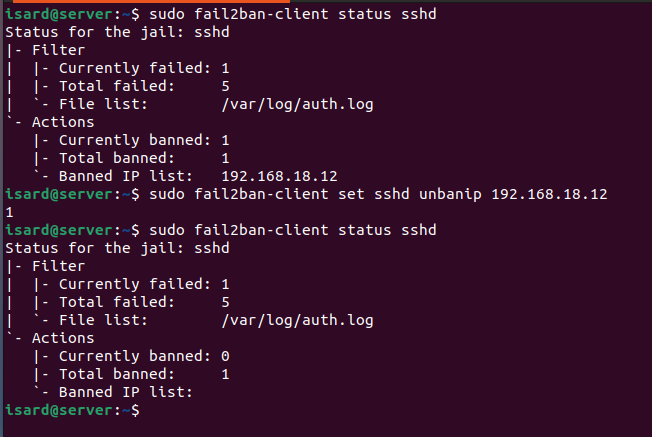

---

## S1-06: Actualizaciones Automáticas de Seguridad en AWS

Realizamos el mismo proceso que en Isard para asegurar actualizaciones automáticas.

```bash
sudo apt update && sudo apt install unattended-upgrades -y
```
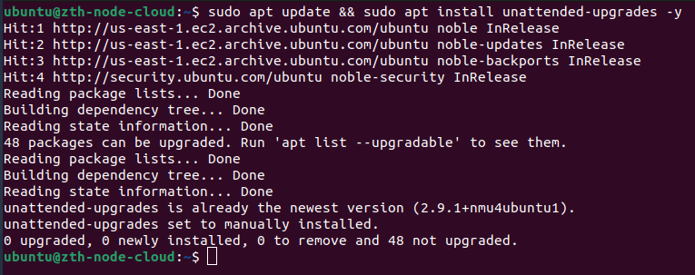

Configuramos:
```bash
sudo dpkg-reconfigure --priority=low unattended-upgrades
```


Comprobamos:
```bash
systemctl status unattended-upgrades
```
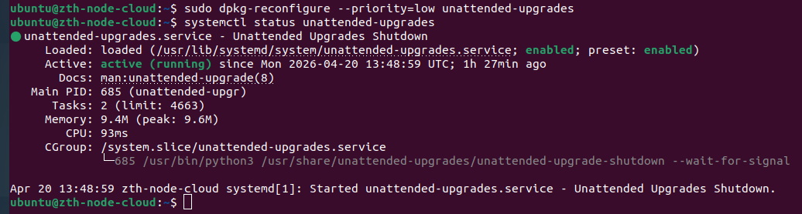
