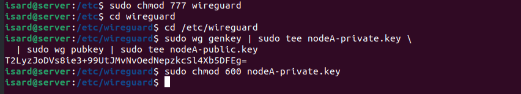
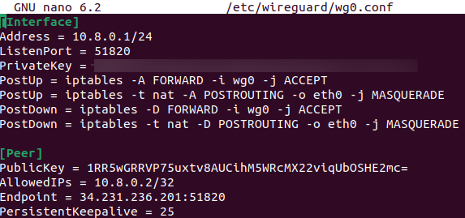
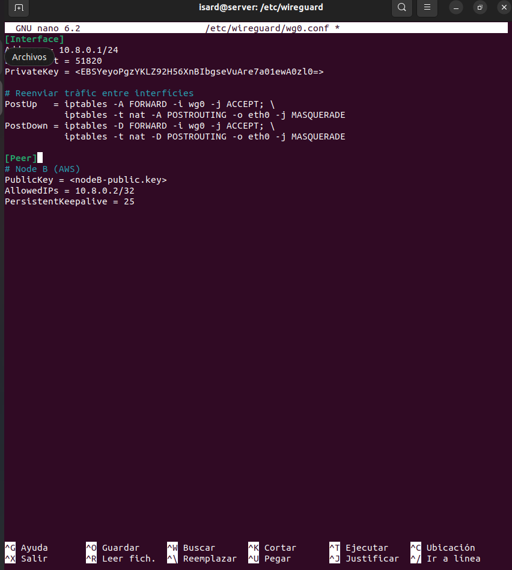

# Guía de Instalación y Configuración de WireGuard

Esta documentación detalla el proceso de instalación y configuración de WireGuard para establecer una Red Privada Virtual (VPN) punto a punto, permitiendo una comunicación segura entre un servidor local (Nodo A) y otros nodos (como AWS).

## Índice
1. [Instalación de WireGuard](#1-instalación-de-wireguard)
2. [Generación de Llaves](#2-generación-de-llaves)
3. [Configuración del Servidor (wg0.conf)](#3-configuración-del-servidor-wg0conf)
4. [Configuración del Peer (Nodo B)](#4-configuración-del-peer-nodo-b)
5. [Gestión del Servicio](#5-gestión-del-servicio)

---

## 1. Instalación de WireGuard

Para comenzar, instalamos las herramientas necesarias de WireGuard en el sistema:

```bash
sudo apt update
sudo apt install wireguard -y
```


## 2. Generación de Llaves

WireGuard utiliza criptografía de llave pública. Es necesario generar una llave privada y una pública para el servidor:

```bash
# Generar llave privada y pública
wg genkey | tee privatekey | wg pubkey > publickey
```



## 3. Configuración del Servidor (wg0.conf)

El archivo de configuración principal se encuentra en `/etc/wireguard/wg0.conf`.

### Parámetros de Interfaz:
- **Address:** `10.8.0.1/24`. Define la IP privada del servidor dentro de la VPN.
- **ListenPort:** `51820`. Puerto UDP estándar para el tráficos de WireGuard.
- **PostUp / PostDown:** Utiliza comandos de `iptables` para habilitar el reenvío de tráficos (forwarding) y el enmascaramiento de red (MASQUERADE), permitiendo que el tráficos de la VPN salga hacia internet a través de la interfaz física (ej. `eth0` o `enp1s0`).

```ini
[Interface]
PrivateKey = <TU_LLAVE_PRIVADA_AQUÍ>
Address = 10.8.0.1/24
ListenPort = 51820
PostUp = iptables -A FORWARD -i %i -j ACCEPT; iptables -t nat -A POSTROUTING -o eth0 -j MASQUERADE
PostDown = iptables -D FORWARD -i %i -j ACCEPT; iptables -t nat -D POSTROUTING -o eth0 -j MASQUERADE
```



## 4. Configuración del Peer (Nodo B)

Para permitir que otro dispositivo se conecte, debemos añadirlo como "Peer".

- **AllowedIPs:** `10.8.0.2/32`. Especifica qué dirección IP interna tiene permitido comunicarse a través del túnel.
- **PersistentKeepalive:** `25`. Envía un paquete cada 25 segundos para mantener el túnel abierto a través de firewalls o NAT.

```ini
[Peer]
PublicKey = <LLAVE_PUBLICA_DEL_NODO_B>
AllowedIPs = 10.8.0.2/32
PersistentKeepalive = 25
```



## 5. Gestión del Servicio

Una vez configurado, podemos levantar la interfaz y habilitarla para que inicie con el sistema:

```bash
# Levantar la interfaz wg0
sudo wg-quick up wg0

# Comprobar el estado
sudo wg show

# Habilitar al inicio del sistema
sudo systemctl enable wg-quick@wg0
```
