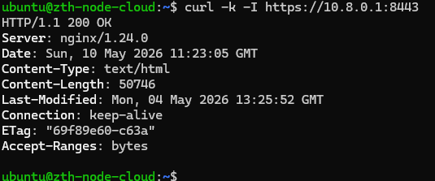
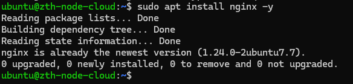
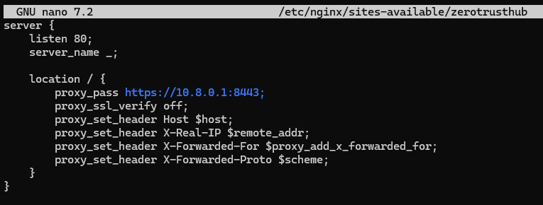
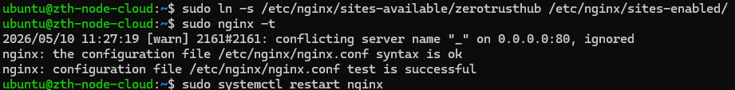
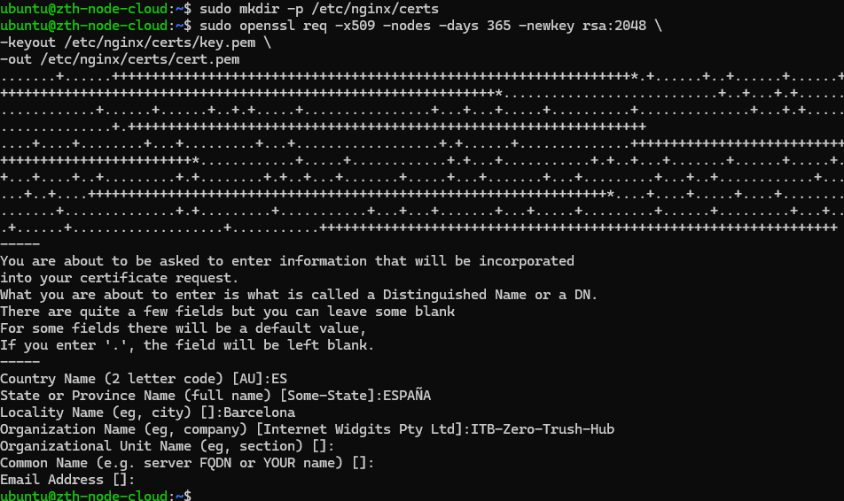
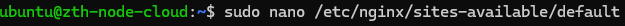
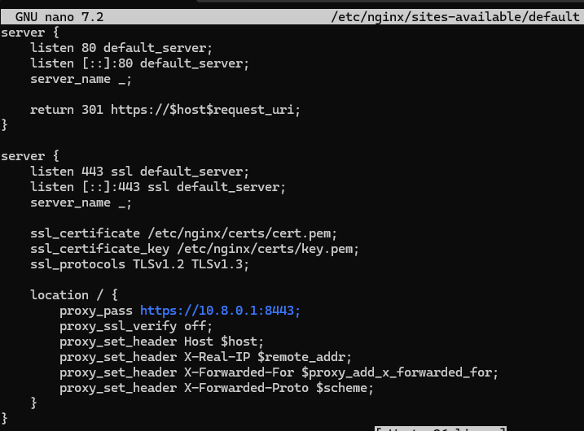
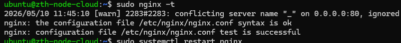
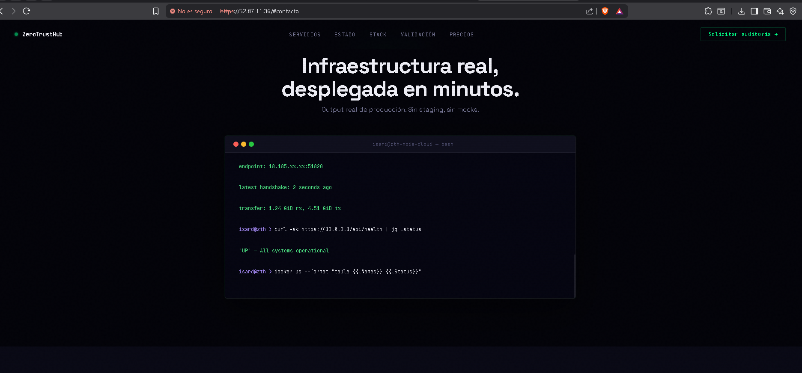

# Configuración de Nginx para que sea visible desde el exterior

## 1) Contexto (por qué no se publica desde el nodo local)

No se pudo publicar la web directamente desde el nodo local porque, aunque el servidor disponía de IP pública de salida y los puertos 80 y 8443 aparecían abiertos desde el exterior, el acceso mediante esa IP devolvía un error 502 Bad Gateway en lugar de mostrar la página real.

Tras las comprobaciones, se verificó que Nginx en el nodo local funcionaba correctamente en local y servía la web sin problemas. Esto indica que el problema estaba en la capa externa de publicación/encaminamiento de la infraestructura de Isard (un elemento intermedio entre Internet y la VM) que impedía que las peticiones llegaran correctamente al servicio.

Por este motivo, se descartó la exposición directa desde el nodo local y se optó por publicar la web a través del nodo cloud en AWS, usando AWS como punto de acceso público y reenviando el tráfico al nodo local mediante el túnel WireGuard.

## 2) Comprobar acceso al servicio del nodo local desde AWS (vía WireGuard)

Primero se comprueba que desde el nodo cloud (AWS) se puede acceder a la web del nodo local por la IP de WireGuard.

```bash
curl -k -I https://10.8.0.1:8443
```



## 3) Instalar Nginx en AWS

Se instala Nginx en el nodo cloud para usarlo como proxy inverso público.

```bash
sudo apt update && sudo apt install nginx -y
```



## 4) Crear configuración del sitio (proxy hacia el nodo local por WireGuard)

Se abre un nuevo fichero de configuración del sitio:

```bash
sudo nano /etc/nginx/sites-available/zerotrusthub
```


Se añade una configuración mínima para reenviar las peticiones hacia el nodo local mediante la IP de WireGuard:

```nginx
server {
  listen 80;
  server_name _;

  location / {
    proxy_pass https://10.8.0.1:8443;
    proxy_ssl_verify off;
    proxy_set_header Host $host;
    proxy_set_header X-Real-IP $remote_addr;
    proxy_set_header X-Forwarded-For $proxy_add_x_forwarded_for;
    proxy_set_header X-Forwarded-Proto $scheme;
  }
}
```



## 5) Activar configuración y reiniciar Nginx

Se habilita el sitio, se valida la sintaxis y se reinicia el servicio para aplicar cambios:

```bash
sudo ln -s /etc/nginx/sites-available/zerotrusthub /etc/nginx/sites-enabled/ && sudo nginx -t && sudo systemctl restart nginx
```



## 6) Crear certificados SSL en AWS (self-signed)

Se crea la carpeta para los certificados y se genera un certificado autofirmado:

```bash
sudo mkdir -p /etc/nginx/certs && sudo openssl req -x509 -nodes -days 365 -newkey rsa:2048 \
  -keyout /etc/nginx/certs/key.pem \
  -out /etc/nginx/certs/cert.pem
```



## 7) Configurar Nginx (AWS) como proxy inverso con redirección HTTP→HTTPS

Se abre el fichero por defecto para que el nodo cloud deje de servir la página por defecto y pase a actuar como proxy inverso:

```bash
sudo nano /etc/nginx/sites-available/default
```



Se configura:
- Puerto 80: redirección automática a HTTPS.
- Puerto 443: SSL con el certificado generado y proxy hacia el nodo local (10.8.0.1:8443).

```nginx
server {
  listen 80 default_server;
  listen [::]:80 default_server;
  server_name _;

  return 301 https://$host$request_uri;
}

server {
  listen 443 ssl default_server;
  listen [::]:443 ssl default_server;
  server_name _;

  ssl_certificate /etc/nginx/certs/cert.pem;
  ssl_certificate_key /etc/nginx/certs/key.pem;
  ssl_protocols TLSv1.2 TLSv1.3;

  location / {
    proxy_pass https://10.8.0.1:8443;
    proxy_ssl_verify off;
    proxy_set_header Host $host;
    proxy_set_header X-Real-IP $remote_addr;
    proxy_set_header X-Forwarded-For $proxy_add_x_forwarded_for;
    proxy_set_header X-Forwarded-Proto $scheme;
  }
}
```



## 8) Validar sintaxis y reiniciar Nginx

Se valida la configuración y se reinicia el servicio:

```bash
sudo nginx -t && sudo systemctl restart nginx
```



## 9) Acceso desde el exterior

Finalmente se comprueba que la redirección funciona correctamente desde cualquier equipo accediendo al nodo AWS:

```text
https://52.87.11.36/
```



