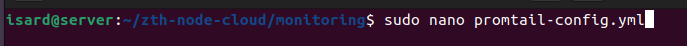
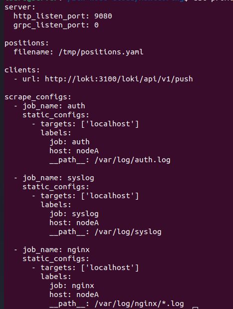
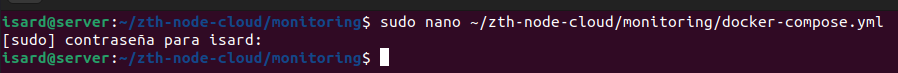
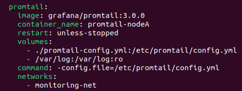
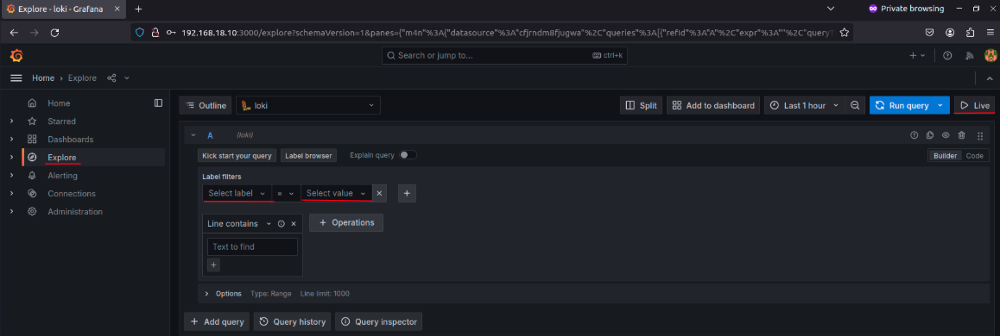
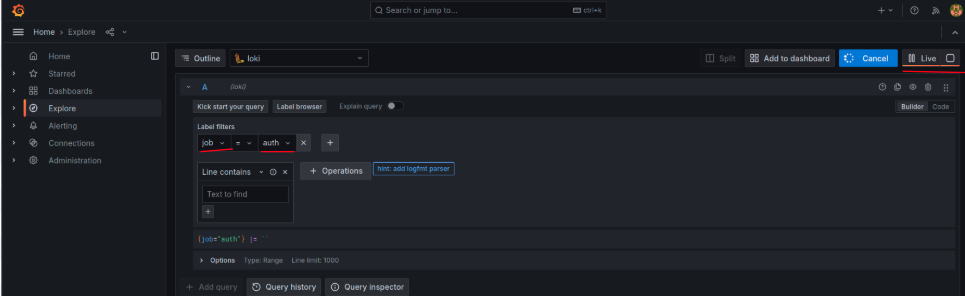
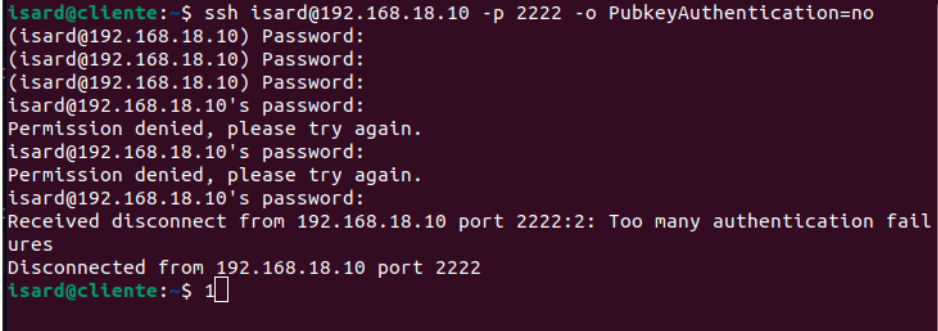
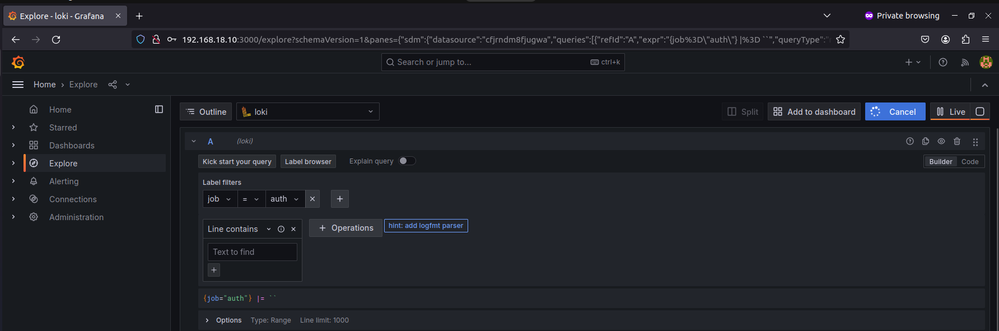
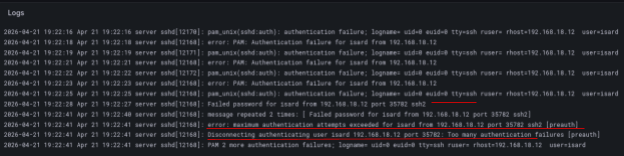
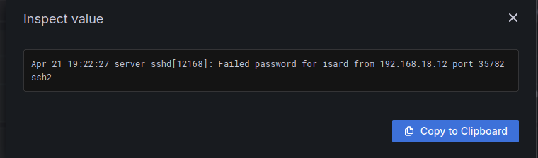

# **Configuración de Promtail en Entorno Isard**


# **Índice**
- [1. Despliegue del Agente de Logs (Promtail)](#1-despliegue-del-agente-de-logs-promtail)
  - [1.1 Crear configuración de Promtail](#11-crear-configuración-de-promtail)
  - [1.2 Despliegue mediante Docker Compose](#12-despliegue-mediante-docker-compose)
- [2. Monitorización y Pruebas de Funcionamiento](#2-monitorización-y-pruebas-de-funcionamiento)
  - [2.1 Verificación del despliegue del contenedor](#21-verificación-del-despliegue-del-contenedor)
  - [2.2 Pruebas de inyección de logs en tiempo real](#22-pruebas-de-inyección-de-logs-en-tiempo-real)

---

## **1. Despliegue del Agente de Logs (Promtail)**

### **1.1 Crear configuración de Promtail**

   Promtail es el agente encargado de leer los logs generados en el nodo y enviarlos (upload) hacia el servidor central de **Loki**.

   Para comenzar, crearemos el archivo de configuración:

```bash
sudo nano promtail-config.yml
```

   

   El contenido del archivo será el siguiente:

```yaml
server:
  http_listen_port: 9080
  grpc_listen_port: 0

positions:
  filename: /tmp/positions.yaml

clients:
  - url: http://loki:3100/loki/api/v1/push

scrape_configs:
  - job_name: auth
    static_configs:
      - targets: ['localhost']
        labels:
          job: auth
          host: nodeA
          __path__: /var/log/auth.log

  - job_name: syslog
    static_configs:
      - targets: ['localhost']
        labels:
          job: syslog
          host: nodeA
          __path__: /var/log/syslog

  - job_name: nginx
    static_configs:
      - targets: ['localhost']
        labels:
          job: nginx
          host: nodeA
          __path__: /var/log/nginx/*.log
```

   

   **Detalles de la configuración:**
   - **Etiquetas (Labels)**: Se han definido etiquetas específicas (`job` y `host`) para cada fuente de logs.
   - **Filtrado en Grafana**: Esto permite filtrar rápidamente en Grafana si los logs provienen del servidor Web (**Nginx**), de autenticación (**auth.log**) o del sistema general (**syslog**).

### **1.2 Despliegue mediante Docker Compose**

   Una vez creado el archivo de configuración, lo incluiremos en nuestro despliegue de Docker:

```bash
sudo nano docker-compose.yml
```

   

   Añadiremos el servicio de **Promtail**:

```yaml
promtail:
  image: grafana/promtail:3.0.0
  container_name: promtail-nodeA
  restart: unless-stopped
  volumes:
    - ./promtail-config.yml:/etc/promtail/config.yml
    - /var/log:/var/log:ro
  command: -config.file=/etc/promtail/config.yml
  networks:
    - monitoring-net
```

   

---

## **2. Monitorización y Pruebas de Funcionamiento**

### **2.1 Verificación del despliegue del contenedor**

   Ejecutamos los contenedores para iniciar los servicios:

```bash
docker compose up -d
```

   

   Verificamos que el contenedor de Promtail esté corriendo correctamente.

   

  Esto debería de quedar tal que así

  

Ahora lo que hacemos es un ssh desde nuestro cliente hacia el servidor y fallamos la contraseña aposta

Así generamos logs y podemos ver estos como aparecen al instante los logs

  


### **2.2 Pruebas de inyección de logs en tiempo real**

   Para comprobar el flujo de logs, nos dirigimos al apartado de **Explore** en Grafana:

   1. En **Select Label**, seleccionamos la opción `job`.
   2. En **Select Value**, seleccionamos la opción `auth`.
   3. Hacemos clic en el botón **Live** para ver los logs en tiempo real.

   

   Para generar actividad, realizamos un intento de conexión SSH desde un cliente hacia el servidor y fallamos la contraseña a propósito:

```bash
ssh isard@192.168.18.10 -p 2222 -o PubkeyAuthentication=no
```

   

   Al instante, podemos observar cómo aparecen los logs de error en el panel de Grafana:

   

   **Análisis del evento:**
   Si inspeccionamos uno de los logs, podemos ver de forma detallada la información del evento:
   - **Usuario**: El nombre de usuario que intentó la conexión.
   - **IP de origen**: La dirección desde donde se realizó el intento.
   - **Puerto**: El puerto configurado (2222).
   - **Motivo**: El motivo del fallo de autenticación.

   
