# **Configuración de Promtail en Instancia AWS**

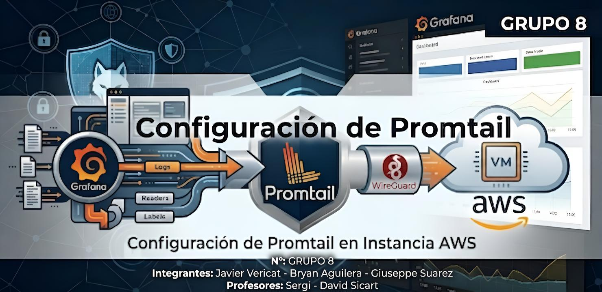

**N°:** GRUPO 8  
**Integrantes:** Javier Vericat - Bryan Aguilera - Giuseppe Suarez  
**Profesores:** Sergi - David Sicart

# **Índice**
- [1. Preparativos](#1-preparativos)
  - [1.1 Descargar e instalar Promtail](#11-descargar-e-instalar-promtail)
  - [1.2 Paquetes y Unzip](#12-paquetes-y-unzip)
- [2. Promtail en AWS](#2-promtail-en-aws)
  - [2.1 Creacion y configuracion de carpetas y archivos](#21-creacion-y-configuracion-de-carpetas-y-archivos)
  - [2.2 Ejecución al Iniciar Instancia](#22-ejecución-al-iniciar-instancia)
  - [2.3 Activación](#23-activación)
  - [2.4 Verificacion](#24-verificacion)

---

## **1. Preparativos**

### **1.1 Descargar e instalar Promtail**

   Se descarga el binario oficial de Promtail desde el repositorio de lanzamientos de Grafana Loki:

```bash
wget https://github.com/grafana/loki/releases/download/v3.0.0/promtail-linux-amd64.zip
```

   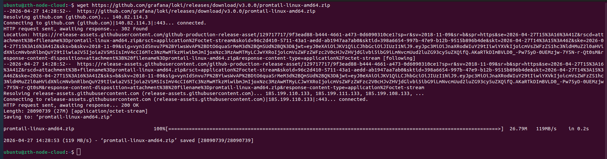

### **1.2 Paquetes y Unzip**

   Actualizamos los paquetes e instalamos la herramienta necesaria para descomprimir archivos ZIP:

```bash
sudo apt update && sudo apt install unzip -y
```

   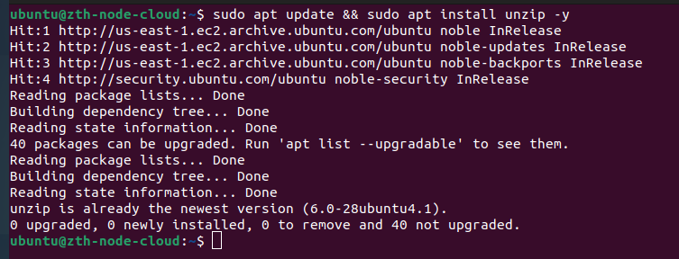

   Descomprimimos el archivo y movemos el binario a la ruta de ejecución del sistema:

```bash
unzip promtail-linux-amd64.zip
sudo mv promtail-linux-amd64 /usr/local/bin/promtail
```
   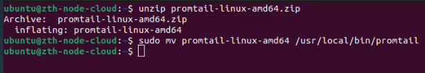

---

## **2. Promtail en AWS**

### **2.1 Creacion y configuracion de carpetas y archivos**

   Creamos el directorio de configuración y el archivo YAML correspondiente:

```bash
sudo mkdir -p /etc/promtail
sudo nano /etc/promtail/config.yml
```

   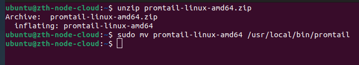

   El contenido del archivo `config.yml` será el siguiente:

```yaml
server:
  http_listen_port: 9080
  grpc_listen_port: 0

positions:
  filename: /tmp/positions.yaml

clients:
  - url: http://10.8.0.1:3100/loki/api/v1/push

scrape_configs:
  - job_name: system
    static_configs:
    - targets:
        - localhost
      labels:
        job: system_logs
        host: zth-node-cloud
        __path__: /var/log/{syslog,auth.log}

  - job_name: nginx
    static_configs:
    - targets:
        - localhost
      labels:
        job: nginx
        host: zth-node-cloud
        __path__: /var/log/nginx/*.log

  - job_name: wireguard
    static_configs:
    - targets:
        - localhost
      labels:
        job: wireguard
        host: zth-node-cloud
        __path__: /var/log/wireguard/*.log
```

   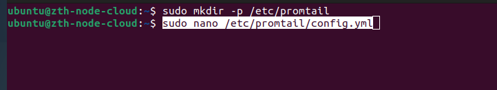

   **Nota de Seguridad:** Se ha configurado la URL del cliente apuntando a la IP de la VPN (`10.8.0.1`), garantizando que los logs viajen de forma segura a través del túnel **WireGuard** hacia el servidor central de Loki.

   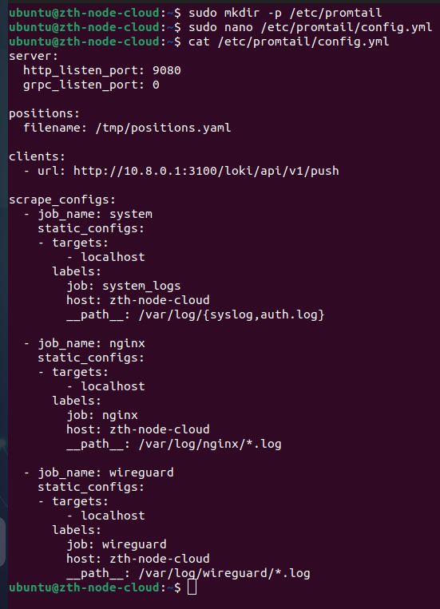

### **2.2 Ejecución al Iniciar Instancia**

   Para garantizar la alta disponibilidad, creamos un archivo de unidad en **Systemd** para que el servicio se inicie automáticamente:

```bash
sudo nano /etc/systemd/system/promtail.service
```

   El contenido del servicio es:

```ini
[Unit]
Description=Promtail service
After=network.target

[Service]
Type=simple
User=root
ExecStart=/usr/local/bin/promtail -config.file=/etc/promtail/config.yml
Restart=on-failure

[Install]
WantedBy=multi-user.target
```

   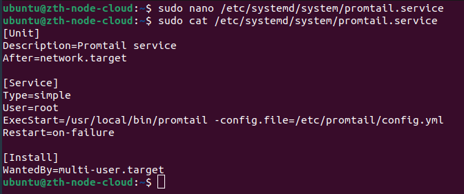

### **2.3 Activación**

   Realizamos la activación del servicio con los siguientes comandos:

```bash
sudo systemctl daemon-reload
sudo systemctl enable promtail
sudo systemctl start promtail
```

   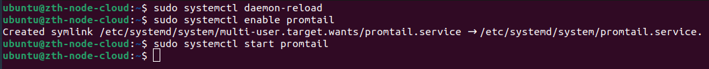

   - **daemon-reload**: Informa al sistema de la creación del nuevo fichero.
   - **enable**: Configura el inicio automático al encender la instancia.
   - **start**: Inicia el envío de logs a Loki.

### **2.4 Verificacion**

   Para validar la conexión, enviamos un log de prueba desde la instancia de AWS:

```bash
sudo logger "PROBANDO GRAFANA: CONEXIÓN OK"
```

   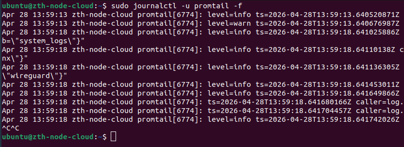

   Verificamos en el panel de **Grafana** que los logs se reciben correctamente:

   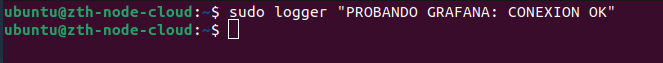

   Y confirmamos el estado del servicio:

   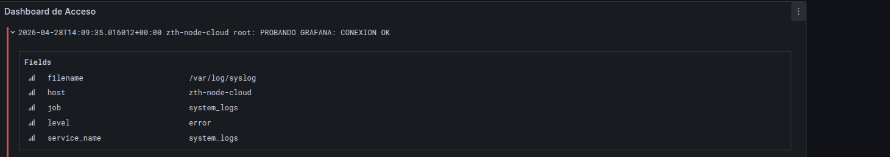
