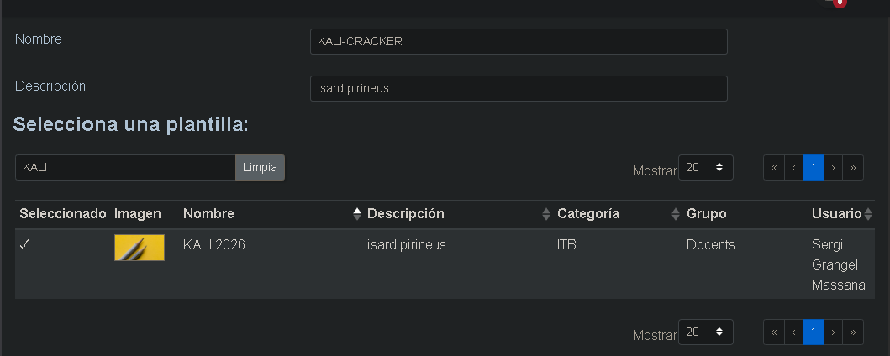
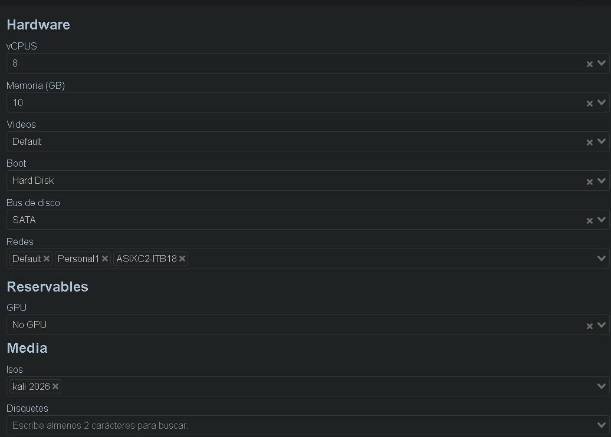
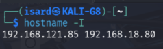
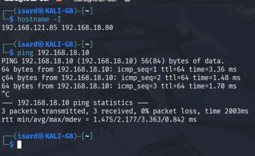
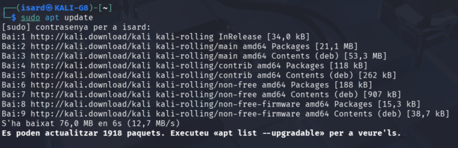
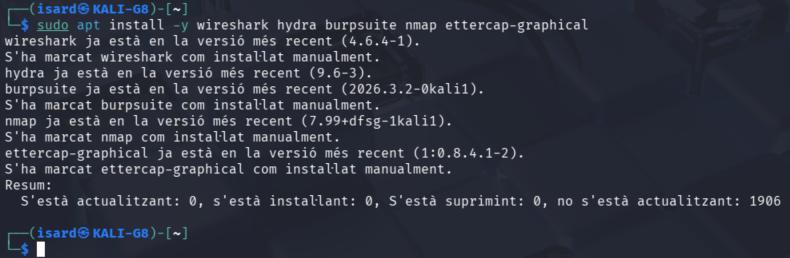
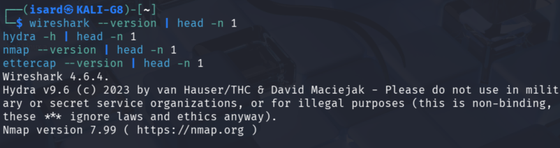
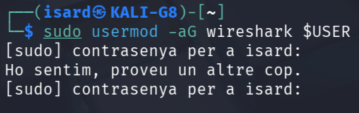

# Creación del KALI, instalación de herramientas de pentesting

## 1) Crear la VM de Kali en Isard

Se selecciona la imagen de Kali y se asigna un nombre a la máquina.
Paso en interfaz gráfica (Isard): seleccionar imagen de Kali y definir nombre de la VM




## 2) Asignar parámetros de hardware

Se configuran los recursos de la VM (CPU/RAM/disco) según las necesidades de las prácticas.
Paso en interfaz gráfica (Isard): configurar CPU, RAM y disco de la VM




## 3) Verificar conectividad de red (Default e ITB18)

Se comprueba que la VM obtiene IP en ambas redes (la red por defecto y la red de laboratorio).

```bash
ip a
```



## 4) Comprobar conectividad con el nodo local (ping)

Se lanza un ping desde Kali hacia el nodo local para verificar la comunicación en la red de prácticas.

```bash
ping -c 4 <IP_NODO_LOCAL>
```



## 5) Actualizar paquetes del sistema

Se actualiza el índice de paquetes y se aplica la actualización del sistema para partir de un entorno actualizado.

```bash
sudo apt update && sudo apt full-upgrade -y
```



## 6) Instalar herramientas de pentesting

Se instalan las herramientas base usadas en las pruebas: Wireshark, Hydra, Burp Suite, Nmap y Ettercap.

```bash
sudo apt install -y wireshark hydra burpsuite nmap ettercap-graphical
```



## 7) Comprobar versiones instaladas

Se verifican las versiones para confirmar que las herramientas quedaron instaladas correctamente.

```bash
wireshark --version
hydra -h
burpsuite --version
nmap --version
ettercap -V
```



## 8) Añadir usuario al grupo de Wireshark

Para poder capturar tráfico sin ejecutar Wireshark como root, se añade el usuario al grupo `wireshark`.

```bash
sudo usermod -aG wireshark $USER
newgrp wireshark
```



