# **Infraestructura de Monitorización y Observabilidad (Loki & Grafana)**

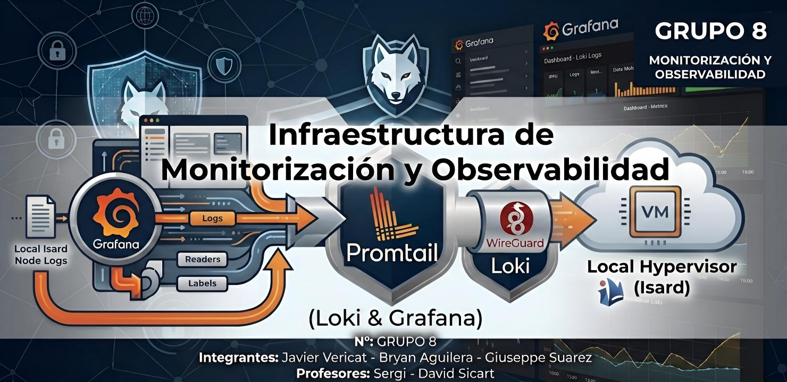

**N°:** GRUPO 8  
**Integrantes:** Javier Vericat - Bryan Aguilera - Giuseppe Suarez  
**Profesores:** Sergi - David Sicart

# **Índice**
- [1. Gestion de Directorios](#1-gestion-de-directorios)
- [2. Docker Compose](#2-docker-compose)
  - [2.1 Configuración](#21-configuración)
  - [2.2 Ejecución](#22-ejecución)
  - [2.3 Firewall](#23-firewall)
  - [2.4 Comprobación de acceso](#24-comprobación-de-acceso)
  - [2.5 Configuración de Loki Web](#25-configuración-de-loki-web)
  - [2.6 Comprobaciones de LOGS](#26-comprobaciones-de-logs)

---

## **1. Gestion de Directorios**

   Crearemos un directorio donde tendremos los archivos de monitoreo:

```bash
mkdir -p ~/zth-node-cloud/monitoring
```
   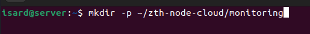

   Accedemos al directorio:

```bash
cd ~/zth-node-cloud/monitoring
```
   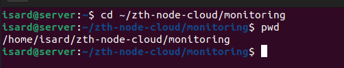

---

## **2. Docker Compose**

### **2.1 Configuración**

   Crearemos un archivo `.yml`, donde estarán los contenedores para que se enciendan juntos.

   Primero crearemos la configuración de nuestro servicio de **Loki**:

```bash
sudo nano loki-config.yml
```
   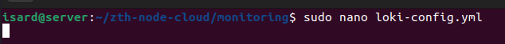

   Y contendría lo siguiente:

```yaml
auth_enabled: false

server:
  http_listen_port: 3100

common:
  path_prefix: /loki
  storage:
    filesystem:
      chunks_directory: /loki/chunks
      rules_directory: /loki/rules
  replication_factor: 1
  ring:
    kvstore:
      store: inmemory

schema_config:
  configs:
    - from: 2024-01-01
      store: tsdb
      object_store: filesystem
      schema: v13
      index:
        prefix: index_
        period: 24h

limits_config:
  allow_structured_metadata: false
  reject_old_samples: true
  reject_old_samples_max_age: 168h

compactor:
  working_directory: /loki/compactor
```
   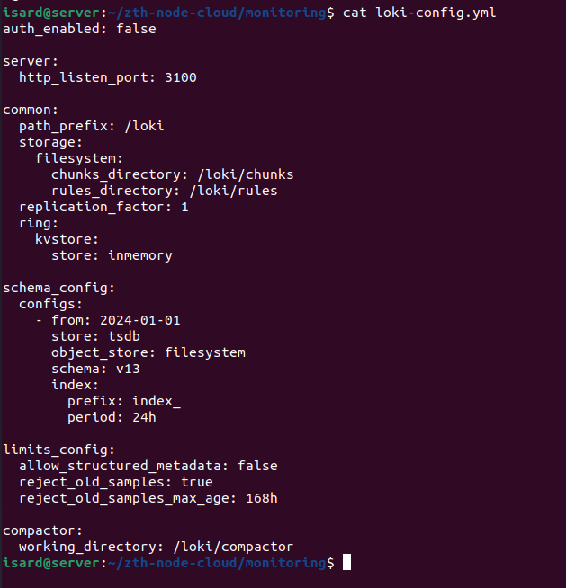

   Ahora crearemos el archivo para los contenedores:

```bash
sudo nano docker-compose.yml
```
   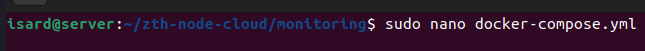

   Y este archivo contendrá lo siguiente:

```yaml
services:
  # Interfaz visual para consultar los logs
  grafana:
    image: grafana/grafana:11.0.0
    container_name: grafana
    restart: unless-stopped
    environment:
      GF_SECURITY_ADMIN_PASSWORD: admin1234 # Contraseña definida tras el reset
      GF_AUTH_GENERIC_OAUTH_ENABLED: "false" # Desactivado para validación inicial
    ports:
      - "3000:3000"
    volumes:
      - grafana_data:/var/lib/grafana
    networks:
      - monitoring-net

  # Motor de almacenamiento y procesamiento de logs
  loki:
    image: grafana/loki:3.0.0
    container_name: loki
    restart: unless-stopped
    ports:
      - "3100:3100"
    volumes:
      - ./loki-config.yml:/etc/loki/local-config.yaml
      - loki_data:/loki
    command: -config.file=/etc/loki/local-config.yaml
    networks:
      - monitoring-net

  # Agente recolector de logs del servidor
  promtail:
    image: grafana/promtail:3.0.0
    container_name: promtail-nodeA
    restart: unless-stopped
    volumes:
      - ./promtail-config.yml:/etc/promtail/config.yml
      - /var/log:/var/log:ro
    command: -config.file=/etc/promtail/config.yml
    networks:
      - monitoring-net

volumes:
  grafana_data:
  loki_data:

networks:
  monitoring-net:
    driver: bridge
```
   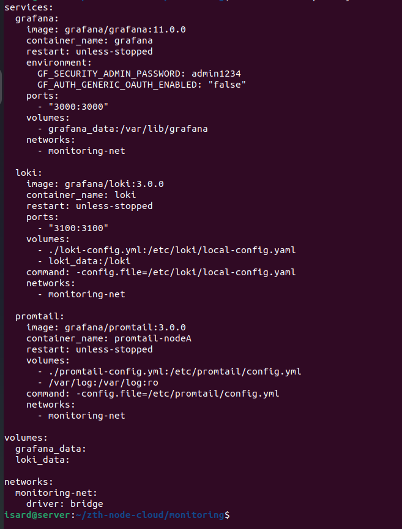

### **2.2 Ejecución**

   Ahora ejecutamos los dockers para encender los servicios:

```bash
docker compose up -d
```
   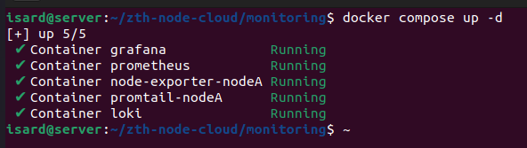


### **2.3 Firewall**

   Una vez tenemos los servicios ejecutándose, deberemos de aplicar una nueva regla para el puerto del grafana:

```bash
sudo ufw allow 3000/tcp
```
   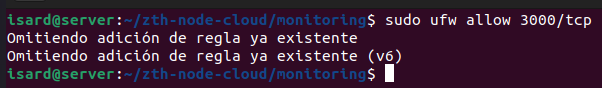


### **2.4 Comprobación de acceso**

   Ahora para acceder pondremos lo siguiente en la URL:

   `http://192.168.18.10:3000`


   Pondremos las credenciales y podremos acceder.
   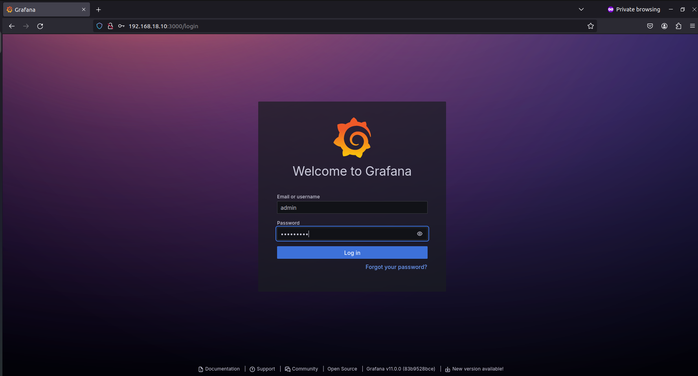


### **2.5 Configuración de Loki Web**

   Ahora procederemos a configurar el **Loki** en el Grafana. Nos dirigiremos al apartado de **Connections** y después a **Add Data Source** y buscamos **Loki**.
   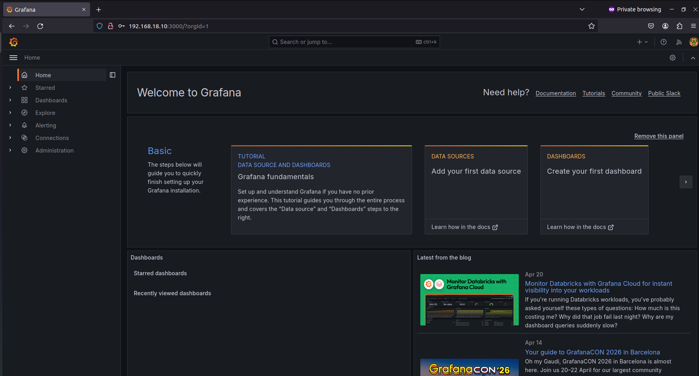
   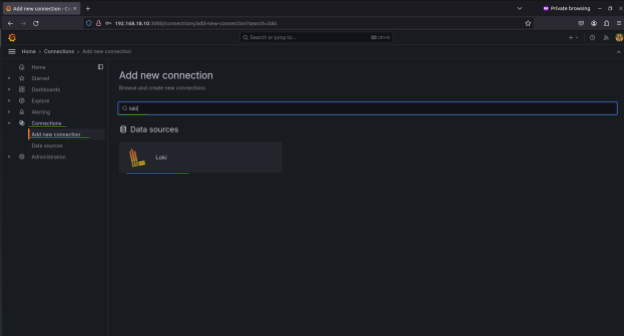


   Ahora damos clic:

   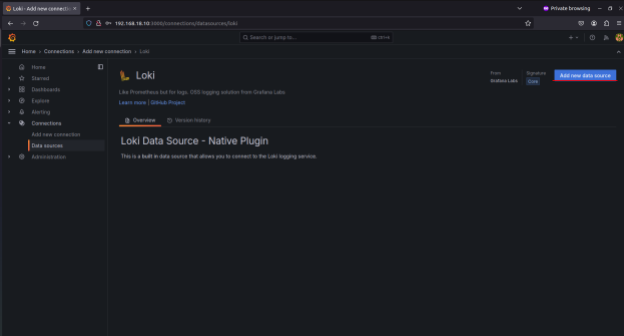

   Ahora lo que hacemos es indicar como URL la siguiente:

   `http://loki:3100`

  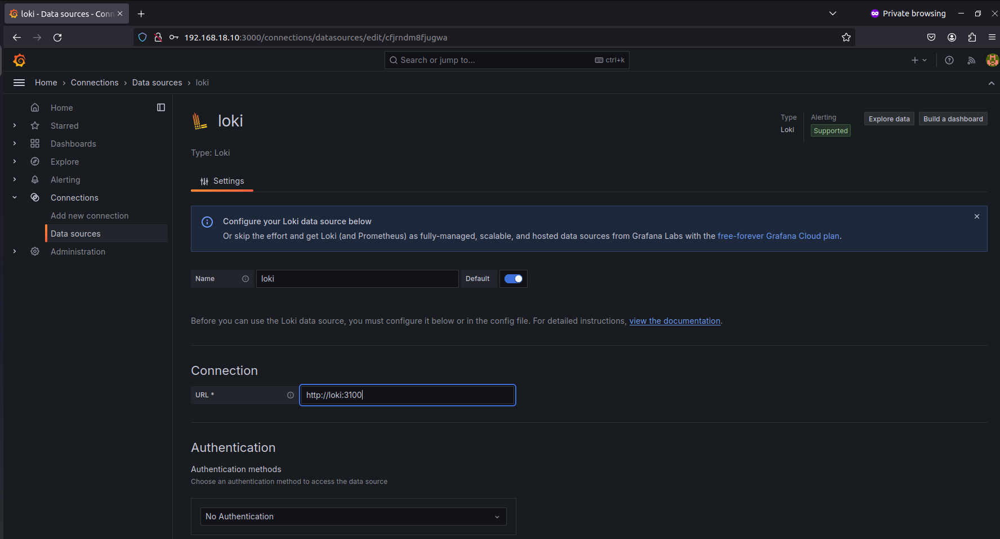


   Ahora lo que haremos es darle a **Save & Test** y aparecerá el mensaje de que la validación es correcta.

   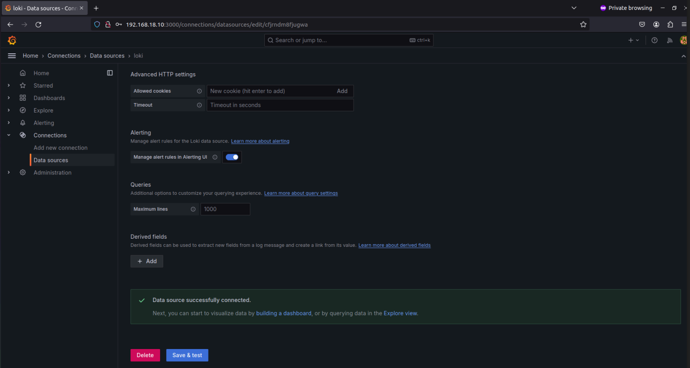
### **2.6 Comprobaciones de LOGS**

   Para comprobar si funciona o no, nos vamos al apartado de **Explore**. En **Select Label** seleccionamos la opción de `job` y el **Select Value** la opción de `auth`. Para finalizar, le damos clic donde dice **Live**.

   

   Esto debería de quedar tal que así:

   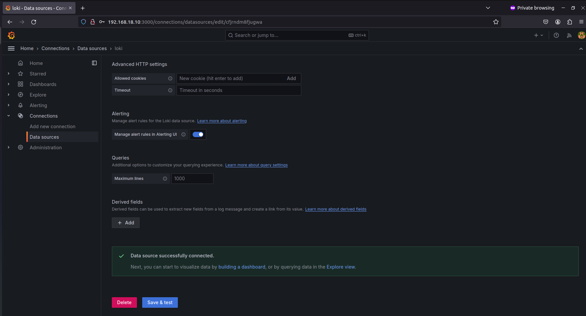

   Ahora lo que hacemos es un SSH desde nuestro cliente hacia el servidor y fallamos la contraseña a propósito:

```bash
ssh user@server -p 2222
```

   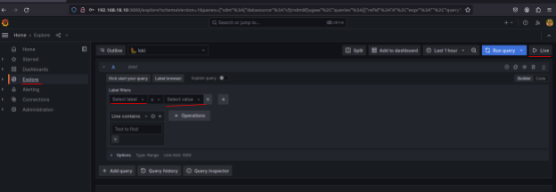

   Así generamos logs y podemos ver cómo aparecen al instante los logs:

   

   En estos logs también podemos ver desde donde se hace, es decir la IP de origen, vemos que el puerto del origen es 2222 que es el configurado, etc.

   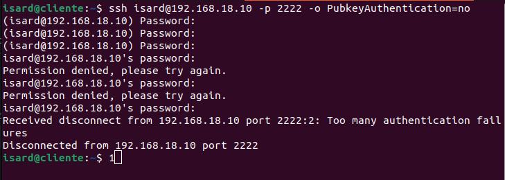

   Si inspeccionamos uno de los logs podemos ver más a fondo y concreto lo que nos dice.

   
