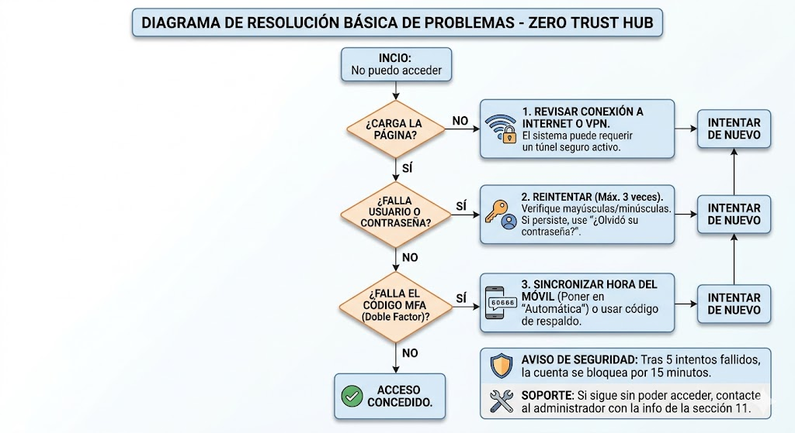
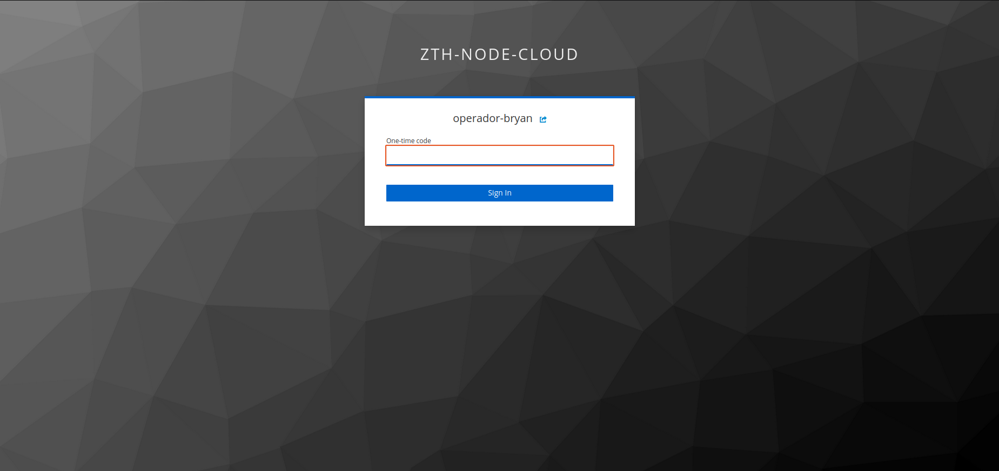
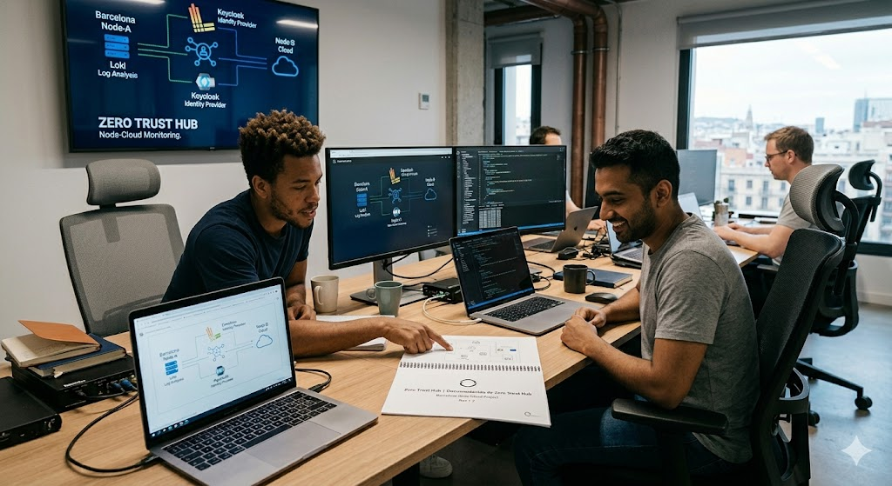
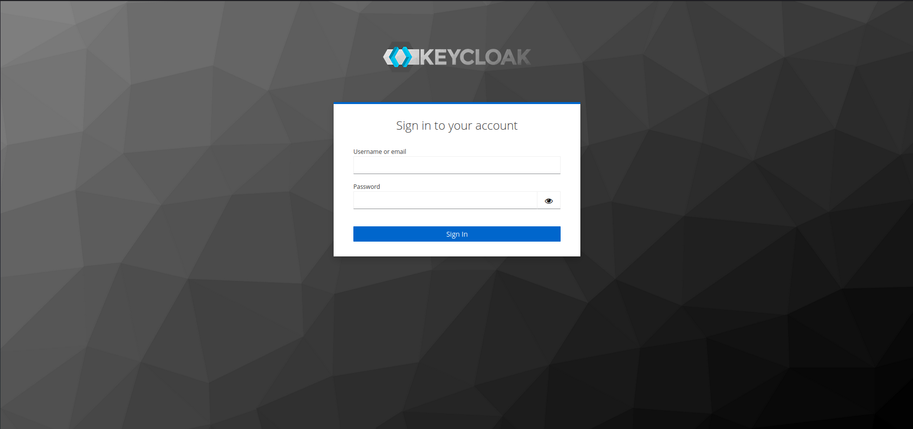
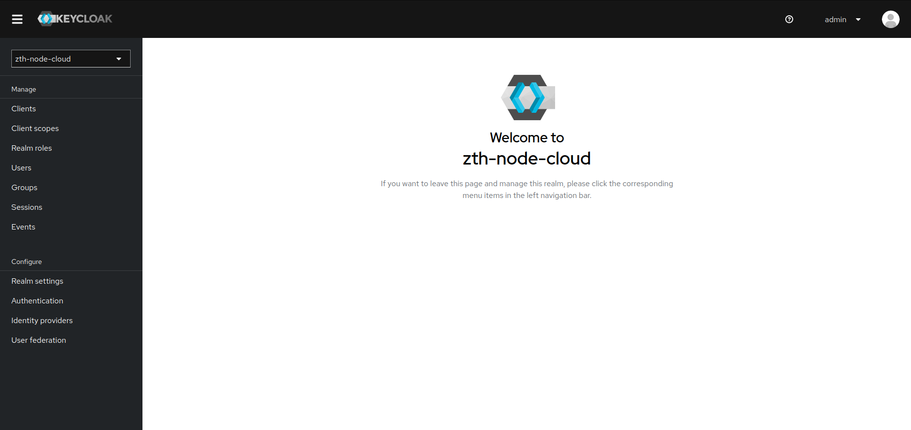
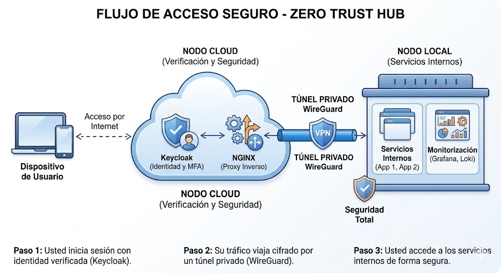

# Documentación de cliente — Zero Trust Hub

Proyecto de Integración de Sistemas de Seguridad Híbridos

```text
Grupo: 8
Integrantes: Bryan Aguilera, Javier Vericat, Giuseppe Suarez
Fecha: Mayo 2026
```



## Índice

- 1. Introducción
- 2. Objetivo de la solución
- 3. Qué incluye la solución
- 4. Cómo accede el usuario
- 5. Inicio de sesión
- 6. Qué puede hacer el usuario
- 7. Comportamientos de seguridad esperados
- 8. Recomendaciones de uso para el cliente
- 9. Resolución básica de problemas
- 10. Mantenimiento básico para cliente
- 11. Soporte
- 12. Conclusión
- Anexo: Glosario de conceptos clave

## 1. Introducción

Zero Trust Hub es una solución de acceso seguro a servicios internos basada en una arquitectura híbrida compuesta por un nodo local y un nodo cloud conectados mediante una VPN WireGuard. El sistema incorpora autenticación centralizada con Keycloak, proxy inverso con NGINX y monitorización con Grafana, Loki y Prometheus.

```text
Idea clave:
Nunca confiar, siempre verificar.
```

## 2. Objetivo de la solución

El objetivo de Zero Trust Hub es proteger el acceso a servicios internos aplicando un modelo Zero Trust. Para ello, se limita la exposición de puertos, se obliga al uso de autenticación centralizada y se registran eventos y métricas para detectar comportamientos anómalos.

```text
Objetivo:
- Reducir superficie expuesta
- Centralizar autenticación/autorización
- Registrar eventos y métricas
- Facilitar detección de anomalías
```

## 3. Qué incluye la solución

La solución incluye:

```text
- Conectividad segura entre nodo local y nodo cloud mediante WireGuard
- Gestión de identidad y acceso mediante Keycloak
- Proxy inverso con NGINX para publicar y proteger servicios
- Monitorización y recogida de logs con Grafana, Loki, Promtail y Prometheus
```

## 4. Cómo accede el usuario

El usuario accede a la plataforma a través de la interfaz web publicada por el sistema. El acceso se realiza con credenciales personales gestionadas en Keycloak. Dependiendo de la configuración, puede requerirse también verificación adicional mediante MFA.

```text
Acceso:
1) Abrir la URL del servicio (facilitada por el administrador)
2) Iniciar sesión con usuario/contraseña (Keycloak)
3) Completar MFA si está habilitado
4) Entrar al servicio autorizado
```



## 5. Inicio de sesión

Para iniciar sesión:

```text
1) Acceder a la URL del servicio web proporcionada por el administrador
2) Introducir nombre de usuario y contraseña
3) Completar el segundo factor de autenticación si está habilitado
4) Una vez autenticado, acceder al servicio correspondiente
```







## 6. Qué puede hacer el usuario

El usuario puede utilizar los servicios autorizados según el rol que tenga asignado. La autenticación y autorización se gestionan desde Keycloak, por lo que no todos los usuarios tienen acceso a los mismos recursos.

```text
Roles (resumen funcional):
- Usuario estándar: aplicaciones web del negocio, logs básicos (login/logout)
- Auditor: Grafana (solo lectura), visualización de eventos de seguridad
- Admin: acceso total y configuración, registro detallado de toda actividad
```

## 7. Comportamientos de seguridad esperados

El sistema incorpora medidas de seguridad para proteger el acceso: restricción de exposición de puertos, protección mediante VPN y autenticación centralizada, bloqueo temporal ante múltiples intentos fallidos y registro de eventos de seguridad para su monitorización.

```text
Importante:
Tras 5 intentos fallidos, el sistema bloquea la IP/usuario durante 15 minutos.
```

## 8. Recomendaciones de uso para el cliente

```text
- No compartir credenciales con otros usuarios
- Utilizar contraseñas robustas
- No reutilizar contraseñas antiguas
- Mantener el segundo factor activo si está disponible
- En caso de bloqueo por múltiples intentos fallidos, contactar con el administrador
```

## 9. Resolución básica de problemas

Si el usuario no puede acceder:

```text
1) Comprobar usuario y contraseña
2) Verificar el segundo factor (MFA) si aplica
3) Revisar conexión a red o VPN si el servicio la requiere
4) Si la cuenta está bloqueada temporalmente, esperar el desbloqueo o contactar con soporte
```



## 10. Mantenimiento básico para cliente

Desde la perspectiva del cliente, el mantenimiento consiste principalmente en mantener actualizados los datos de acceso, revisar que el dispositivo usado para MFA esté operativo y notificar incidencias de acceso o bloqueos no esperados. La administración técnica del sistema queda fuera de esta guía.

```text
Mantenimiento (cliente):
- Mantener datos de acceso actualizados
- Asegurar dispositivo MFA operativo
- Reportar incidencias con contexto y capturas
```

## 11. Soporte

En caso de incidencia, el cliente debe facilitar al equipo técnico:

```text
- Servicio al que intenta acceder
- Fecha y hora aproximada del problema
- Mensaje de error observado
- Captura de pantalla (si es posible)
```

## 12. Conclusión

Zero Trust Hub proporciona una solución de acceso seguro a servicios internos combinando autenticación centralizada, conectividad segura entre nodos y monitorización continua. Esta guía permite al cliente comprender el funcionamiento general del sistema y utilizarlo correctamente sin necesidad de conocer su configuración técnica interna.

```text
Resultado:
Acceso seguro + trazabilidad + monitorización, con controles de bloqueo y registro de eventos.
```

## Anexo: Glosario de conceptos clave

```text
Zero Trust (Confianza Cero):
Modelo de seguridad que verifica identidad y estado de seguridad en cada acceso.

Keycloak (Gestor de Identidad):
Sistema que gestiona usuarios, autenticación y permisos.

MFA / 2FA (Doble Factor de Autenticación):
Capa extra: además de contraseña, código temporal (normalmente app móvil).

WireGuard (Túnel Seguro):
VPN que crea un túnel cifrado para comunicación entre nodos.

Proxy inverso (NGINX):
Intermediario que recibe peticiones y las dirige al servicio interno correspondiente.

Monitorización (Grafana/Loki):
Sistema de observabilidad que registra estado, accesos y eventos para alertar de anomalías.
```

