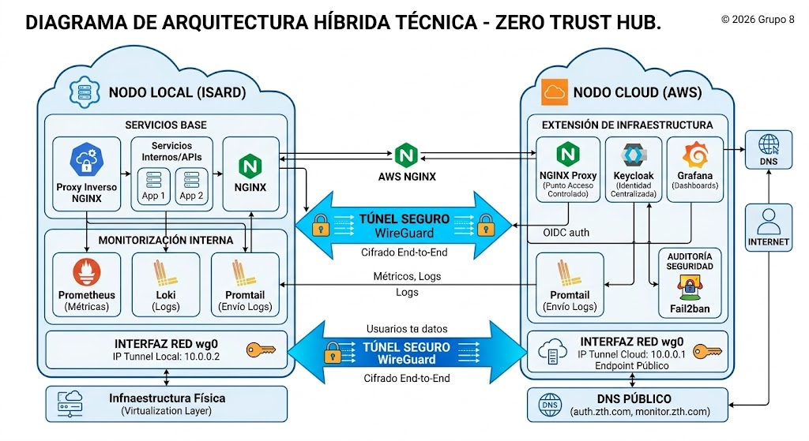

# Documentación técnica de administrador — Zero Trust Hub


## Proyecto de Integración de Sistemas de Seguridad Híbridos

- Grupo: 8
- Integrantes: Bryan Aguilera, Javier Vericat, Giuseppe Suarez
- Fecha: Mayo 2026

---

## Índice
<details open>
<summary>Ver/ocultar índice</summary>

- [1. Descripción general del sistema](#1-descripcion-general-del-sistema)
- [2. Arquitectura técnica](#2-arquitectura-tecnica)
- [3. Estructura documental del proyecto](#3-estructura-documental-del-proyecto)
- [4. Dependencias principales](#4-dependencias-principales)
- [5. Instalación inicial](#5-instalacion-inicial)
  - [5.1 Nodo cloud en AWS](#51-nodo-cloud-en-aws)
  - [5.2 Nodo local en Isard](#52-nodo-local-en-isard)
  - [5.3 WireGuard](#53-wireguard)
  - [5.4 Despliegue de servicios](#54-despliegue-de-servicios)
  - [5.5 Gestión de Secretos y Credenciales](#55-gestion-de-secretos-y-credenciales)
- [6. Configuración de servicios](#6-configuracion-de-servicios)
  - [6.1 SSH](#61-ssh)
  - [6.2 WireGuard](#62-wireguard)
  - [6.3 Keycloak](#63-keycloak)
  - [6.4 NGINX](#64-nginx)
  - [6.5 Monitorización](#65-monitorizacion)
  - [6.6 Seguridad de Acceso (OAuth2 Proxy)](#66-seguridad-de-acceso-oauth2-proxy)
- [7. Comandos de administración habituales](#7-comandos-de-administracion-habituales)
- [8. Tabla de puertos y servicios recomendados](#8-tabla-de-puertos-y-servicios-recomendados)
- [9. Tabla de servicios y mantenimiento](#9-tabla-de-servicios-y-mantenimiento)
- [10. Incidencias comunes y resolución](#10-incidencias-comunes-y-resolucion)
  - [10.1 Pérdida de acceso SSH](#101-perdida-de-acceso-ssh)
  - [10.2 WireGuard no conecta](#102-wireguard-no-conecta)
  - [10.3 Servicios internos visibles desde la red](#103-servicios-internos-visibles-desde-la-red)
  - [10.4 Dashboards sin datos o alertas incompletas](#104-dashboards-sin-datos-o-alertas-incompletas)
  - [10.5 Reconfiguración de AWS tras pérdida del nodo](#105-reconfiguracion-de-aws-tras-perdida-del-nodo)
- [11. Mantenimiento periódico](#11-mantenimiento-periodico)
- [12. Recomendaciones de administración y mejora](#12-recomendaciones-de-administracion-y-mejora)
- [13. Procedimiento básico de recuperación](#13-procedimiento-basico-de-recuperacion)
  - [13.1 Procedimientos de Backup y Exportación](#131-procedimientos-de-backup-y-exportacion)
- [14. Conclusión](#14-conclusion)
</details>

---

<a id="1-descripcion-general-del-sistema"></a>
# 1. Descripción general del sistema

Zero Trust Hub es una infraestructura híbrida compuesta por un nodo local desplegado en Isard y un nodo cloud desplegado en AWS

Ambos nodos están conectados mediante un túnel WireGuard y forman parte de una arquitectura orientada al modelo Zero Trust

El sistema integra autenticación centralizada con Keycloak, proxy inverso con NGINX y monitorización mediante Grafana, Loki, Prometheus y Promtail

Esta estructura se corresponde con la organización del repositorio por sprints y con los bloques documentales incluidos en cada uno de ellos

---

<a id="2-arquitectura-tecnica"></a>
# 2. Arquitectura técnica

La arquitectura del proyecto se compone de dos nodos principales:

- Nodo local (Isard): alojado en el entorno de virtualización local, encargado de parte de los servicios base, el proxy inverso y la monitorización interna

- Nodo cloud (AWS): instancia Ubuntu en AWS utilizada para extender la infraestructura y validar el modelo híbrido en un entorno externo

Los componentes técnicos principales del sistema son:

- WireGuard para la conectividad segura entre ambos nodos

- Keycloak para la autenticación centralizada, usuarios, roles y políticas de seguridad

- NGINX como proxy inverso y punto de acceso controlado a servicios

- Grafana, Loki, Prometheus y Promtail para dashboards, recogida de logs, métricas y alertas
Todo ello está reflejado en los directorios y documentos presentes en Sprint 1 y Sprint 2



<a id="3-estructura-documental-del-proyecto"></a>
# 3. Estructura documental del proyecto

El repositorio se organiza en:

- SPRINT 1, con documentación sobre actas, creación y configuración de la instancia AWS, WireGuard en AWS, Docker, esquema de red, hardening y configuración de WireGuard en Isard

- SPRINT 2, con documentación sobre integración de servicios, NGINX, Grafana, Loki, Promtail, Keycloak, pruebas de seguridad y validaciones finales

<a id="4-dependencias-principales"></a>
# 4. Dependencias principales

Para el funcionamiento del sistema se requieren:

- Ubuntu Server en el nodo cloud

- Entorno Linux en el nodo local

- Docker y Docker Compose para el despliegue de servicios

- WireGuard en ambos nodos

- NGINX como proxy inverso

- Keycloak como sistema de identidad

- Grafana, Loki, Prometheus, Promtail y Node Exporter para monitorización

---

<a id="5-instalacion-inicial"></a>
# 5. Instalación inicial

<a id="51-nodo-cloud-en-aws"></a>
## 5.1 Nodo cloud en AWS

El despliegue del nodo cloud parte de la creación de una instancia Ubuntu en AWS, su configuración de red, su acceso SSH seguro y la posterior instalación de WireGuard y del resto de componentes necesarios

La existencia de documentación específica sobre la creación de la instancia y la configuración de WireGuard en AWS aparece en Sprint 1

<a id="52-nodo-local-en-isard"></a>
## 5.2 Nodo local en Isard

El nodo local se aprovisiona en Isard y se prepara para alojar la infraestructura base

Esto incluye hardening inicial, despliegue de Docker, WireGuard y servicios internos

Esa parte también está reflejada en Sprint 1

<a id="53-wireguard"></a>
## 5.3 WireGuard

WireGuard se configura en ambos nodos mediante claves públicas y privadas, peers y direcciones internas del túnel

La instalación y configuración en AWS e Isard están documentadas en Sprint 1

<a id="54-despliegue-de-servicios"></a>
## 5.4 Despliegue de servicios

Los servicios principales se levantan mediante contenedores y configuración específica por servicio

Sprint 1 documenta Docker y Sprint 2 documenta la integración de NGINX, Grafana, Loki, Promtail y Keycloak

<a id="55-gestion-de-secretos-y-credenciales"></a>
## 5.5 Gestión de Secretos y Credenciales

Para mantener la integridad del modelo Zero Trust, las credenciales y llaves no están integradas en el código base, sino que se gestionan de forma aislada:

Claves de Túnel (WireGuard): Las llaves privadas (privatekey) se almacenan exclusivamente en /etc/wireguard/ en cada nodo. Nunca deben salir del servidor

Variables de Entorno (.env): Los servicios desplegados con Docker (Keycloak, Grafana, etc.) utilizan archivos .env para almacenar contraseñas de bases de datos y claves de administración

Ubicación: /opt/zth/config/.env

Acceso AWS (.pem): La llave privada para el acceso SSH al nodo Cloud debe ser custodiada por el administrador en un dispositivo seguro (no subir al repositorio de GitHub)

Certificados SSL/TLS: Gestionados por NGINX, almacenados en /etc/letsencrypt/ o en la ruta definida para el proxy inverso

---

<a id="6-configuracion-de-servicios"></a>
# 6. Configuración de servicios

<a id="61-ssh"></a>
## 6.1 SSH

- Ruta crítica: /etc/ssh/sshd_config

- Configuración de endurecimiento:

- Uso exclusivo de clave pública

- PermitRootLogin no

- Puerto administrativo distinto del 22 (ej. 2222)

- Revisión periódica del servicio tras reinicios: sudo systemctl status ssh

<a id="62-wireguard"></a>
## 6.2 WireGuard

- Ruta crítica: /etc/wireguard/wg0.conf

- Puntos de revisión del túnel:

- Estado del handshake: sudo wg show

- IP pública actual del peer remoto y tráfico transferido

- Estado del servicio: systemctl status wg-quick@wg0

<a id="63-keycloak"></a>
## 6.3 Keycloak

- Rutas críticas: ~/zth-node-cloud/keycloak/docker-compose.yml

- Gestión administrativa:

- Administración de usuarios, roles y realms

- Configuración de MFA y políticas de bloqueo por fuerza bruta

- Nota: Ver documentación detallada de integración en Sprint 2

---

<a id="64-nginx"></a>
## 6.4 NGINX

- Rutas críticas: ~/zth-node-cloud/nginx/nginx.conf

- Revisión del Proxy:

- Validación de sintaxis: sudo nginx -t

- Rutas de proxy_pass y módulos de auth_request para seguridad

- Control de puertos publicados y exposición de servicios

- Certificados: ~/zth-node-cloud/nginx/certs/

- Página principal: ~/zth-node-cloud/nginx/zerotrusthub.html

<a id="65-monitorizacion"></a>
## 6.5 Monitorización

Para la gestión de la observabilidad, los archivos de configuración se encuentran centralizados en el nodo local

- Rutas Críticas (Nodo Local):

- Docker Compose: ~/zth-node-cloud/monitoring/docker-compose.yml

- Prometheus (Métricas):

~/zth-node-cloud/monitoring/prometheus.yml

- Loki (Logs): ~/zth-node-cloud/monitoring/loki-config.yml

- Promtail (Agente de Logs): ~/zth-node-cloud/monitoring/promtail-config.yml

- Flujo de trabajo coordinado:

- Promtail: Recolecta y envía logs

- Loki: Almacenamiento indexado de logs

- Prometheus: Recolección de métricas de nodos y contenedores

Grafana: Visualización centralizada, dashboards y sistema de alertas

---

<a id="66-seguridad-de-acceso-oauth2-proxy"></a>
## 6.6 Seguridad de Acceso (OAuth2 Proxy)

Para proteger los servicios internos que no disponen de autenticación nativa o para centralizar el acceso, se utiliza OAuth2 Proxy vinculado al Realm de Keycloak

- Ruta Crítica: ~/zth-node-cloud/oauth2-proxy/docker-compose.yml

- Configuración del servicio:

- Proveedor: OIDC (OpenID Connect)

- Issuer URL: Vinculado al servidor Keycloak (http://zth-keycloak-server:8080/realms/zth-node-cloud)

- Client ID: grafana (Este debe coincidir con el cliente creado en la consola de Keycloak)

- Puerto de escucha: 4180 (Internal network)

Nota de administración: Si un usuario no puede acceder a los dashboards a pesar de tener internet, el administrador debe revisar la validez del client-secret y del cookie-secret en este archivo, así como la conectividad con el contenedor de Keycloak

---

<a id="7-comandos-de-administracion-habituales"></a>
# 7. Comandos de administración habituales

### SSH

```bash
sudo systemctl status ssh

sudo ss -tulpn | grep ssh

sudo /usr/sbin/sshd -t

```

### WireGuard

```bash
sudo wg

ip a show wg0

sudo systemctl status wg-quick@wg0

```

### Docker

```bash
docker ps

docker logs NOMBRE_CONTENEDOR --tail 50

docker compose up -d

docker compose down

```

### NGINX

```bash
sudo systemctl status nginx

sudo nginx -t

```

### Fail2ban

```bash
sudo fail2ban-client status

sudo fail2ban-client status sshd

```

### Monitorización

```bash
docker ps

docker logs grafana --tail 50

docker logs loki --tail 50

docker logs prometheus --tail 50

```

---

### Comandos de Diagnóstico Avanzado:

Verificar autenticación en vivo: docker logs -f oauth2-proxy (Fundamental si Keycloak falla).

Probar conectividad interna del túnel: ping 10.8.0.1 (desde local) o ping 10.8.0.2 (desde cloud)

Limpieza de emergencia (Disco lleno): docker system prune -f (Borra datos temporales de Docker para liberar espacio)

<a id="8-tabla-de-puertos-y-servicios-recomendados"></a>
# Documentación técnica de administrador — Zero Trust Hub

## 8. Tabla de puertos y servicios recomendados

| Puerto | Protocolo | Servicio | Uso recomendado | Exposición recomendada |
| :--- | :--- | :--- | :--- | :--- |
| 2222 | TCP | SSH | Administración remota | Restringido a IPs autorizadas |
| 51820 | UDP | WireGuard | VPN entre nodos | Solo peer autorizado |
| 80 | TCP | NGINX | Redirección o acceso web | Solo si es necesario |
| 443 | TCP | NGINX HTTPS | Acceso web seguro | Permitido si el servicio se publica |
| 8080 | TCP | Keycloak | Servicio interno | No exponer directamente |
| 3000 | TCP | Grafana | Panel interno | No exponer directamente |
| 3100 | TCP | Loki | Logs internos | No exponer directamente |
| 9090 | TCP | Prometheus | Métricas internas | No exponer directamente |
| 8090 | TCP | Servicio interno/proxy adicional | Uso puntual | Revisar necesidad |

---
<a id="9-tabla-de-servicios-y-mantenimiento"></a>
## 9. Tabla de servicios y mantenimiento

| Servicio | Función | Comprobación básica | Acción de mantenimiento |
| :--- | :--- | :--- | :--- |
| SSH | Acceso remoto | `systemctl status ssh` | revisar puerto, claves y arranque |
| WireGuard | Túnel entre nodos | `sudo wg` | revisar peer, endpoint e IP pública |
| NGINX | Proxy inverso | `nginx -t` | revisar rutas y exposición |
| Keycloak | Identidad y acceso | logs / acceso web | revisar usuarios, eventos y MFA |
| Grafana | Dashboards y alertas | acceso web / logs | revisar datasource y paneles |
| Loki | Almacenamiento de logs | logs de contenedor | revisar ingestión desde Promtail |
| Prometheus | Métricas | targets / logs | revisar exporters y scrape |
| Promtail | Envío de logs | logs de servicio | revisar rutas de logs |
| Fail2ban | Protección SSH | `fail2ban-client status` | revisar jails y baneos |


<a id="10-incidencias-comunes-y-resolucion"></a>
# 10. Incidencias comunes y resolución

<a id="101-perdida-de-acceso-ssh"></a>
## 10.1 Pérdida de acceso SSH

Revisar:

- sshd_config

- puerto configurado

- systemctl status ssh

- Security Group o firewall

- si ssh.service está habilitado al arranque

<a id="102-wireguard-no-conecta"></a>
## 10.2 WireGuard no conecta

Revisar:

- IP pública del peer

- Endpoint

- Claves públicas

- Estado del handshake

- Puerto UDP permitido

<a id="103-servicios-internos-visibles-desde-la-red"></a>
## 10.3 Servicios internos visibles desde la red

Revisar:

- Docker ps

- Publicación de puertos en docker-compose.yml

- Configuración de NGINX

- Escaneos con nmap

---

<a id="104-dashboards-sin-datos-o-alertas-incompletas"></a>
## 10.4 Dashboards sin datos o alertas incompletas

Revisar:

- Estado de Promtail

- Loki

- Prometheus targets

- Datasource de Grafana

- Conectividad entre nodos

<a id="105-reconfiguracion-de-aws-tras-perdida-del-nodo"></a>
## 10.5 Reconfiguración de AWS tras pérdida del nodo

La pérdida de una instancia cloud obliga a:

- Crear nueva instancia

- Rehacer acceso SSH

- Reinstalar WireGuard

- Restaurar servicios

- Revisar IP pública y Security Group
Esta necesidad encaja con la existencia de documentación de AWS y WireGuard en Sprint 1

<a id="11-mantenimiento-periodico"></a>
# 11. Mantenimiento periódico

Se recomienda revisar de forma periódica:

- El estado del túnel WireGuard

- El acceso SSH

- Los contenedores activos

- Los puertos realmente expuestos

- Los dashboards y alertas

- Los eventos de autenticación de Keycloak

- La conectividad entre nodo local y nodo cloud

- Cambios de IP pública que afecten al peer de WireGuard

<a id="12-recomendaciones-de-administracion-y-mejora"></a>
# 12. Recomendaciones de administración y mejora

Para garantizar el correcto funcionamiento y la seguridad del sistema, se recomienda mantener una revisión periódica de todos los componentes principales de la infraestructura

En primer lugar, conviene comprobar regularmente el estado del túnel WireGuard, validando que ambos peers mantienen handshake activo y que no han cambiado las IP públicas utilizadas en la configuración, especialmente en el nodo local

También se recomienda revisar de forma frecuente la configuración de SSH para asegurar que se mantiene el acceso mediante clave pública, que el puerto configurado sigue siendo el definido por el proyecto y que no se han reactivado opciones inseguras como la autenticación por contraseña o el acceso root

Del mismo modo, es aconsejable verificar el funcionamiento de fail2ban y confirmar que las jails más importantes, como sshd, continúan activas y registrando eventos correctamente.

En la parte de monitorización, se recomienda comprobar que Promtail, Loki, Prometheus y Grafana siguen intercambiando datos con normalidad, y que tanto los dashboards como las alertas recogen información de los dos nodos

También es recomendable validar periódicamente que los eventos de Keycloak se están registrando correctamente y que la integración con Grafana no ha perdido conectividad ni visibilidad sobre el nodo cloud o el nodo local

A nivel de despliegue, conviene evitar exponer servicios internos directamente a la red si no es estrictamente necesario

Servicios como Keycloak, Loki, Prometheus o Grafana deberían permanecer detrás de NGINX, accesibles solo de forma controlada, o restringidos a localhost, VPN o túneles administrativos

En este sentido, se recomienda revisar de manera periódica la publicación de puertos en Docker y realizar escaneos de comprobación para verificar que la superficie de exposición sigue siendo mínima

Por otra parte, se aconseja mantener copias de seguridad actualizadas de los ficheros de configuración más importantes, como los docker-compose.yml, configuraciones de NGINX, claves y configuración de WireGuard, y exportaciones relevantes de Keycloak o Grafana

Esto facilita la recuperación del sistema ante incidencias como la pérdida del nodo cloud, errores de configuración o necesidad de migración

Finalmente, se recomienda documentar cualquier cambio relevante en la infraestructura dentro del repositorio del proyecto y mantener actualizadas tanto la documentación técnica como la de cliente

Esto permite que otro administrador pueda retomar el sistema, entender su estado actual y resolver incidencias sin depender exclusivamente del conocimiento previo del equipo original

---

<a id="13-procedimiento-basico-de-recuperacion"></a>
# 13. Procedimiento básico de recuperación

En caso de pérdida del nodo cloud o necesidad de rehacer parte de la infraestructura:

- Crear una nueva instancia en AWS

- Configurar acceso SSH seguro

- Reinstalar WireGuard y rehacer el peer

- Verificar el túnel entre nodos

- Levantar servicios con Docker

- Revisar Keycloak, NGINX y monitorización

- Comprobar dashboards, logs y alertas
El repositorio incluye documentación relacionada con AWS, WireGuard, Docker y hardening que sirve de apoyo para esta recuperación

<a id="131-procedimientos-de-backup-y-exportacion"></a>
## 13.1 Procedimientos de Backup y Exportación

Configuraciones: Copiar toda la carpeta ~/zth-node-cloud/ a un almacenamiento externo o repositorio privado

Keycloak (Usuarios): Exportar el Realm para no perder las cuentas:

```bash
docker exec keycloak /opt/keycloak/bin/kc.sh export --file /home/isard/zth-node-cloud/Backup-docker/realm-export.json

```

Secretos: Guardar en lugar seguro los archivos .env de cada carpeta, ya que contienen las contraseñas que no están en el código

---

<a id="14-conclusion"></a>
# 14. Conclusión

La documentación técnica de administrador debe permitir comprender la arquitectura, desplegar el sistema desde cero, mantener los servicios y resolver incidencias habituales

Gracias a la estructura del repositorio, con 206 commits y documentación organizada en Sprint 1 y Sprint 2, el proyecto dispone de una base suficientemente completa para soportar tareas de administración, operación y recuperación de la infraestructura


