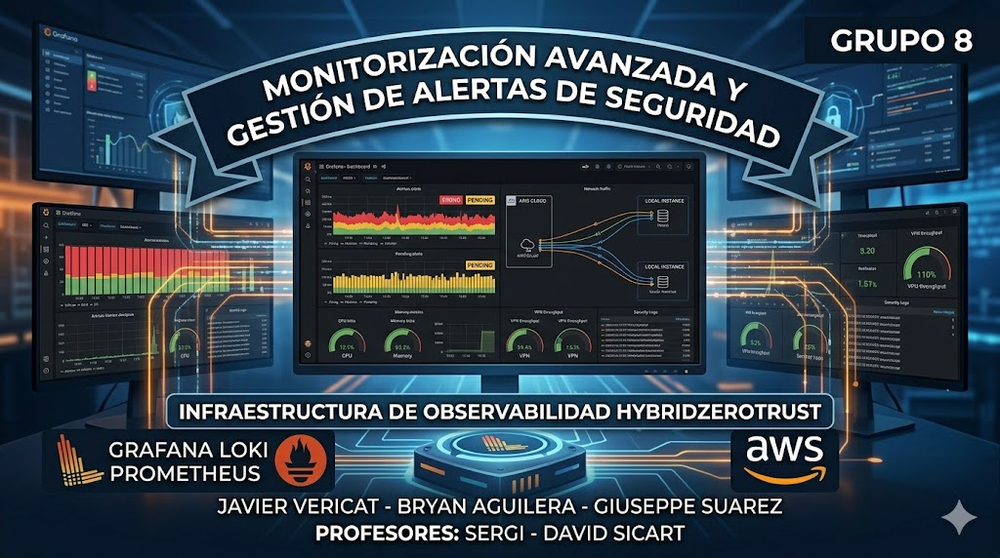

# Monitorización Avanzada y Gestión
## Indice

- [de Alertas de Seguridad](#de-alertas-de-seguridad)
- [N°: GRUPO 8](#n-grupo-8)
- [Integrantes: Javier Vericat - Bryan Aguilera - Giuseppe Suarez](#integrantes-javier-vericat-bryan-aguilera-giuseppe-suarez)
- [Profesores: Sergi - David Sicart](#profesores-sergi-david-sicart)
- [1. ​ Preparativos](#1-preparativos)
- [a. ​ Origen de Datos y Configuración de Logs (auth.log / syslog)](#a-origen-de-datos-y-configuración-de-logs-authlog-syslog)
- [2.​ Dashboard de Hardware](#2-dashboard-de-hardware)
- [3.​ Dashboard de Auditoría de Accesos](#3-dashboard-de-auditoría-de-accesos)
- [4.​ Dashboard SSH](#4-dashboard-ssh)
- [5.​ Monitorización de Tráfico VPN (Wireguard)](#5-monitorización-de-tráfico-vpn-wireguard)
- [6.​ Panel de Control Global](#6-panel-de-control-global)
- [7.​Configuración de Alertas Críticas y](#7configuración-de-alertas-críticas-y)
- [Disponibilidad](#disponibilidad)
- [a.​ Alerta de Fuerza Bruta SSH (Seguridad)](#a-alerta-de-fuerza-bruta-ssh-seguridad)
- [b.​Alerta de CPU Crítica (Disponibilidad)](#balerta-de-cpu-crítica-disponibilidad)
- [c.​ Caída de Servicios](#c-caída-de-servicios)
- [d.​Login sin MFA](#dlogin-sin-mfa)
- [e.​ Conexión VPN Desconocida](#e-conexión-vpn-desconocida)
- [8.​ Auditoría de Seguridad y Validación MFA](#8-auditoría-de-seguridad-y-validación-mfa)

## de Alertas de Seguridad

#### N°: GRUPO 8
#### Integrantes: Javier Vericat - Bryan Aguilera - Giuseppe Suarez
#### Profesores: Sergi - David Sicart

1. Preparativos.........................................................................................................................3
a. Origen de Datos y Configuración de Logs (auth.log / syslog)........................................3
2. Dashboard de Hardware................................................................................................ 4
3. Dashboard de Auditoría de Accesos..............................................................................8
4. Dashboard SSH........................................................................................................... 10
5. Monitorización de Tráfico VPN (Wireguard).................................................................14
6. Panel de Control Global............................................................................................... 18
7. Configuración de Alertas Críticas y Disponibilidad........................................................... 22
a. Alerta de Fuerza Bruta SSH (Seguridad).....................................................................22
i. Comprobación......................................................................................................... 25
b. Alerta de CPU Crítica (Disponibilidad)......................................................................... 28
i. Comprobacion......................................................................................................... 30
c. Caída de Servicios....................................................................................................... 32
i. Comprobación......................................................................................................... 33
d. Login sin MFA...............................................................................................................35
i. Comprobación......................................................................................................... 36
e. Conexión VPN Desconocida........................................................................................37
i. Comprobación......................................................................................................... 39
8. Auditoría de Seguridad y Validación MFA....................................................................41
a. Objetivo.................................................................................................................. 41
i. Acceso con credenciales correctas (Sin MFA).................................................. 41
ii. Acceso con código OTP erróneo......................................................................42
iii. Acceso exitoso con OTP..................................................................................45

### 1. ​ Preparativos
#### a. ​ Origen de Datos y Configuración de Logs (auth.log / syslog)
Antes de realizar cualquier acción primero debemos de asegurar la correcta
recepción de eventos verificando que el agente de logs está capturando los
ficheros de sistema en tiempo real
sudo tail -f /var/log/auth.log
sudo tail -f /var/log/syslog
Como podemos ver en la captura siguiente, los logs los lee correctamente

#### 2.​ Dashboard de Hardware
Para crear los dashboard, tendremos que dirigirnos al apartado de Dashboard y crear
uno nuevo

Ahora le damos a Import Dashboard

Se ha importado el Dashboard ID 1860 (Node Exporter Full), ya que este ofrece
métricas detalladas de salud del nodo (CPU, Memoria, disco y Red) extraídas mediante
Prometheus

Nos aparecerá el Dashboard de Node Exporter Full

Al darle a Import nos aparecerá todo vacío al principio, esto es normal, es porque aun
no le hemos indicado de donde debe se extraerse la información

Le tendremos que dar a DataSource​

Debemos de seleccionar Prometheus

Ahora si que sale correctamente los datos​

#### 3.​ Dashboard de Auditoría de Accesos
Para crear otro DashBoard tendremos que darle a New y después a DashBoard

Ahora le damos a Add Visualization

Seleccionamos en este caso Loki

Elegimos Loki porque es bastante completo para verificar los logs y ver quién ha
accedido, de dónde a qué hora etc
Una vez elegimos Loki, nos aparecerá los logs

#### 4.​ Dashboard SSH
Ahora tenemos que crear un dashboard para poder monitorizar ataques de fuerza bruta
por ejemplo al servicio del ssh
Como mencionamos antes, le daremos a New DashBoard, y le damos de nuevo a Add
Visualization, le damos a Loki nuevamente

Ahora en el apartado de Code escribiríamos lo siguiente
{job="auth"} |= "sshd" → Para que nos filtre por SSH, y le damos al Run Query

Añadimos un título y podemos ver los logs, en el apartado de line

Y vemos que nos aparece los logs

a.​ Alertas de ataque
Crearemos una alerta ataques de fuerza Bruta SSH

Ahora crearemos la alerta, seleccionamos Loki y en el apartado de code
pondremos esto​
count_over_time({job=~"auth|system_logs"} |~ "Failed password" [5m])

En expression quedaria asi

El motor de alertas evalúa las expresiones que tiene este lock, en intervalos que
nosotros le indicamos. Si el conteo supera el umbral (Threshold) establecido, la
alerta cambia a estado Firing y dispara la notificación
Ahora hemos creado una carpeta llamada Alertas de Seguridad y después en
evaluation group pusimos esto​

b.​ Verificacion
Desde aws ejecutamos este comando para generar log

Ahora desde grafana sale como Pending en amarillo

Finalmente sale asi, en rojo
#### 5.​ Monitorización de Tráfico VPN (Wireguard)
Como hemos realizado hasta ahora, tendremos que dar a New - New Dashboard.
Ahora seleccionamos Prometheus

Seleccionamos la opción de Code, y pondremos el siguiente comando -
irate(node_network_receive_bytes_total{device="wg0"}[5m])
Ahora le damos a Run Queries

Ahora le daremos a Add Query

Y pondremos lo siguiente
sum(irate(node_network_receive_bytes_total[5m]))
sum(irate(node_network_transmit_bytes_total[5m]))

Ahora podremos ver los logs, de baja como de subida respectivamente

#### 6.​ Panel de Control Global
Crearemos un nuevo Dashboard para observar todo a nivel general, para saber si el
Servidor está vivo o ha caído
Como antes, crearemos un nuevo DashBoard, con el Add Visualization y elegiremos
Prometheus, en el apartado de Code pondremos lo siguiente
100 - (avg by (instance) (irate(node_cpu_seconds_total{mode="idle"}[5m])) * 100)
De nombre le puse Carga Actual de CPU, para mirar como esta la CPU en tiempo real

Ahora añadiremos otro con prometheus mismo pero este sera de Red
Pondremos de título Actividad en Red y en la opción de Code le pondremos lo siguiente
sum(rate(node_network_receive_bytes_total[5m]))

Para finalizar nuestro DashBoard General tendríamos lo siguiente,
El contador de intentos de SSH que han intentado acceder y han fallado
Este será el único que tendrá Loki en nuestro panel Overview
De título pusimos Alertas de intrusión por el servicio en este caso del SSH, y pusimos en
el code la siguiente
count_over_time({job="auth"} |= "sshd" |= "Failed" [1h])

Una vez guardado este Dashboard quedaría así​

Aunque este último panel se parezca al del Punto 1, no son lo mismo, el primer panel
creado es solo de Hardware, miramos todas las métricas que Prometheus nos facilita,
pero aquí juntamos tanto Loki como Prometheus, aquí podemos observar de manera
más general el estado del servidor.
Si vemos que la actividad de la red sube y tenemos el contador subiendo también a la
vez podemos deducir que es un ataque, mientras que si simplemente sube la carga de
la CPU podría ser algo momentáneo.

Y aquí tendremos los Dashboard creados

## 7.​Configuración de Alertas Críticas y
## Disponibilidad
#### a.​ Alerta de Fuerza Bruta SSH (Seguridad)
Ahora crearemos alertas, para ello nos dirigimos al apartado de alertas → Alert
Rules → New Alert Rule

Ahora rellenaremos la información con lo siguiente

Para el motor de datos usaremos Loki, luego le daremos click en code y le
ponemos lo siguiente​
count_over_time({job=~"auth|system_logs"} |~ "Failed password" [5m])​
Esto lo que hace es indicar cuantas veces aparece la frase de “Failed Password”
en un ratio de 5 minutos
Luego tenemos el apartado llamado Expression

En la expresión B Reduce, lo dejamos por defecto, actualmente esto lo que nos
indica es que recogerá la información de los últimos ataques detectados
Por otro lado en C Threshold cambiamos el apartado de IS ABOVE al número 3
Esto indica que si hay 3 intentos fallidos en los últimos 5 min que la alarma salte

Ahora creamos la alerta

i.​
Comprobación
La alerta estará así si todo está tranquilo sin ataques

Pero si hacemos este comando que simula realizar un ataque….

El estado de la alerta se pondrá en Pending, primero esperará 1 min para saber
si realmente es un ataque o no.

Si se detecta que es un ataque saldrá lo siguiente en rojo

Nos llegará una alerta al Gmail conforme nos están haciendo un ataque

#### b.​Alerta de CPU Crítica (Disponibilidad)
Crearemos una nueva alerta

Lo rellenamos con los siguientes datos

De nombre Disponibilidad -CPU Crítica (>85%), en este caso el motor de datos
será Prometheus, y ponemos la siguiente query
100 - (avg by (instance) (rate(node_cpu_seconds_total{mode="idle"}[5m])) * 100)

Este lo que nos indica es el uso de la CPU en tiempo real, restando el uso
cuando no se está haciendo en reposo
En el apartado de Expresión lo eliminaremos dando click en el siguiente icono de
Papelera

Por otro lado en la expresión C tendremos que poner IS ABOVE 85
Guardamos la regla

i.​
Comprobacion
Si ejecutamos el siguiente comando para realizar una prueba de estrés

Podremos observar que como anteriormente, pasa al estado de Pending, alerta
amarilla

Despues pasara a la alerta de color rojo, lo cual saltará

Y por ende nos llegará el correo con el aviso de dicha alerta

#### c.​ Caída de Servicios
Crearemos la nueva alerta, llamado caída de nodo/servicio

En este caso ponemos la siguiente query
up{instance="node-exporter-nodeA:9100"}
Esto nos indica que si la respuesta del nodo es 1 está vivo pero si es 0 esta caido
o no disponible
Ahora ponemos en Expression C el input A y ponemos IS BELOW y de valor 1 ,
conseguimos que si este valor pasa de 1 a 0 la alerta saltará

Ahora guardaremos la alerta

i.​
Comprobación
Simularemos una caía de servicio parando el contenedor un momento

El estado Pending actúa como un filtro de seguridad para evitar 'falsos positivos'.
La alerta solo pasa a estado Firing (rojo) si la condición crítica persiste durante el
tiempo de evaluación configurado

Si después de 1 min ve que sigue sin responder si no está “vivo”, salta la alerta
roja

Como antes, la alerta también nos llega al Gmail

#### d.​Login sin MFA
Crearemos la alerta para los login sin el MFA

De nombre pusimos, Seguridad - Login sin MFA detectado y de la query lo
siguiente
count_over_time({job="auth"} |~ "Accepted password" !~ "google_authenticator"
[5m])
Mirará los logs, de autenticación, revisará el apartado de contraseña aceptada
pero mirara los que no hayan realizado o no tengan el google_authenticator

Ahora eliminamos como antes el Expression B y nos quedamos con el C de la
siguiente manera

Esto lo que nos dice es que si hay solo 1 login sin MFA que nos avise la alerta
Guardamos la alerta y esta todo Ok

i.​
Comprobación
Para realizar la comprobación realizaremos el siguiente comando

Y nos saltará la alerta

Nos llega la alerta

#### e.​ Conexión VPN Desconocida
Crearemos la alerta de conexiones con una VPN que no sea la nuestra

El nombre de esta seria, Seguridad - Conexión VPN/Origen Desconocido y de
query ponemos lo siguiente
count_over_time({job="auth"} |~ "Accepted" !~ "10.0.0.5" [5m])
Esta IP es una Inventada, para que cuando se realice la comprobación, salte la
alerta
En el apartado de Expression, quitamos la B y nos quedamos con la C con
INPUT en A y luego tenemos el apartado de IS ABOVE en 0

Con esto lo que conseguimos es que nos alertara por cualquier acceso
detectado por una IP no autorizada o fuera del túnel creado de la VPN

Ahora guardamos la alerta, y veremos que esta esta normal y creada
correctamente

i.​
Comprobación
Ejecutamos el siguiente comando para simular un logueo mediante una
VPN desconocida

La alerta salta en rojo

Seguidamente nos salta también el aviso en Gmail

#### 8.​ Auditoría de Seguridad y Validación MFA
a.​ Objetivo
El objetivo de este punto es realizar unas pruebas del comportamiento del
sistema de Login
i.​
Acceso con credenciales correctas (Sin MFA)
En este caso lo haremos con las credenciales del Grafana

Si le damos al Login, podemos ver que accedemos correctamente

ii.​
Acceso con código OTP erróneo
Ahora probaremos a acceder al grafana con sistema de Keycloak pero
con el código OTP erróneo para comprobar que no se puede acceder

Ponemos las credenciales

Ahora nos pide el código OTP

Ahora pondremos un código erróneo

Como podemos observar, nos da error y no podemos acceder

Si nos vamos al Keycloak podemos ver que por fallar el código OTP nos
aparecerá que la cuenta ha sido bloqueada

iii.​
Acceso exitoso con OTP
Ahora accederemos con un código de OTP correcto

Ahora nos pedirá un código de OTP

Como podemos ver hemos accedido correctamente
Otra cosa a tener en cuenta, es que podemos ver que dice que la
información que tenemos como nombre de usuario correo electrónico etc,
ha sido sincronizado con los datos que proporciona el Keycloak

ID
Caso de
Prueba
Método de
Acceso
Resultado Obtenido
Estado
TEST-01
Acceso
Directo
Usuario/Pass
Grafana
Acceso exitoso
Correcto
TEST-02
Acceso con
OTP Erróneo
Keycloak + MFA
Bloqueo de cuenta y
acceso denegado
Correcto
TEST-03
Acceso con
OTP Correcto
Keycloak + MFA
Acceso exitoso y
sincronización de perfil
Correcto
