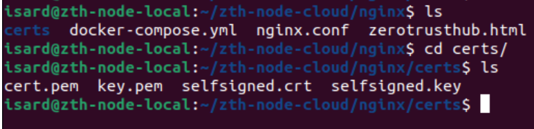
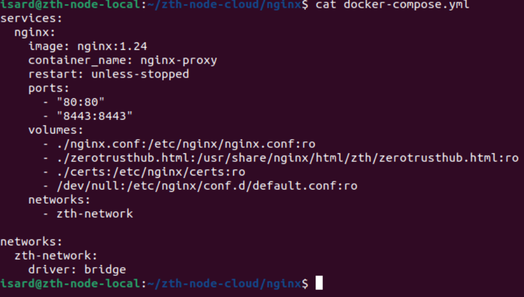
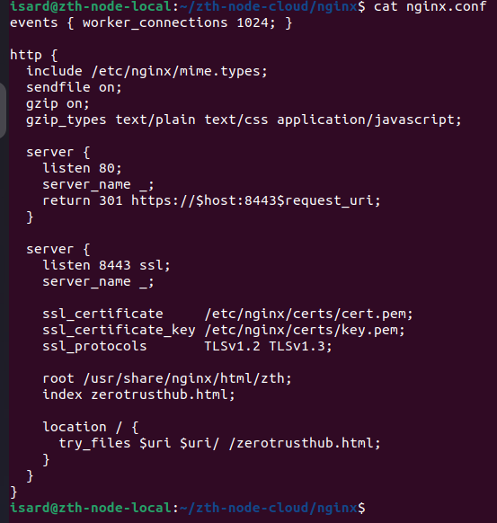
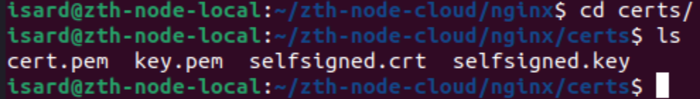
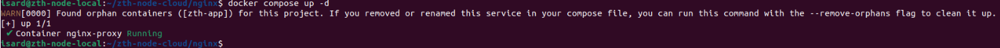
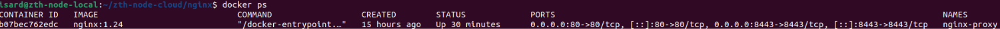
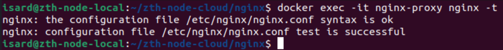
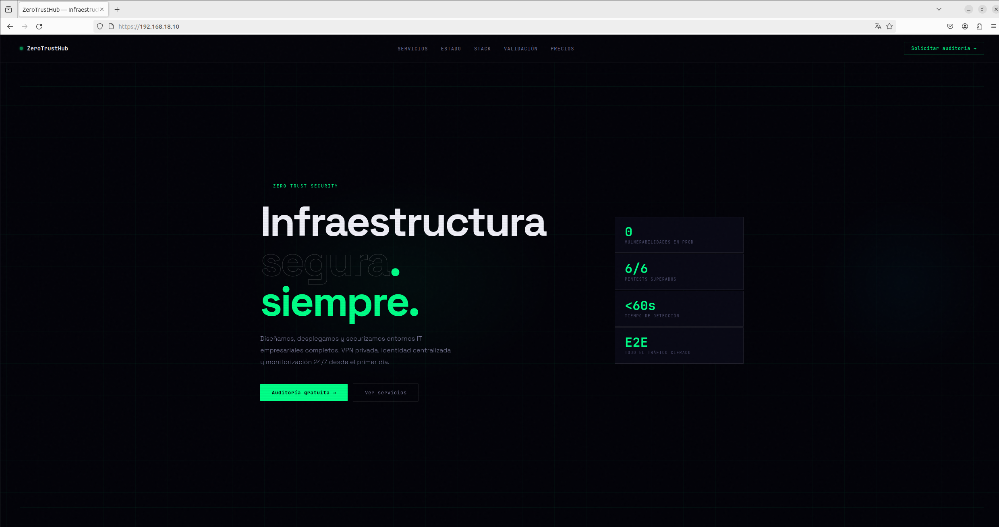

# ZeroTrustHub — Despliegue Web con Nginx + Docker + HTTPS

## Descripción

Este módulo implementa el frontend público de ZeroTrustHub utilizando Nginx como 
servidor web y reverse proxy ligero, desplegado dentro de un contenedor Docker.

La infraestructura sirve una landing page estática orientada a servicios de 
ciberseguridad y arquitectura Zero Trust, incluyendo:

- HTTPS habilitado mediante certificados TLS
- Redirección automática HTTP → HTTPS (puerto 80 → 8443)
- Hosting estático optimizado
- Exposición controlada de puertos
- Aislamiento mediante red Docker dedicada
- Configuración minimalista y portable

El despliegue se encuentra contenido en:

```bash
~/zth-node-cloud/nginx
```

---

# Estructura del proyecto



```bash
nginx/
├── certs/
│   ├── cert.pem
│   ├── key.pem
│   ├── selfsigned.crt
│   └── selfsigned.key
├── docker-compose.yml
├── nginx.conf
└── zerotrusthub.html
```

---

# Docker Compose

## Archivo



```yaml
services:
  nginx:
    image: nginx:1.24
    container_name: nginx-proxy
    restart: unless-stopped

    ports:
      - "80:80"
      - "8443:8443"

    volumes:
      - ./nginx.conf:/etc/nginx/nginx.conf:ro
      - ./zerotrusthub.html:/usr/share/nginx/html/zth/zerotrusthub.html:ro
      - ./certs:/etc/nginx/certs:ro
      - /dev/null:/etc/nginx/conf.d/default.conf:ro

    networks:
      - zth-network

networks:
  zth-network:
    driver: bridge
```

---

# Explicación de la configuración

## Imagen utilizada

```yaml
image: nginx:1.24
```

Se utiliza una imagen oficial estable de Nginx basada en Debian. Es ligera, 
muy estable, fácil de mantener, compatible con TLS moderno y con bajo consumo 
de recursos.

---

## Nombre del contenedor

```yaml
container_name: nginx-proxy
```

Permite identificar el servicio fácilmente desde Docker:

```bash
docker ps
docker logs nginx-proxy
docker exec -it nginx-proxy bash
```

---

## Reinicio automático

```yaml
restart: unless-stopped
```

Garantiza persistencia del servicio tras reinicios del host, caídas del 
contenedor o reinicios de Docker.

---

# Exposición de puertos

## HTTP — Puerto 80

```yaml
- "80:80"
```

Recibe tráfico HTTP externo. Este tráfico es automáticamente redirigido 
a HTTPS en el puerto 8443.

---

## HTTPS — Puerto 8443

```yaml
- "8443:8443"
```

Puerto principal de producción. Todo el contenido público se sirve 
mediante TLS en este puerto. Se usa 8443 en lugar del 443 estándar para 
evitar conflictos con otros servicios que puedan estar corriendo en el host.

---

# Volúmenes montados

## Configuración Nginx

```yaml
- ./nginx.conf:/etc/nginx/nginx.conf:ro
```

Monta la configuración personalizada dentro del contenedor en modo 
read-only, evitando modificaciones accidentales desde dentro del contenedor.

---

## Deshabilitar configuración por defecto

```yaml
- /dev/null:/etc/nginx/conf.d/default.conf:ro
```

Nginx por defecto carga un archivo `default.conf` que puede interferir 
con la configuración personalizada. Montando `/dev/null` en su lugar, 
ese archivo queda vacío y solo se aplica el `nginx.conf` que nosotros 
controlamos.

---

## HTML principal

```yaml
- ./zerotrusthub.html:/usr/share/nginx/html/zth/zerotrusthub.html:ro
```

Monta el frontend estático principal. La web completa está implementada 
en un único archivo HTML autosuficiente con HTML, CSS y JavaScript.

---

## Certificados TLS

```yaml
- ./certs:/etc/nginx/certs:ro
```

Monta los certificados SSL/TLS dentro del contenedor en modo read-only.

---

# Configuración Nginx

## Archivo completo



```nginx
events { worker_connections 1024; }

http {
  include /etc/nginx/mime.types;
  sendfile on;
  gzip on;
  gzip_types text/plain text/css application/javascript;

  server {
    listen 80;
    server_name _;
    return 301 https://$host:8443$request_uri;
  }

  server {
    listen 8443 ssl;
    server_name _;
    ssl_certificate     /etc/nginx/certs/cert.pem;
    ssl_certificate_key /etc/nginx/certs/key.pem;
    ssl_protocols       TLSv1.2 TLSv1.3;
    root /usr/share/nginx/html/zth;
    index zerotrusthub.html;

    location / {
      try_files $uri $uri/ /zerotrusthub.html;
    }
  }
}
```

---

## Bloque events

```nginx
events { worker_connections 1024; }
```

Define el número máximo de conexiones concurrentes que Nginx puede manejar.

---

## MIME Types

```nginx
include /etc/nginx/mime.types;
```

Permite servir correctamente HTML, CSS, JS, JSON, fuentes e imágenes con 
el Content-Type correcto en cada respuesta.

---

## Optimización y compresión

```nginx
sendfile on;
gzip on;
gzip_types text/plain text/css application/javascript;
```

`sendfile` mejora el rendimiento en transferencia de archivos. `gzip` 
comprime las respuestas para reducir el ancho de banda consumido y mejorar 
los tiempos de carga.

---

# Redirección HTTP → HTTPS

```nginx
server {
  listen 80;
  server_name _;
  return 301 https://$host:8443$request_uri;
}
```

Todo acceso que llegue por el puerto 80 es redirigido permanentemente 
hacia HTTPS en el puerto 8443. El código 301 indica redirección permanente.

---

# Servidor HTTPS principal

## Certificados

```nginx
ssl_certificate     /etc/nginx/certs/cert.pem;
ssl_certificate_key /etc/nginx/certs/key.pem;
```

Certificado y clave privada montados desde la carpeta `certs/` del host 
a través del volumen Docker.

---

## Protocolos TLS

```nginx
ssl_protocols TLSv1.2 TLSv1.3;
```

Se deshabilitan versiones inseguras — SSLv2, SSLv3, TLS 1.0 y TLS 1.1 — 
aceptando únicamente protocolos modernos y seguros.

---

## Routing

```nginx
location / {
  try_files $uri $uri/ /zerotrusthub.html;
}
```

Cualquier ruta que no encuentre un archivo concreto cae de vuelta al 
`zerotrusthub.html`, lo que es útil para navegación interna y anchors.

---

# Certificados TLS

## Estructura



```bash
certs/
├── cert.pem
├── key.pem
├── selfsigned.crt
└── selfsigned.key
```

`cert.pem` y `key.pem` son los certificados actualmente en uso por Nginx. 
`selfsigned.crt` y `selfsigned.key` son los certificados autofirmados 
utilizados inicialmente durante las pruebas locales.

---

# Comandos útiles

## Levantar el servicio



```bash
docker compose up -d
```

---

## Ver estado del contenedor



```bash
docker ps
```

---

## Validar configuración Nginx



```bash
docker exec -it nginx-proxy nginx -t
```

---

## Ver logs

```bash
docker logs nginx-proxy
```

---

## Reiniciar el contenedor

```bash
docker restart nginx-proxy
```

---

## Acceder al contenedor

```bash
docker exec -it nginx-proxy bash
```

---

## Parar los servicios

```bash
docker compose down
```

---

# Flujo de tráfico

```text
Cliente
   │
   ▼
Puerto 80 (HTTP)
   │
   ▼
Redirección 301 → HTTPS:8443
   │
   ▼
Puerto 8443 (HTTPS + TLS 1.2/1.3)
   │
   ▼
Nginx
   │
   ▼
zerotrusthub.html
```

---

# Verificación del despliegue




---

# Estado actual

```text
Nginx:                    operativo
HTTPS (puerto 8443):      operativo
Docker:                   operativo
Frontend:                 operativo
TLS 1.2/1.3:              operativo
Redirección HTTP→HTTPS:   operativa
default.conf desactivado: operativo
```

---

# Próximas mejoras previstas

## Certificados Let's Encrypt

Sustituir los certificados actuales por renovación automática con Certbot.

---

## Puerto 443 estándar

Migrar de 8443 al puerto 443 estándar una vez se resuelvan posibles 
conflictos con otros servicios del host.

---

## Reverse Proxy avanzado

Integración completa con Keycloak, OAuth2 Proxy y APIs internas.

---

## Headers de seguridad adicionales

Añadir cabeceras como `Content-Security-Policy`, `X-Frame-Options`, 
`X-Content-Type-Options` y `HSTS` para endurecer la seguridad del servidor.

---

## Rate Limiting y Fail2Ban

Protección contra bruteforce, scraping y ataques automatizados.
