# Pruebas de seguridad contra los nodos

## 1) Comprobar IP pública/privada del nodo local

Se comprueba la IP pública del nodo local, y se identifica también su IP privada en la red interna.

```bash
curl ifconfig.me
```

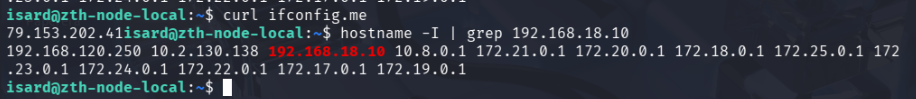

## 2) Comprobar IP pública del nodo cloud (AWS)

Se realiza la misma comprobación de IP pública en el nodo cloud.

```bash
curl ifconfig.me
```

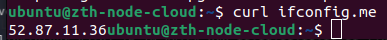

## 3) Escaneo de puertos al nodo local

Se revisa la exposición de servicios del nodo local. Inicialmente, algunos servicios de contenedores estaban publicados en `0.0.0.0` (accesibles desde fuera). Para reducir exposición, se modificaron los `docker-compose.yml` para bindearlos a `127.0.0.1` (solo accesibles desde el propio nodo), manteniendo expuestos únicamente los puertos necesarios.

```bash
sudo nmap -Pn -sV 79.153.202.41
```

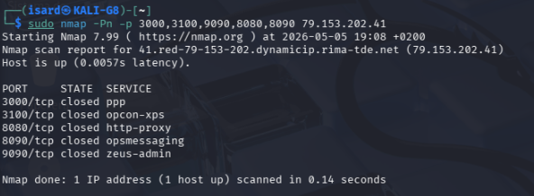

Se valida que desde el exterior queden abiertos únicamente los puertos necesarios (p. ej. 80/443 para Nginx y 2222 para SSH), y que los puertos de servicios internos (Grafana/Keycloak/etc.) aparezcan cerrados.

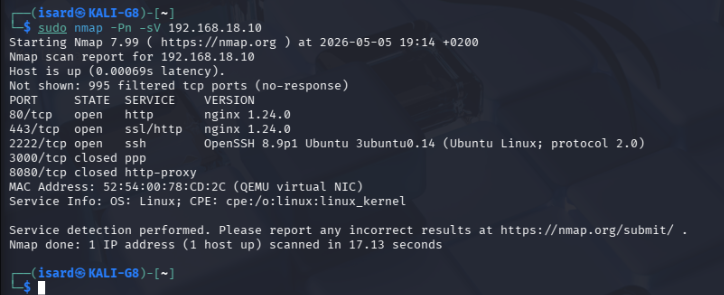

## 4) Escaneo de puertos al nodo cloud (AWS)

Se escanean los servicios expuestos por el nodo cloud desde Internet para confirmar que solo queda accesible el puerto requerido para administración remota.

```bash
sudo nmap -Pn -sV 52.87.11.36
```

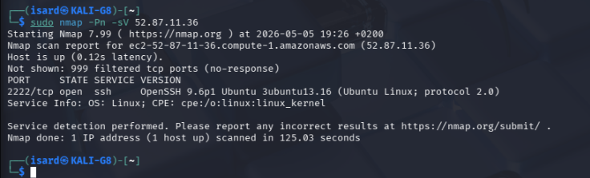

## 5) Bruteforce SSH con Hydra hacia los nodos (password auth deshabilitado)

Se intenta un ataque de fuerza bruta SSH desde Kali contra el nodo local. Si SSH tiene autenticación por contraseña deshabilitada, Hydra no puede ejecutar el ataque.

```bash
hydra -l isard -P passwords_test.txt ssh://192.168.18.10:2222 -V
```

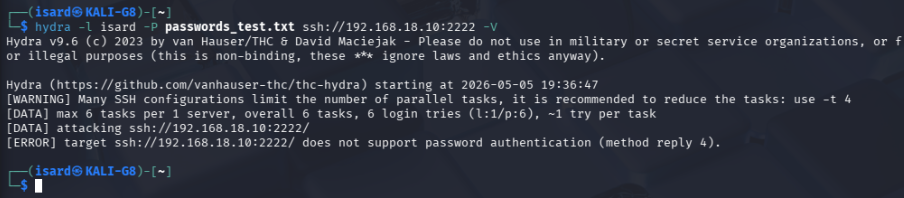

## 6) Validar fail2ban habilitando temporalmente password auth y forzando intentos fallidos

Se desactiva temporalmente la restricción en SSH para permitir autenticación por contraseña, se reinicia el servicio y se crea un usuario de prueba para validar que fail2ban banea tras múltiples intentos fallidos.

```bash
sudo nano /etc/ssh/sshd_config
sudo systemctl restart ssh
sudo adduser testssh
```

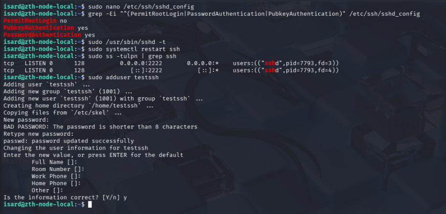

Se lanza el ataque de fuerza bruta desde Kali usando un diccionario.

```bash
hydra -l testssh -P passwords_test.txt ssh://192.168.18.10:2222 -V
```

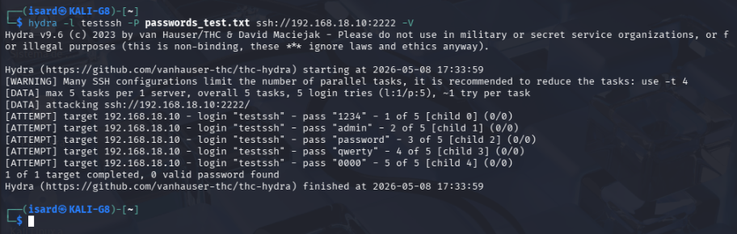

Se comprueba que fail2ban banea la IP atacante y se revisan logs para ver intentos fallidos y el baneo.

```bash
sudo fail2ban-client status
sudo fail2ban-client status sshd
sudo tail -n 200 /var/log/auth.log
```

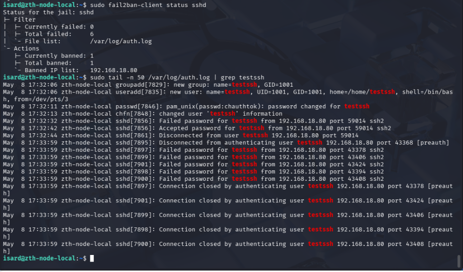

## 7) Bruteforce web contra Keycloak

Se comprueba que el contenedor de Keycloak está levantado y funcionando.

```bash
docker ps
```

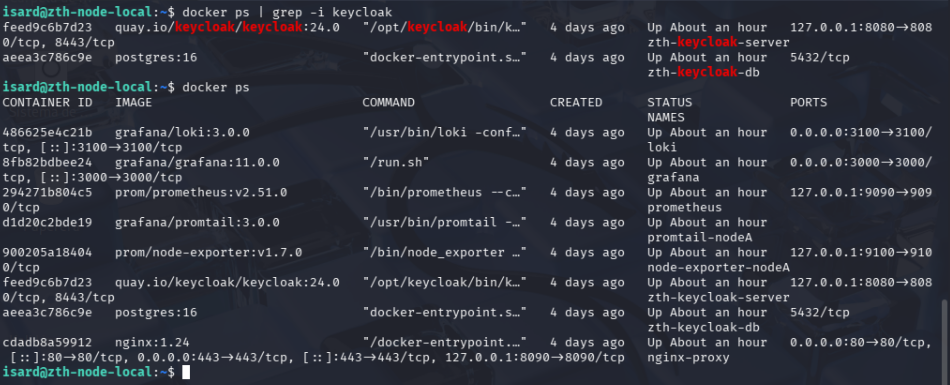

Se usa un usuario de pruebas para ejecutar el ataque.

```text
Usuario de pruebas para login en Keycloak
```

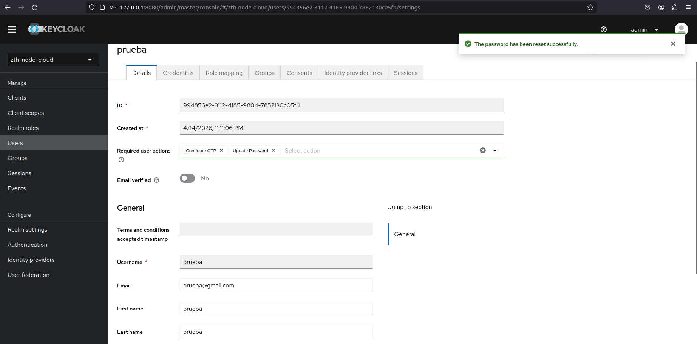

Se valida acceso a la web de Keycloak desde Kali.

```text
Abrir Keycloak desde Kali (URL del entorno de pruebas)
```

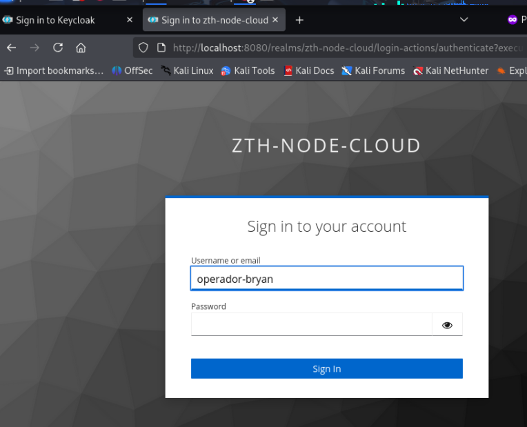

Se lanza fuerza bruta contra el login web. Se observa que puede producirse un falso positivo, pero Keycloak termina bloqueando temporalmente al usuario ante múltiples intentos fallidos.

```bash
hydra -l <usuario> -P passwords_test.txt <host> http-post-form "<ruta_login>:username=^USER^&password=^PASS^:<condición_fallo>" -V
```

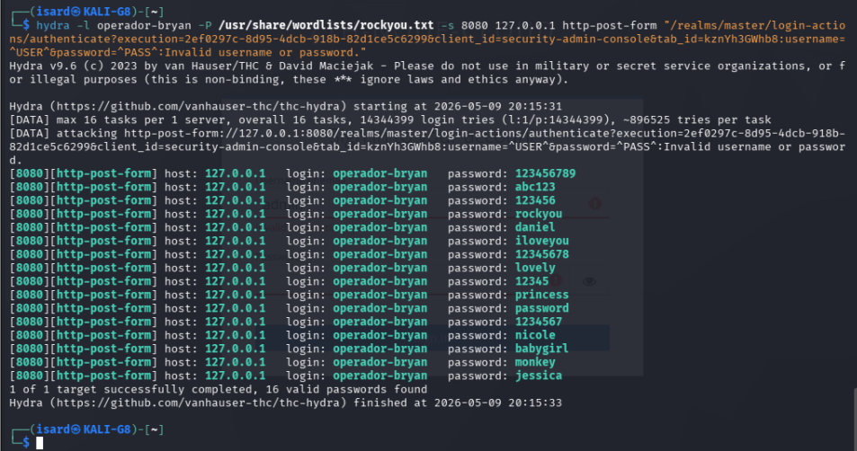

Se revisan eventos de Keycloak y se confirma el motivo de detección por fuerza bruta y el bloqueo temporal del usuario.

```text
Keycloak Admin Console → Events (ver motivo brute_force_attack_detected y user_temporarily_disabled)
```

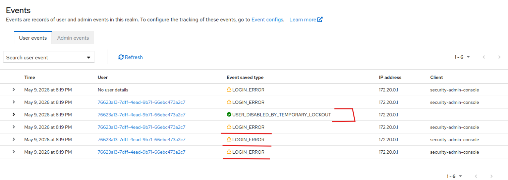

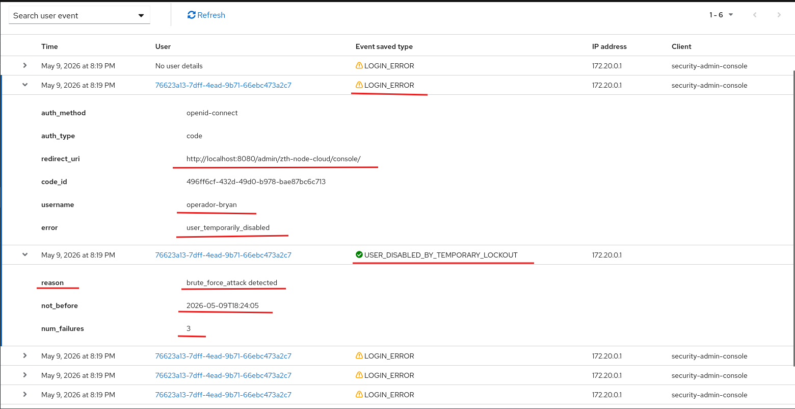

