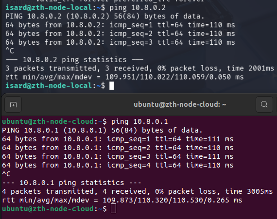
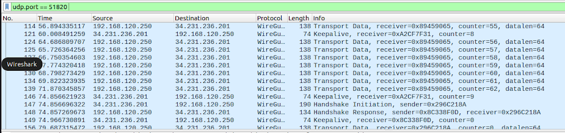
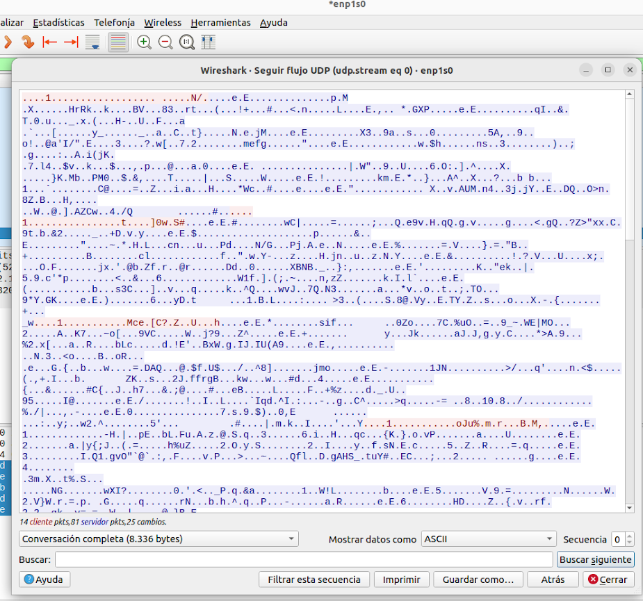

# Pruebas MitM sobre el túnel WireGuard entre el nodo local y el nodo en AWS

## 1) Comprobar que WireGuard está levantado en AWS

WireGuard debe estar activo y la interfaz `wg0` debe existir con la IP esperada del túnel.

```bash
sudo wg && ip a show wg0
```


## 2) Comprobar que WireGuard está levantado en el nodo local

En el equipo local se repite la comprobación para validar que el túnel está levantado también en ese extremo.

```bash
sudo wg && ip a show wg0
```


## 3) Direcciones IP del túnel

A partir de la información anterior, se observan las siguientes IP del túnel:

|        | Nodo local | Nodo cloud |
|--------|------------|------------|
| IP     | 10.8.0.1   | 10.8.0.2   |

## 4) Comprobar conectividad entre nodos (ping)

Se valida la conectividad ICMP entre extremos del túnel.

```bash
# En AWS
ping 10.8.0.1

# En local
ping 10.8.0.2
```



## 5) Capturar tráfico del túnel en Wireshark

Para observar únicamente el tráfico de WireGuard, se filtra por el puerto UDP típico de WireGuard (en este caso `51820`).

```text
udp.port == 51820
```



## 6) Verificar que el contenido capturado no es legible (tráfico cifrado)

Al inspeccionar un paquete capturado del túnel, el contenido no es interpretable en claro porque todo el tráfico va cifrado.

```text
Wireshark: inspeccionar un paquete UDP de WireGuard (no se observa payload en claro)
```



## Conclusión

La prueba confirma que el túnel WireGuard protege la confidencialidad de la comunicación entre el nodo local y el nodo cloud. Aunque el tráfico UDP del túnel puede capturarse, su contenido no resulta interpretable en claro, por lo que un atacante sin acceso a las claves privadas no puede leer la información transmitida.

